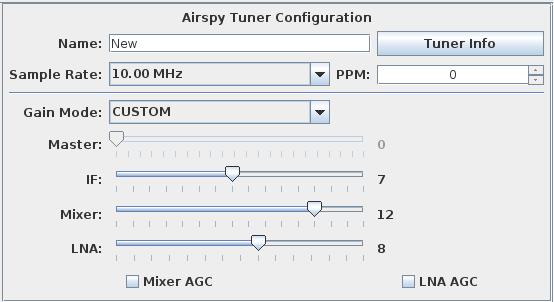

**Version:** 0.3.0

Airspy Tuner Configuration
---

**Figure 1:** Airspy Tuner Configuration

The following settings shown in Figure 1 are available for configuring the airspy tuner:

#### Name
Name for the tuner configuration. 

#### Tuner Info Button
Provides a summary of details about the currently selected tuner, including Serial number, Firmware
version, airspy part number, and airspy board identifier.

#### Sample Rate
Allows you to change the sample rate.

#### PPM
Adjusts the frequency correction Parts Per Million (PPM) value for the tuner.  Airspy normally
provides fairly stable frequency accuracy and this value can be left at 0.0.  If you notice in
the spectral display that the frequency labels are slightly misaligned to observed signals, you
can adjust this value to align the frequency to the observed signals with known operating 
frequencies.

#### Gain Mode
* **Linearity** - provides a single master gain control with settings optimized for gain linearity
* **Sensitivity** - provides a single master gain control with settings optimized for gain sensitivity
* **Custom** - provides fine-grained control over each of the IF, Mixer and LNA gain settings.

#### Mixer AGC Checkbox
Enables or disables Mixer Automatic Gain Control (AGC)

#### LNA AGC Checkbox
Enables or disables LNA AGC

Updating Firmware
---
The firmware label shown in the **Tuner Info** popup message is the GIT revision label that was
tagged against the software release.  SDRTrunk does not support flashing the Airspy with new firmware.  Use 
the _Airspy tools_ to update the tuner.

Using Airspy With Linux
---
On first use of the airspy tuner in linux you'll need to add permissions to allow users to access 
the device:

* Copy the file **\config\52-airspy.rules** from the sdrtrunk application folder to your **\etc\udev\rules.d** folder.
 
    `sudo cp 52-airspy.rules \etc\udev\rules.d`

* Set file permissions.

    `sudo chmod u=rw,g=r,o=r 52-airspy.rules`

* Refresh the udev rules

    `sudo udevadm control --reload-rules`
