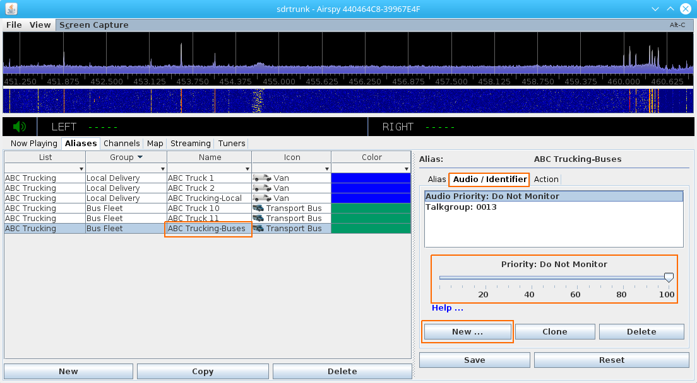

**Version:** 0.3.0

Aliases
---
Table of Contents
---
* [Creating, Deleting and Copying Aliases](#creating,-deleting-and-copying-aliases)
* [Single Alias Editor - Alias Tab](#single-alias-editor---alias-tab)
* [Single Alias Editor - Audio/Identifier Tab](#single-alias-editor---audio/identifier-tab)
  * [Audio and Identifier Items](#audio-and-identifier-items)
* [Single Alias Editor - Action Tab](#single-alias-editor---action-tab)
* [Multiple Alias Editor](#multiple-alias-editor)
* [Examples](#examples)
  * [Example: Create Aliases for an Alias List](#example-create-aliases-for-an-alias-list)
  * [Example: P25 Aliases](#example-p25-aliases)
  * [Example: Audio Priority](#example-audio-priority)
  * [Example: Audio Streaming](#example-audio-streaming)
  * [Example: Alias with Wildcard P25 Talkgroup](#example-alias-with-wildcard-p25-talkgroup)
  * [Example: Audio Recording](#example-audio-recording)

Example: Alias with Wildcard P25 Talkgroup

Aliases are a powerful feature in sdrtrunk that enable you to assign meaning to 
many of the logical identifiers found in radio communication systems.  An 
alias can represent one or more radios, radio groups, people, vehicles, 
network nodes, etc. An alias can have multiple associated identifiers that 
allow you to link together each of the pieces of information that can be used 
to identify something or someone.
 
Aliases provide the ability to trigger actions whenever any of the identifiers
that are associated with the alias are active on the radio network.  For
instance, you can assign an alias to beep, or popup a message dialog whenever
the alias is active.  By assigning a script alias action, the possibilities
are unlimited for triggered actions.

Aliases also allow you to define audio monitoring priority, recording, and 
network audio streaming of audio associated with the alias when active.

**Figure 1:** Alias Table and Single Alias Editor

Figure 1 presents the Alias tab showing the alias table and the single alias 
editor.  In this view, you can select an individual alias row in the table 
and the alias editor allows you to change any of the details about the alias 
and to add or delete alias identifiers and alias actions.  

Each column in the table provides a drop-down field in the column header 
allowing multiple search and row filtering options.

Each of the single alias editor options are described later in this document.

**Figure 2:** Alias Table and Multiple Alias Editor

Figure 2 shows the multiple alias editor.  By selecting multiple rows of
aliases, you can modify individual settings across a set of aliases with a 
single action.

Click on a check box for a setting that you want to change, type in a value
or select from the list, and click **Save** to change that setting for all 
selected aliases. 

Each of the multiple alias editor options are described later in this document

Creating, Deleting and Copying Aliases
---
Use the three buttons at the bottom of the alias table to create new aliases,
copy one or more existing aliases, or delete one or more aliases.

#### New Button
Click the new button to create a new alias.  The new alias appears at the bottom
of the alias table.  Select the new alias and use the single alias editor pane at
the right to edit the alias settings and save the changes with the **Save** button 
at the bottom of the alias editor.

#### Copy Button
Select one or more aliases that you have already created and click the Copy button
to create duplicate copies of the selected aliases.  You can then edit each of the
alias copies individually.  This is a convenient feature when you are creating
many aliases that are mostly the same and you only have to change a few settings.

#### Delete Button
Select one or more aliases and click the Delete button to remove the selected 
aliases from the list.

Single Alias Editor - Alias Tab
---

The following are settings that can be modified for each alias.  The single
alias editor is shown in Figure 1.

#### Name
The alias name is the textual value that will be displayed everywhere that the
alias is used.

#### List
An alias list is a named group of aliases that you attach to one or more
channel configurations.  Type in a new alias list name select an existing 
alias list name from the list.  

Attach an alias list to a channel configuration and all aliases with the
alias list name will be used by any decoder(s) specified in the channel
configuration.

#### Group
An alias group is a second grouping option that allows you to better organize
your alias lists and to quickly filter your larger alias lists into manageable
sizes convenient for editing.  The alias group value is not used by any of the
decoders and is only provided as a means for you to organize your aliases.

#### Color
Select a color by clicking on the color bar and choose a color from the 
dialog.  This color will be used when displaying the alias name or when 
plotting the GPS locations and path of travel for an alias on the integrated 
map display.  NOTE: use caution when choosing a light color or white, because
the text will not be visible against most of the white background displays.

#### Icon
Choose an icon from the dropdown list or click on the **Icon Manager** button
to import your own custom icon to attach to your alias.  The icon will be
displayed next to your alias name and will be used on the integrated map 
display when plotting GPS locations.

#### Save Button
After editing any of the settings in the aliast, click the **Save** button 
to save the settings.

#### Reset Button
Click the reset button if you have made changes to the alias settings and 
wish to revert all settings back to the previous saved state.

Single Alias Editor - Audio/Identifier Tab
---
This tab allows you to assign one or more identifiers to an alias and to 
assign audio settings for priority, recording and streaming.  Once you have
attached audio or identifier items to an alias, you can select each item
individually in the list and an editor will appear allowing you to change
the setting(s) for the item.

#### New Button
Click the new button to choose a new audio or identifier item to attach to 
the alias.  The items that you can add or attach to an alias are detailed
immediately following the Delete button description.

#### Clone Button
Select an existing item in the list and click the Clone button to create a
duplicate copy of the item.  You can then change the settings for the cloned
copy of the audio or identifier.

#### Delete Button
Select an existing item in the list that you want to remove from the alias 
and click the Delete button.

Audio and Identifier Items
---
The following alias identifiers and audio items can be attached to any alias.
Multiple identifiers and identifier types can be attached to each alias.  Most
alias identifiers also support wildcard (*) characters.  Click the **Help ...**
link in any of the identifier editor windows to view tips and comments on 
how to format identifier values for each of the identifier types.

##### ESN
Electronic Serial Number (ESN) identifiers used in specific decoders like 
LTR-Net.  

##### Fleetsync
Kenwood fleetsync radio or group identifier.  This identifier only applies to
the Fleetsync decoder.

##### LoJack
Lojack function and ID.  This identifier only applies to the LoJack decoder.

##### LTRNet UID
LTR-Net Unique ID.  This identifier only applies to the LTR-Net decoder.

##### MDC-1200
MDC-1200 radio identifier.  This identifier only applies to the MDC-1200 
decoder.

##### MPT-1327
MPT-1327 radio or group identifier.  This identifier only applies to the
MPT-1327 decoder.

##### Passport MIN
Passport Mobile ID Number (MIN).  This identifier only applies to the Passport
decoder.

##### Site
Radio network site identifier.  This identifier is used in the LTR-Net, 
MPT-1327 and P25 decoders to allow you to alias each network site with a 
meaningful site descriptor label.

##### Status
Status code identifier.  This identifier is used by the Fleetsync and 
MPT-1327 decoders.

##### Talkgroup
Talkgroup or radio identifier.  This identifer is used by the P25, LTR 
Standard, and Tait 1200 decoders.

##### Audio Broadcast Channel (Streaming)
This audio setting designates an audio broadcast (streaming) channel.  Any
audio calls associated with the alias will be streamed across the specified
streaming channel. See the [Streaming](Streaming) page for details on 
configuring audio streaming channels.

##### Audio Non-Recordable
This audio setting designates the alias as non-recordable.  If you wish to
change the alias and make it recordable again, simply delete the non-recordable
item from the list.

##### Audio Priority
Assigns an audio listening priority of 1 (highest) to 100 (lowest), or 
designates the alias as **Do Not Monitor** when you slide the setting all the 
way to the right.

Single Alias Editor - Action Tab
---
You can attach one ore more alias actions to each alias.  Alias actions are 
performed when any of the identifiers attached to the alias are active on any
radio channels.  Each alias action provides timing and periodicity settings that
allow you to customize how and how often the action will be performed.  Each 
action also provides a **Test** button that allows you to test the action.

#### New Button
Click the new button and select from the list of available alias actions.

#### Clone Button
Select one or more alias actions and click the clone button to create an exact
copy of each selected alias action.  You can then modify each of the action
copies.

#### Delete Button
Select one ore more alias actions and click the delete button to remove the 
alias action from the alias.

#### Beep Alias Action
Generates a beep on your computer when the alias is active on one of the channels.

#### Play Clip Alias Action
Plays a sound clip over your computer speakers when the alias is active.

#### Run Script Alias Action
Executes a computer script when the alias is active.  Create a script that is 
compatible with your computer operating system and store it on the hard drive
and then select the script in the script editor window.

Multiple Alias Editor
---
The multiple alias editor allows you to modify one or more settings across a 
selected set of aliases.  Simply use your mouse in combination with the 
**Alt** key to select a range of aliases.  Use your mouse in combination with
the **Control** key to select multiple individual aliases.

**NOTE:** The multiple alias editor will only modify those settings that you
have selected by clicking the check box to the left of each setting.  You can
modify multiple settings at a time by checking the box next to each setting 
that you want to modify.

#### Save and Reset Buttons
Click the **Save** button to apply any settings that you have changed.  Click
the **Reset** button to reset any changes that you have made to the editor
panel, without applying those changes to the selected aliases.

#### List, Group, Color and Icon
These settings are the same as detailed above for the single alias editor.

#### Record
Recording is turned on for each individual channel configuration.  When
recording is turned on, all calls are recorded.  You can designate specific
aliases or groups of aliases to not be recorded by adding the **Non-Recordable**
alias identifier to each alias.

Choose the **Non-Recordable** option to add the non-recordable alias identifier
to each of the selected aliases.  Choos the **Recordable** option to remove
the non-recordable alias identifier from each of the aliases.  You can view
the recordable status of each alias the single aliase editor, Audio Identifier
tab.

#### Priority
Each alias can have an audio monitoring priority.  Assign a value of 1 to 100
where 1 is the highest priority and 100 is the lowest priority.  Slide the 
audio priority all the way to the right to select a **Do Not Monitor** 
priority.  Audio from any alias with Do Not Monitor will not be played over 
the local speakers.  If you do not assign an audio priority to an alias, it 
will default to a priority of 100 (lowest).

#### Streaming
Each alias can be streamed over one or more internet audio streaming
channels.  Internet streaming channels can be configured in the **Streaming**
tab.

Examples
---

**Figure 3:** Create New Alias

Example: Create Aliases for an Alias List
---
1. Click the Aliases tab in the middle of the application window
1. Click the **New** button to create a new alias.  The alias will be added to the list as shown 
in **Figure 3** and it will be loaded into the alias editor on the right-hand side of the application window.
1. Add the following attributes to your alias:
   * **Name:** ABC Truck 1
   * **List:** ABC Trucking
   * **Group:** Local Delivery
   * **Color:** Blue
   * **Icon:** Van
1. Click the **Save** button
1. The completed alias is shown in **Figure 4**

Repeat these steps and add three more aliases with the following details:

1. Alias:
   * **Name:** ABC Truck 2
   * **List:** ABC Trucking
   * **Group:** Local Delivery
   * **Color:** Blue
   * **Icon:** Van
1. Alias:
   * **Name:** ABC Truck 10
   * **List:** ABC Trucking
   * **Group:** Bus Fleet
   * **Color:** Green
   * **Icon:** Transport Bus
1. Alias:
   * **Name:** ABC Truck 11
   * **List:** ABC Trucking
   * **Group:** Bus Fleet
   * **Color:** Green
   * **Icon:** Transport Bus
1. Your completed aliases should resemble the aliases shown in **Figure 4**.

**Figure 4:** New Aliases - ABC Trucking Alias List

Example: P25 Aliases
---
In this example, we're going to attach P25 radio identifiers and talkgroups to the ABC Trucking aliases 
created in the [first example](#example-create-aliases-for-an-alias-list).  

Individual P25 radios can call other P25 radios, or they can call a talkgroup and the call is placed 
to all radios that belong to that talkgroup.  P25 radio identifiers are up to six hexadecimal characters 
long and P25 talkgroups are up to four hexadecimal characters long.  In order for sdrtrunk to correctly
match radio identifiers and talkgroups, add leading zeros to talkgroups or radio identifiers to make
the value either four (talkgroup) or six (radio identifer) hexadecimal characters long.

In the first part of this example we're going to attach individual P25 radio identifiers to the four 
ABC Truck aliases we created earlier.

1. Select the alias for **ABC Truck 1** in the alias table.
1. Click the **Audio/Identifier** tab in the alias editor.
1. Click the **New button** at the bottom of the alias editor and select **Talkgroup**.
1. Type A1234B in the talkgroup field.
1. Click the **Save** button.
1. The completed P25 alias identifier is shown in **Figure 5** below.

Repeat these steps and add the following P25 radio identifiers to the remaining ABC Trucking aliases:
* ABC Truck 2: **A1234C**
* ABC Truck 10: **A12400**
* ABC Truck 11: **A12401**

**Figure 5:** Adding a P25 Radio Identifier to ABC Truck 1 Alias

Now that we have the P25 radio identifiers attached to the four ABC Truck aliases, let's setup two 
P25 talkgroup aliases.

1. Select the alias for **ABC Trucking-Local** in the alias table.
1. Click the **Audio/Identifier** tab in the alias editor.
1. Click the **New** button at the bottom of the alias editor and select **Talkgroup**.
1. Type **0012** in the talkgroup field.
1. Click the **Save** button.
1. The completed P25 alias identifier is shown in **Figure 6** below.

Repeat these steps to add a talkgroup to the **ABC Trucking-Buses** alias.
* ABC Trucking-Buses: **0013**

**Figure 6:** Adding a P25 Talkgroup to ABC Trucking-Local Alias

Example: Audio Priority
---
In this example, we're going to assign an audio priority to the ABC Trucking talkgroup aliases
that were created in the [first example](#example-create-aliases-for-an-alias-list).  Since we 
want to listen to the ABC Trucking local deliveries and we do not want to listen to the ABC Trucking
bus fleet, we'll assign an audio priority of **10** to the local delivery talkgroup and we'll assign
an audio priority of **Do Not Monitor** to the bus talkgroup.

1. Select the alias for **ABC Trucking-Local** in the alias table.
1. Click the **Audio/Identifier** tab in the alias editor.
1. Click the **New** button and select **Audio Priority**.
1. Adjust the slider to change the value to **Priority: 10**
1. Click the **Save** button.

Next, we set an audio priority for the **ABC Trucking-Buses** alias so that we do not have to 
listen to the radio calls for the bus fleet.

1. Select the alias for **ABC Trucking-Buses** in the alias table.
1. Click the **Audio/Identifier** tab in the alias editor.
1. Click the **New** button and select **Audio Priority**.
1. Move the slider all the way to the right until it reads **Priority: Do Not Monitor**
1. Click the **Save** button.
1. The completed P25 audio priority is shown in **Figure 7** below.

**Figure 7:** Setting Audio Priority to **Do Not Monitor**

Example: Audio Streaming
---
In this example, we're going to setup to stream all calls for the ABC Trucking bus fleet
using the aliases created in the [first example](#example-create-aliases-for-an-alias-list).

In the [audio priority](#example-audio-priority) example, we setup the ABC Trucking bus fleet 
to Do Not Monitor so that we did not have to listen to bus radio calls on our local computer.
However, other listeners have requested to hear the bus fleet streaming over the internet.  So, 
we've already setup a local Icecast audio streaming server and configured an audio stream with 
a name of **ABC Trucking Audio Stream**.  Next, we'll setup the ABC Trucking buses talkgroup to
stream to the server.

1. Select the alias for **ABC Trucking-Buses** in the alias table.
1. Click the **Audio/Identifier** tab in the alias editor.
1. Click the **New** button and select **Audio Broadcast Channel**.
1. Click the dropdown list and select **ABC Trucking Audio Stream** from the list.
   * Note: even though the stream is listed in the drop-down box, you must click the down arrow and
   select the ABC Trucking Audio Stream entry for it to be recognized.
1. Click the **Save** button.
1. The completed audio streaming setup is shown in **Figure 8** below.

**Figure 8:** Setup ABC Trucking for Internet Audio Streaming

Example: Alias with Wildcard P25 Talkgroup
---
We often listen to radio systems that can contain hundreds of user talkgroups and thousands of
individual radios.  When we don't want to create aliases for each and every one of these 
users and talkgroups, we can create wildcard aliases as a catch-all alias for large groups
of these users and talkgroups.  The wildcard alias is useful for matching large groups of users
and applying actions like **Non-Recordable** or **Do Not Monitor** alias identifiers.

1. In the **Aliases** tab, click the **New** button to create a new Alias.
1. Setup the alias with the following values:
   * **Name:** All Other Talkgroups
   * **List:** ABC Trucking
   * **Group:** Blacklisted Talkgroups
   * **Color:** Red
   * **Icon:** No Icon (default)
1. Click the **Save** button.
1. The completed alias is shown in **Figure 9**.

**Figure 9:** Wildcard Alias

Next, we assign a wildcard talkgroup identifier to the alias.  The asterisk (*) is used to
wildcard individual identifier characters.  Since P25 talkgroups are four hexadecimal 
characters long, our wildcard pattern must also be four characters long.  We use
an asterisk to match each hexadecimal digit, so the final pattern will be four asterisks.

**Note:** the four asterisk pattern will only match identifiers that are four characters long,
like P25 talkgroups.  Since P25 radio identifiers are six hexadecimal characters, they will
not match this four asterisk pattern.  If we want to match groups of P25 radio identifiers,
we would use some combination of hexadecimal characters and asterisks to form a six 
character value.

1. Select the **All Other Talkgroups** alias in the alias table.
1. Click the **Audio/Identifier** tab in the alias editor.
1. Click the **New** button at the bottom of the alias editor and select **Talkgroup**.
1. Type **** (4 wildcard asterisks) in the talkgroup field.
1. Click the **Save** button.
1. The completed P25 wildcard talkgroup alias identifier is shown in **Figure 10** below.

**Figure 10:** Wildcard Talkgroup

Example: Audio Recording
---
In this example, we're going to turn on audio recording so that we can record only
the audio from the ABC Trucking bus and local fleets.  Since we do not want to record
any other talkgroups that may be active on the radio system, we have to create a 
wildcard alias that will match all other talkgroups.

Follow the [wildcard alias](#example-alias-with-wildcard-p25-talkgroup) example above 
to create a P25 Alias with a wildcard talkgroup alias identifier.

Next, we'll designate our wildcard alias as **Non-Recordable**.

1. Select the **All Other Talkgroups** alias in the alias table.
1. Click the **Audio/Identifier** tab in the alias editor.
1. Click the **New** button at the bottom of the alias editor and select **Audio Non-Recordable**.
1. Click the **Save** button.
1. The completed recording blacklisted wildcard talkgroup is show in **Figure 11** below.

**Figure 11:** Wildcard Audio Non-Recordable
