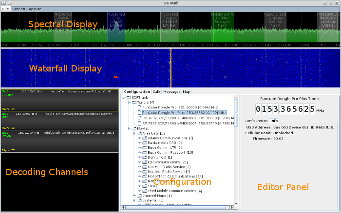

### Application Overview ###

  * [Spectral Display](SpectralDisplay)
  * [Waterfall Display](WaterfallDisplay)
  * [Decoding Channels](DecodingChannels)
  * [Configuration](Configuration)
  * [Editor](Editor)
  * [Calls](CallEvents)
  * [Messages](Messages)
  * [Map](Map)