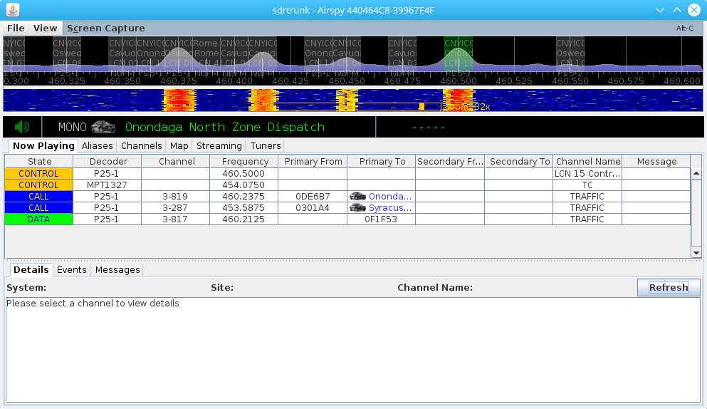
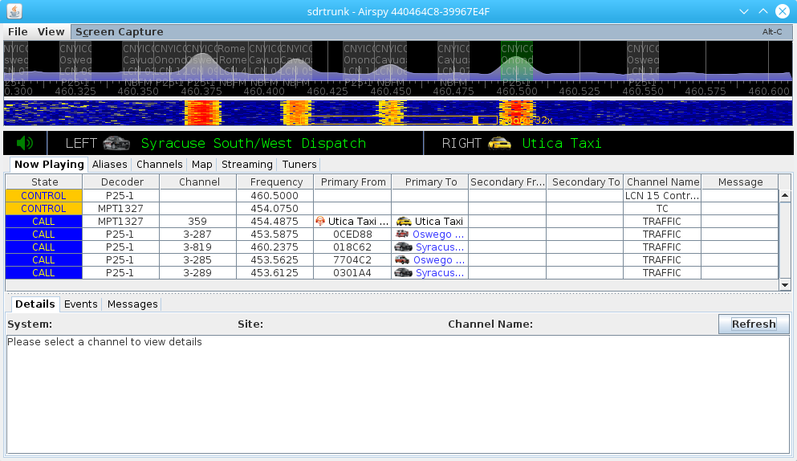
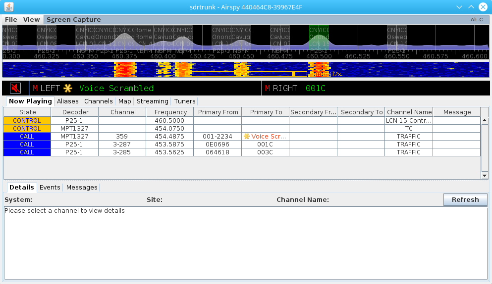

**Version:** 0.3.0

Audio Panel
---

The audio panel controls the audio that is played from the decoding channels to
either your computer speakers or headphones.  Audio from each decoding channel
is automatically routed to the Audio Manager and the audio manager automatically
routes the highest priority audio to the speakers.

Each audio playback channel is automatically started and stopped depending on
audio availability.  Playback channels use an internal buffer to store a 
small number of audio frames before automatically starting playback.  Therefore,
you may experience a slight delay between seeing a call start in the decoder 
window and audio playback starting.  Likewise, you may hear audio playing for a
short period after the decoding channel display indicates that the call has
ended.

Audio priority can be specified for each alias that you create.  If you want 
certain talkgroups or identifiers to have a higher priority for listening, you
can create the [alias](Aliases_V0.3.0), assign the talkgroup(s) or identifier(s) 
and specify a priority.

If a call is in playback over the speakers and a higher priority call comes in,
the higher priority call will be routed and the existing call audio will be 
stopped.

You can override all call priorities defined in the system when you select an
individual decoding channel.  Any audio produced from a selected channel is 
routed with the highest priority for playback.

Audio Playback Device
---

The default audio playback device with mono audio is selected by default.  You
can change the audio playback device and choose the number of playback channels
by right-clicking on the audio panel and use the AUDIO OUTPUT menu to select a
different audio device.

### Mono Audio Playback
You can select mono audio playback to have any playback audio routed to both 
speakers.  The mono audio playback is shown in Figure 1.

**Figure 1:** Audio Playback Panel with Mono Audio

## Stereo Audio Playback ##
You can select stereo audio playback so that you have independent LEFT and RIGHT
audio playback over a stereo audio output.  Each audio channel will be managed
by the Audio Manager and all audio produced by all decoding channels will be
routed to these two channels on a priority basis, as shown in Figure 2.

**Figure 2:** Audio Playback Panel with Stereo Audio

## Master Mute Button ##
The green speaker icon visible in Figure 2 on the audio panel is the master mute 
control.  Click the icon to mute the audio and the icon will turn red as shown
in Figure 3.  Click again, and the audio will unmute and the icon will turn green again.

## Channel Menu ##
Right-click on either the MONO channel, or the LEFT or RIGHT channel to access
the context menu for the channel.  You can independently mute or change the 
audio volume of each channel via this context menu.

## Channel Mute ##
Each channel will show a RED M in the panel when the audio is muted either via
the master mute button, or by the channel mute context menu, as shown in Figure 3.

**Figure 3:** Audio Playback Panel with Muted Audio
