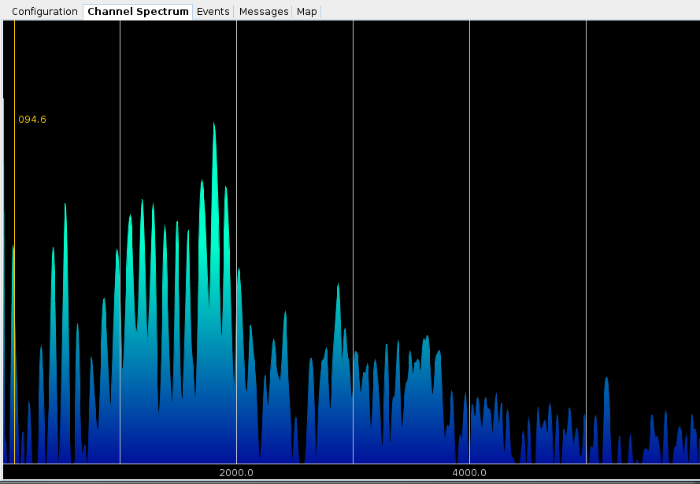

**Version:** 0.3.x

# Channel Spectrum #

The channel spectrum window allows you to view the dynamic frequency content of
the demodulated audio produced from the currently selected decoding channel.  
The demodulated audio is processed with a Discrete Fourier Transform (DFT) 
similar to the Spectral Display.  This display allows you to hover over each of 
the peaks in the audio frequency and a frequency readout is displayed next the 
cursor.

You can use the frequency readout to measure spectral content like CTCSS tones
that may be present in the demodulated audio output.

Spectral display processing only occurs when you have a channel selected and
when the spectral display tab is displayed.  If you have the spectral display
tab displayed and no channels are selected, the display will be empty.

Note: certain decoders like the P25-LSM decoder do not produce demodulated audio
and will not display audio content in the channel spectrum window.  The audio
output from digital voice CODECs is not displayed in this channel spectrum
window.

## Context Menus ##
You can change the color, FFT size, and frame rate of the channel spectrum 
window by right-clicking anywhere in the display and choosing from the menu
options.

