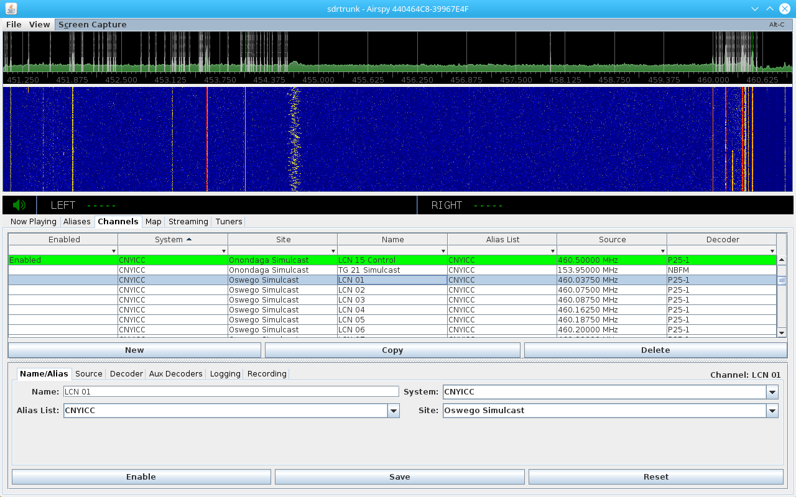
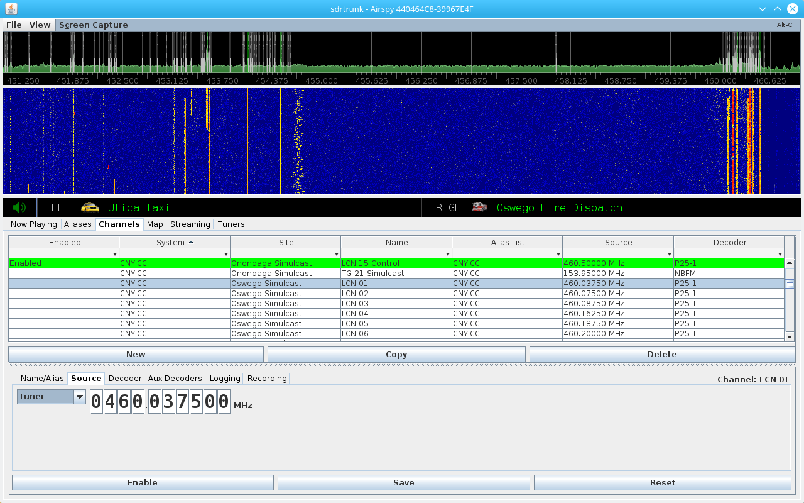
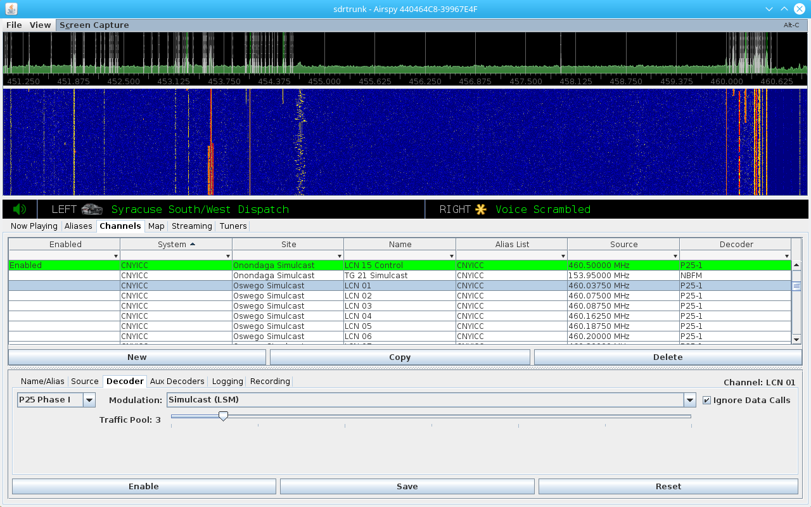
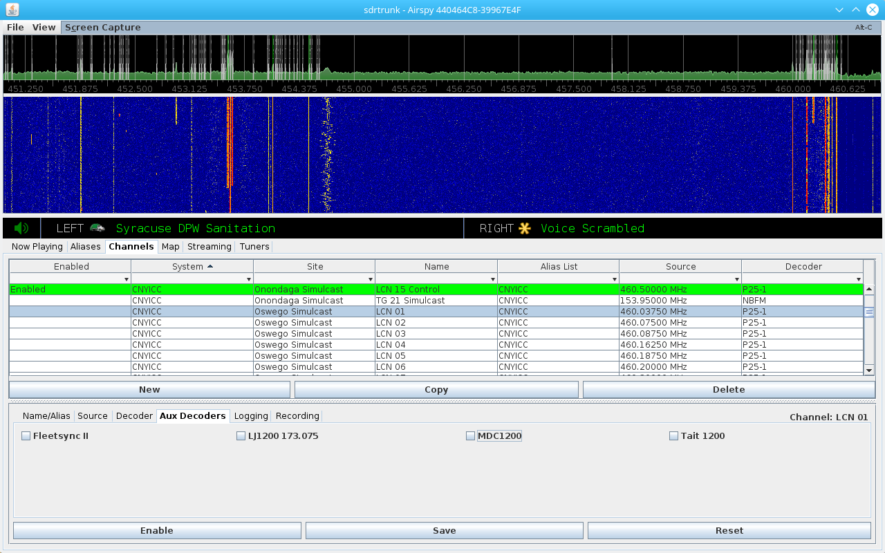
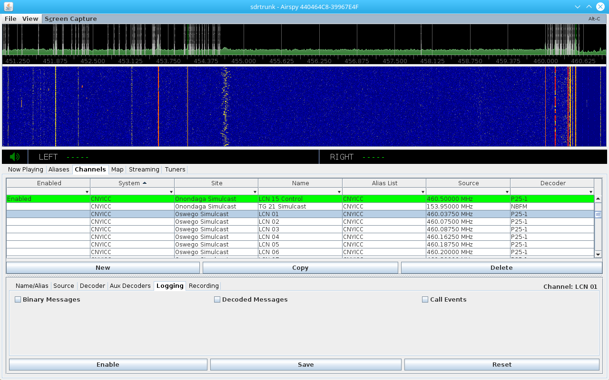
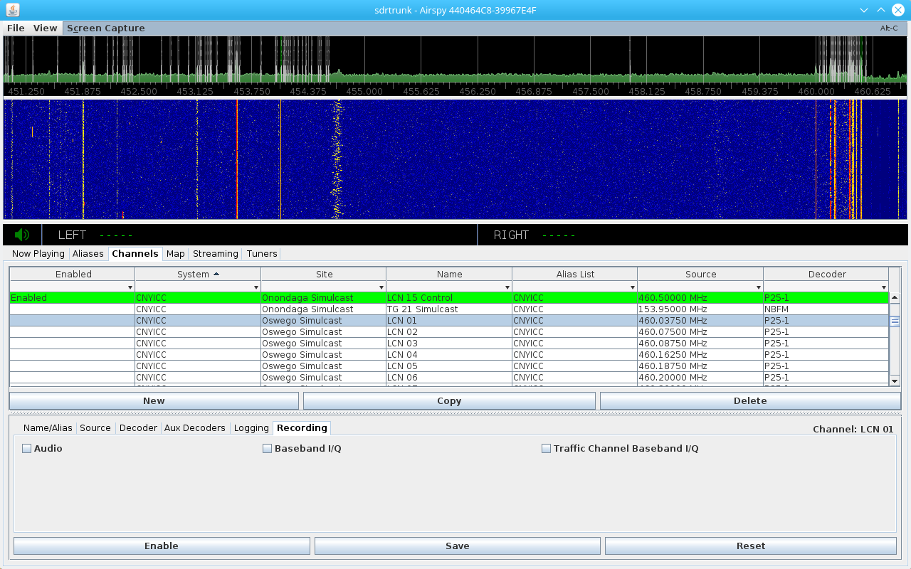

**Version:** 0.3.0 and newer

Channels
---
Channels are configurations that you create for each radio frequency channel that
you want to monitor.  The channel configuration contains the basic information 
needed to tune to a radio channel frequency, attach one or more protocol-specific
decoders, specify an alias list, and setup logging and recording options.

**TIP:** Create channel configurations for all radio channels that you might want to 
monitor.  Click the **Enable** button in the channel configuration editor to start
a channel decoding.  If you shut down the application and restart it later, any
channels that were enabled will automatically start again.

**Figure 1:** Channels Table - Name/Alias Editor

All channel configuration editing and management is accessible in the **Channels**
tab of the application. 

Viewing, Sorting, and Filtering Channels
---

#### Sorting
Click the column name in the channels table to apply alphabetical sorting.  An 
arrow appears to the right of the column name to indicate if the list is sorted 
ascending or descending.  By clicking the column name you can toggle the ascending 
or descending order.

#### Filtering
Each of the columns in the channels table contain a column heading with a drop-down
cell.  In the drop-down menu, you can select from a list of column values to filter 
the list of visible channel configurations.  The top row of the filter drop-down also
supports text and wildcard values for filtering.

You can apply filtering to multiple columns.

Click the top empty row in the drop-down list to remove any filtering that you 
have applied.

**TIP:** Use the **Enabled** column filter to quickly view channels are currently 
decoding. 

#### Viewing
Click on an individual channel configuration row to show the channel configuration
settings in the editor below the table.

Creating, Deleting and Copying Channels
---
Use the three buttons at the bottom of the channels table to create new channels,
copy one or more existing channels, or delete one or more channels.

#### New Button
Click the new button to create a new channel.  The new channel configuration appears
at the bottom of the channel table.  Select the new channel and use the editor
window at the bottom of the screen to configure the channel settings.

#### Copy Button
Select one or more channels that you have already created and click the Copy button
to create duplicate copies of the selected channels.  You can then edit each of the
channel copies individually.  This is a convenient feature when you are creating
many channels that are mostly the same and you only have to change a few settings.

#### Delete Button
Select one or more channels and click the Delete button to remove the selected 
channels from the list.

Channels Table - Editing a Channel Configuration
---
Select one of the channel configurations in the channels table to edit the 
configuration settings.  The following sections explain each of the section tabs
of the channel configuration editor.

#### Enable Button
Once you have created a channel configuration, click the **Enable** button to
start the channel decoding.  The button color will change to green to indicate
that the channel is currently enabled.  Click the button again to disable decoding
for that channel.

#### Save Button

#### Reset Button

Channels Table - Name/Alias Editor
---

The following are settings that can be modified in the **Name/Alias** section tab 
of the channel editor.  The **Name/Alias** editor is shown in Figure 1.

#### Name
The channel name is a textual value that you specify.  This value does not 
affect decoding.

#### Alias List
Choose an alias list name from the drop-down list, or type a new alias list name.
The values in the list are pulled from any [Aliases](wiki/Aliases.md) that you may 
have already created.  

If you type a new alias list name for your channel configuration, be sure to use
that alias list name for any aliases that you create in the [Aliases](wiki/Aliases.md)
table.  When you start your channel decoding, any aliases with the matching alias
list name will be assembled into an alias list for use with the channel.  If you
add new aliases while your channel is currently decoding, they will be automatically
added to the alias list used by your decoding channel if the alias list name
matches the alias list name specified for the channel.

#### System
System is an optional textual value that you can use to manage your set of channel
configurations. By using the System column filter in the channels table, you can quickly filter
down to a related set of channel configurations in the channels table.

**Note:** a planned future enhancement will use the System label to deduplicate
call audio for systems that simulcast a radio call across multiple sites.

#### Site
Site is an optional textual value that you can use to manage your set of channel
configurations. By using the Site column filter in the channels table, you can 
quickly filter down to a related set of channel configurations in the channels 
table.

**Figure 2:** Channels Table - Source Editor

Channels Table - Source Editor
---

The source editor is where you specify the tuner frequency or sound card to 
use as an input to the decoder.  The **Source Editor** is shown in Figure 2.

#### Tuner
Specify a frequency for your channel.  When your channel is enabled, the 
application will automatically select one of the tuners present on your
computer and automatically tune to the channel frequency specified.

#### Sound Card
This optional channel source enables you to feed demodulated audio from an 
external scanner or radio to feed a small subset of decoders.  Decoders that
work with sound card audio: **MPT-1327**, **Fleetsync**, **MDC-1200**, 
**Tait 1200** and **LoJack**.

**Figure 3:** Channels Table - Decoder Editor

Channels Table - Decoder Editor
---
The decoder editor is where you select the _primary_ decoder to use for your
channel configuration.  The **Decoder Editor** is shown in Figure 3.  The application
allows you to specify exactly one primary decoder and one or more auxiliary 
decoders.  See below for details on auxiliary decoders.

Refer to the [Decoders](wiki/Decoders.md) page for details and configuration for each
primary decoder type.

**Figure 4:** Channels Table - Aux Decoders Editor

Channels Table - Aux Decoders Editor
---
The **Aux Decoders Editor** is show in Figure 4.  Use this editor to select one or 
more auxiliary decoders to run in addition to the primary decoder that you have 
selected.  Auxiliary decoders work against demodulated audio to decode in-band 
signalling that may be included in certain radio systems.  These in-band 
signalling types are normally used for radio identification or data/GPS 
transmissions in older analog radio systems.

Refer to the [Decoders](wiki/Decoders.md) page for details and configuration for each
auxiliary decoder type.

**Figure 5:** Channels Table - Logging Editor

Channels Table - Logging Editor
---

The **Logging Editor**, shown in Figure 5, is where you select logging options for
your decoding channel.

#### Binary Messages
This option creates a log file containing a binary (text 0 or 1) representation
of each decoded message.
 
#### Decoded Messages
This option creates a log file containing decoded messages in readable text format.

#### Call Events
This option creates a log file containing the call events and times.

**Figure 6:** Channels Table - Recording Editor

Channels Table - Recording Editor
---

The **Recording Editor**, shown in Figure 6, is where you select recording options for
your decoding channel.

#### Audio
Records all audio and audio calls.

**Note:** you can assign a **Non-Recordable** audio setting to individual aliases
to control which audio is recorded for a channel.  Use wildcards with the 
Talkgroup Alias Identifier to set groups of talkgroups as recordable or non-recordable

#### Baseband I/Q
Records the baseband channel samples.  This recording is not demodulated and
will sound like noise if you attempt to playback this recording.  This format
is used to record the channel for decoding or analysis.

#### Traffic Channel Baseband I/Q
Similar to the Baseband I/Q setting above, this will generate a recording for
each traffic channel that is allocated when you are decoding a control channel
on a system like MPT-1327 or P25.
