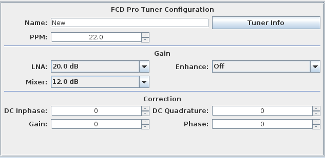

**Version:** 0.3.0

Funcube Dongle Pro Tuner Configuration
---

**Figure 1:** Funcube Dongle Pro Tuner Configuration

The following settings shown in Figure 1 are available for configuring the tuner:

#### Name
Name for the tuner configuration. 

#### Tuner Info Button
Provides a summary of details about the currently selected tuner, including: USB ID, USB address,
USB speed, cellular band block, and Firmware version

#### PPM
Correction value to align the currently tuned frequency with the frequency display values.  Increasing 
the value causes the frequency display to move to the left and vice-versa.

#### LNA
LNA gain setting

#### Enahance
LNA enhance gain setting

#### Mixer
Mixer gain setting

#### DC Inphase
Corrects for DC offset in the Inphase component

#### DC Quadrature
Corrects for DC offset in the Quadrature component

#### Gain
Corrects for Gain error

#### Phase
Corrects for Phase error

**Note:** firmware on the [Funcube Dongle Website](http://www.funcubedongle.com/?page_id=313) 
is identified by a major revision and letter.  Convert the listed firmware minor revision number 
to a letter to identify the correct firmware revision on the funcube website.  For example, 
firmware **18.10** is listed as **18j** on the funcube website.