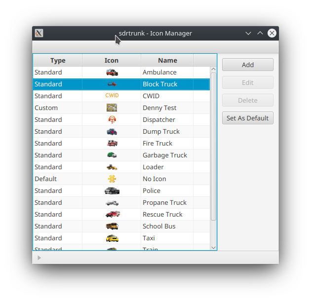
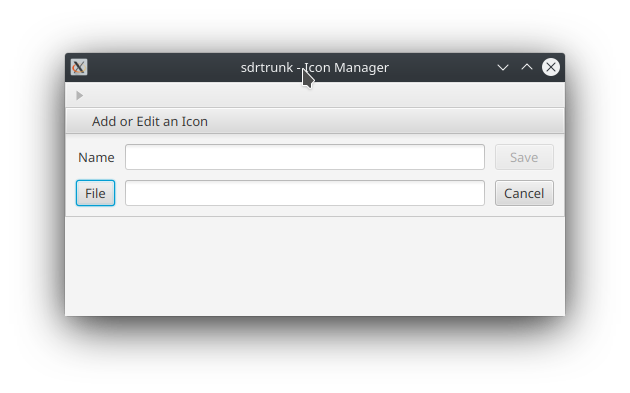

# Icon Manager
Access the Icon Manager from the main application window via the **View** menu.
sdrtrunk provides a set of standard icons that can be used with Aliases (see [Playlist Editor](Playlist-Editor)) to 
display an icon next to talkgroups, individual radios and other identifiers.  You can also add your own custom icons.

These icons are used in the **Now Playing** window in the columns where talkgroups and radio identifiers
are listed.

## Type
The type column indicates the type of icon.
* **Standard** - a standard icon that is part of the sdrtrunk application bundle.
* **Custom** - an icon added by the user.
* **Default** - the default icon to use for all identifiers that do not have an icon specified.

* **Add** - adds a new icon to the list.  Presents a dialog where you select the icon file and the
name to assign to the icon.
* **Edit** - edit a custom icon that you have previously added.  Note: you cannot edit standard icons.
* **Delete** - delete a custom icon that you have previously added.  Note: you cannot delete standard icons.
* **Set As Default** - assigns the currently selected icon as the default icon.

## Add or Edit Custom Icon
Click the **Add** or **Edit** button in the Icon Manager window to add or edit a previously added
icon file.

* **Name** - name for referring to the icon when assigning the icon to various aliases in the Playist editor
* **File** - button to open a file selection dialog for selecting an icon file.
* **Save** - saves the current settings.
* **Cancel** - cancels the add or edit session.

## Icon/Image Formats
You can add icons from a variety of image formats but the PNG image format is optimal.  Your icon 
should have a transparent background so that it blends in with the other elements in the display 
window.

