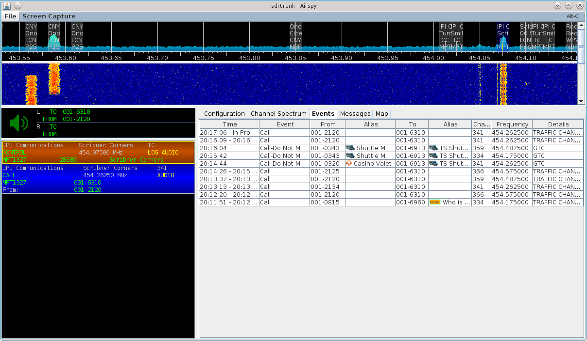

# MPT-1327 #

The MPT-1327 decoder provides decoding of both control and traffic channel 
signaling and trunked traffic channel following.

## Trunked Channel Following ##

Configure the MPT-1327 decoder to process the system control channel and specify
a channel map.  The application will automatically detect call events and 
dynamically create a traffic channel to monitor these calls and end the traffic
channel whenever the channel timeout occurs, or the end of call is detected.

Each system that you monitor may have different call timeouts.  You can change
this timeout from the default 45 seconds to meet your needs.  However, if you
specify a long timeout and the end of call is not detected, you'll have a long
period of static at the end of your calls and recordings.

Specify the maximum number of traffic channels that the decoder can allocate
simultaneously in order to keep total processing to a level that your computer
can handle.  You may have to experiment with this value in order to keep the
application from allocating more channels than your computer can process.  Start
with 1 traffic channel and monitor your computer's CPU and memory to see how it
responds.  Keep increasing the traffic channel count and restart the channel
until you find the maximum number of traffic channels that your computer can 
process and then consider reducing that count by one or two.

## Channel Map ##
You must specify a channel map name in the decoder configuration in order for 
trunked channel following to work. Otherwise, the application does not know 
about the channel number to frequency mapping.  You can run the decoder without
a chanel map against control and traffic channels, however no trunked channel
following will occur.

If you don't know what the [channel map](ChannelMap) is, you can try to find the license
for the system that specifies the frequencies for the system.  Configure an
sdrtrunk channel to monitor each frequency and after successfully decoding a
call, look at the messages tab.  The end of call signaling messages tell the mobile 
radio what channel it is currently on, and what the channel number is for the 
control channel that the mobile radio must return to.  You can use these 
channel numbers to determine the channel map.  If you need help, use the 
radioreference.com forums, or post a help request in the sdrtrunk support group. 
There is also a wiki page on radioreference.com that details how to calculate
the channel map from known frequency to channel number pairings.

## Squelch Control ##

When moniting a control channel the audio is muted.  When monitoring a traffic 
channel, audio squelch is controlled by the call start and call end signaling that
is decoded on the traffic channel.

## Talkgroups ##

The following talkgroups are used in all MPT-1327 systems.  Create an alias 
group containing the following MPT-1327 system idents:

 * `*``*``*`-8185 = System Register
 * `*``*``*`-8190 = System Controller

