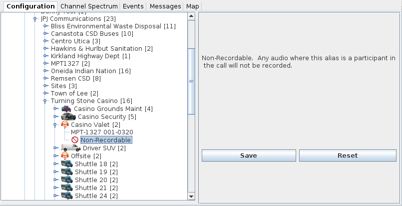

# Non-Recordable #

Any alias can be designated as non-recordable.

Audio recording can be enabled for all calls that occur on the decoding channel.
By using the non-recordable alias setting, you can designate certain aliases
to not be recorded.

When you are initially monitoring a new system, this feature allows you to record
every call.  Then, as you identify each user or group on the system, you can
create an alias for the group and designate the group as non-recordable.  
Eventually, you record fewer groups until you identify all of the users on the 
system.  

