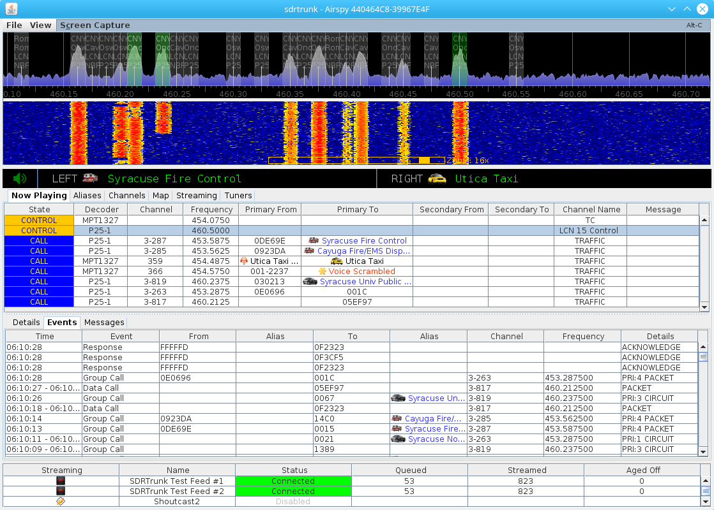
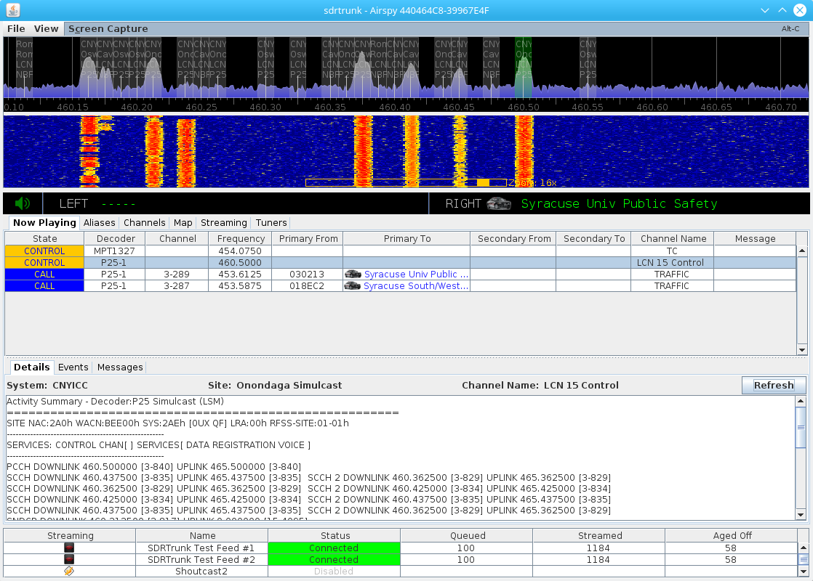
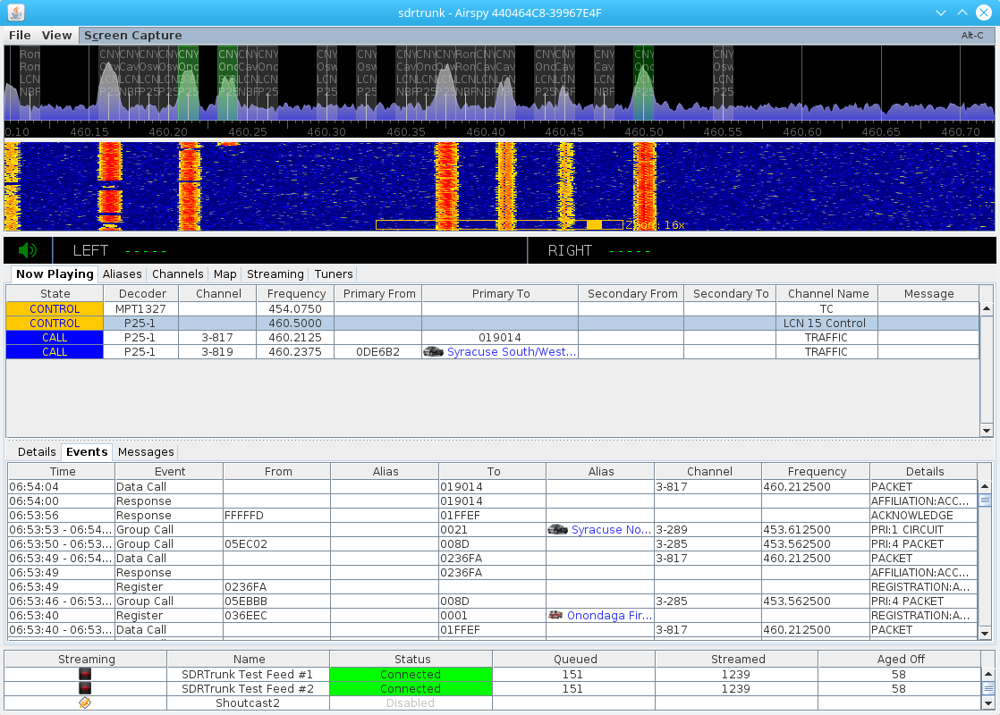
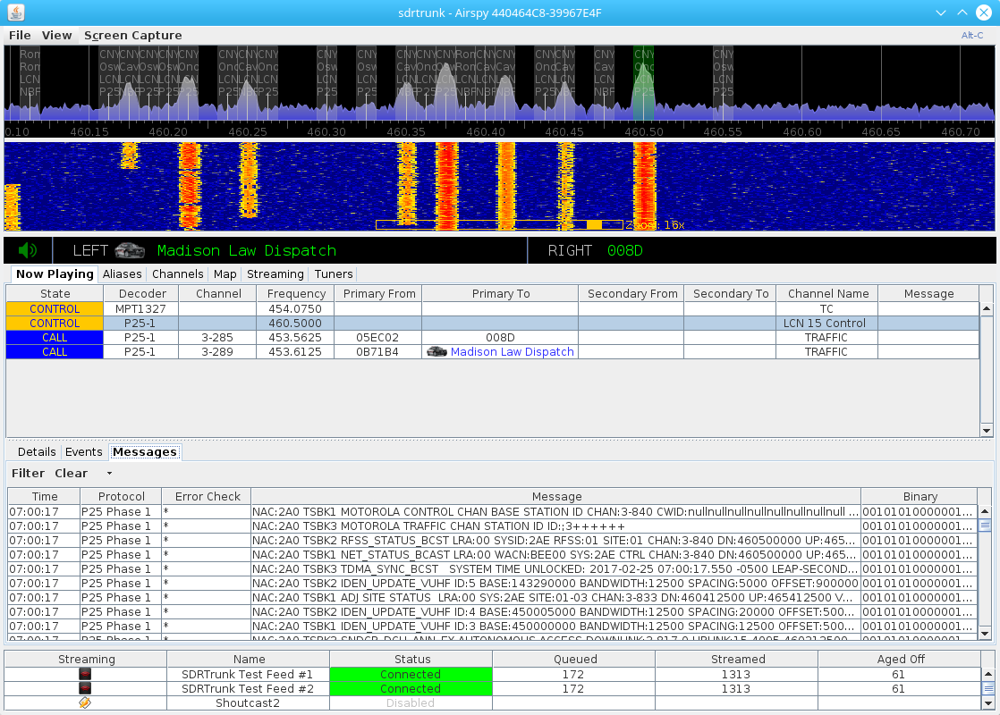

**Version:** 0.3.0 and newer

Now Playing
---
The **Now Playing** tab provides a convenient summary screen to monitor when you
are decoding channels and monitoring audio.  It displays a summary of channels and
provides access to decoding details, messages and call events for each channel.

**Figure 1:** Application Overview with Now Playing tab

Decoding Channel Table
---
The table at the top of the Now Playing screen provides a summary of all channels that you have 
enabled for decoding.  The table contains the following columns:

#### State
Indicates the current state of the channel's primary and secondary decoders:
* **CALL** - a radio call is in progress
* **CONTROL** - a trunked radio control channel is being decoded
* **DATA** - a radio data call is in progress
* **ENCRYPTED** - an encrypted radio call is in progress
* **FADE** - temporary state when a call has ended before changing to IDLE state
* **IDLE** - the decoder is running
* **OVERFLOW** - temporary error when the computer is unable to keep up with the incoming 
data rate.  When this occurs frequently, consider reducing the number of decoding channels
that you have enabled
* **RESET** - temporary state when the decoders are being reset
* **TEARDOWN** - temporary state when a traffic channel call has ended and the channel is 
being removed

#### Decoder
Primary decoder specified in the channel configuration.  Any auxiliary decoders that you have enabled
for the channel will not be displayed here.

#### Channel
Diplays the logical Channel identifier for trunked radio systems.

#### Frequency
Tuned frequency for the channel

#### Primary From
Primary decoder radio or talkgroup identifier for the (FROM) part of a radio call.

#### Primary To
Primary decoder radio or talkgroup identifier for the (TO) part of a radio call.

#### Secondary From
Secondary (auxiliary) decoder radio or talkgroup identifier for the (FROM) part of a radio call.

#### Secondary To
Secondary (auxiliary) decoder radio or talkgroup identifier for the (TO) part of a radio call.

#### Channel Name
Channel name from the channel configuration.  Note: traffic channels that are automatically created
when decoding a trunked radio control channel will display _TRAFFIC_.

#### Message
Any decoded status, GPS, or text message from the Primary and Auxiliary decoders.

Channel Information
---
The lower half of the **Now Playing** screen shows additional information when you select/click on a 
row in the channels table above.

**Figure 2:** Now Playing with Channel Details View

Details View
---
The details view provides summary information from each of the primary and auxiliary decoders
for the channel.  Primary decoder summary information is displayed first and a section is added
to the bottom of the report for each additional auxiliary decoder that is configured for the
channel.

The channel configuration System, Site and Channel name are displayed across the top of the 
detail view.

**Note:** the format of the detail summary report is different for each decoder.

#### Refresh Button
The summary report is generated when you first select a channel and click on the details view.
You can regenerate the report with the latest summary information from the decoders when you
click on the **Refresh** button.

**Figure 3:** Now Playing with Channel Events View

Events View
---
The events view details any events decoded from either the primary decoder or from any of the
auxiliary decoders that may be included in the channel configuration.

#### Time
Timestamp or time range of the event

#### Event
Event description.  

#### From
Identifier of the radio or entity for the FROM part of the event.

#### (From) Alias
Optional alias corresponding to the **From** identifier.

#### To
Identifier of the radio or entity for the TO part of the event

#### (To) Alias
Optional alias corresponding to the **To** identifier

#### Channel
Logical channel identifier for the event

#### Frequency
Channel frequency for the event

#### Details
Message, GPS location, status, or additional details about the event.

**Figure 4:** Now Playing with Channel Messages View

Messges View
---
The channel messages table displays messages being decoded by the primary decoder for the
channel.

#### Time
Time for the message

#### Protocol
Radio protocol being decoded

#### Error Check
Indicates if sections of the message were decoded without errors (*) or if sections of the 
message were corrected (C)

#### Message
Textual representation of the decoded message.

#### Binary
Textual representation of the binary (0 or 1) decoded message.

**Note:**
Viewing the real-time messages decoding adds to the computer's processing workload.  When you 
are viewing the messages, each message is being fully parsed.  When you are not viewing the
message display, the computer is only parsing the minimum information that it needs from 
each message.