## Table of Contents
* [Accessing the Playlist Editor](#access-the-playlist-editor)
* [Playlists](#playlists)
* [Channels](#channels)
* [Aliases](#aliases)
  * [Alias Lists](#alias-list)
* [Streaming](#streaming)
* [Radio Reference](#radio-reference)
  * [Agencies](#radio-reference---nationalstatecounty-agencies)
  * [Trunked Systems](#radio-reference---statecounty-trunked-system)
* [Quick Setup / How-To Guides](#quick-setup-guides)
  * [How To: Create a Playlist Copy](#how-to-create-a-copy-of-your-playlist)
  * [How To: Setup Channels](#how-to-setup-channels)
  * [How To: Setup Aliases](#how-to-setup-aliases)
  * [How To: Record Audio](#how-to-record-audio)
  * [How To: Block (Mute) Audio](#how-to-blockmute-audio)
  * [How To: Setup Audio Streaming](#how-to-setup-an-audio-stream)
  * [How To: Setup Broadcastify Calls](#how-to-setup-broadcastify-calls)
  * [How To: Setup Broadcastify Feeds](#how-to-setup-broadcastify-feeds)
  * [How To: Setup Rdio-Scanner Streaming](#how-to-setup-rdio-scanner-streaming)
  * [How To: Setup OpenMHz Streaming](#how-to-setup-openmhz-streaming)
  * [How To: Assign Aliases to an Audio Stream](#how-to-assign-aliases-to-an-audio-stream)
  * [How To: Login to Radio Reference](#how-to-login-to-radio-reference)
  * [How To: Search Radio Reference](#how-to-search-radio-reference-for-agencies-and-trunked-systems)
  * [How To: Import Agencies from Radio Reference](#how-to-import-agencies-from-radio-reference)
  * [How To: Import Trunked Systems from Radio Reference](#how-to-import-trunked-systems-from-radio-reference)
  * [How To: Import Talkgroups from Radio Reference](#how-to-import-talkgroups-from-radio-reference)
  * [How To: Setup and Use NBFM Squelch](#how-to-setup-and-use-nbfm-squelch)
  * [How To: Use Aliases With NBFM Decoder](#how-to-use-aliases-with-nbfm-decoder)
  
## Overview
Playlists are an essential part of sdrtrunk.  Decoding, channel selection, streaming, aliasing of talkgroups and radio 
identifiers, etc are controlled by playlists.  The playlist editor gives you access to each of these pieces and includes 
fully integrated access to the world-wide database of radio network information at RadioReference.com\*\*.

The playlist editor provides the following components:
* **[Playlists](#playlists)** - manage all of your playlists and select the current playlist
* **[Channels](#channels)** - create channel and decoder configurations and start/stop decoding
* **[Aliases](#aliases)** - create aliases and names for a variety of identifiers like talkgroups and 
radio IDs
  * **[Alias Lists](#alias-list)** - organize your aliases
* **[Streaming](#streaming)** - manage audio streaming and assign aliases to streaming channels
* **[Radio Reference](#radio-reference)**\*\* - online radio system database for easy downloading radio 
systems and talkgroups

\*\*Radio Reference access requires a premium subscription from [RadioReference.com](http://radioreference.com/premium)
***
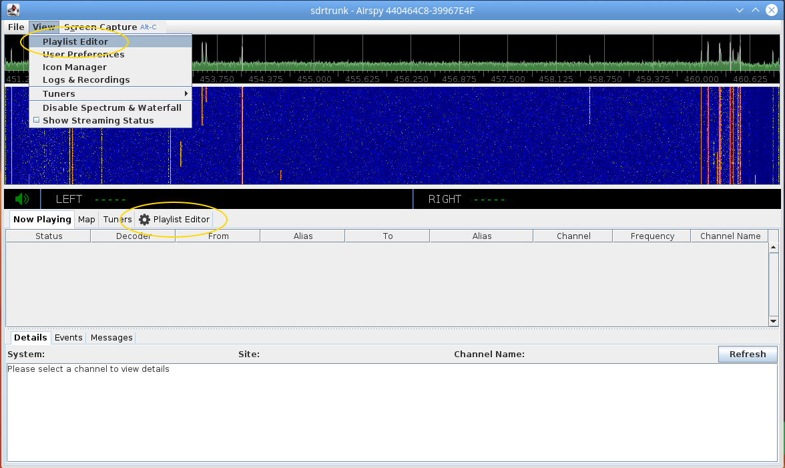
## Access The Playlist Editor in sdrtrunk
* **View Menu** provides a menu option to open the playlist editor
* **Tabs** also has a quick launch tab that opens the playlist editor
***

## Playlists
The playlist tab provides options for managing your playlists.  Only one playlist can be selected (active) at any 
time. A default playlist (**default.xml**) is automatically created for you when you use the software for the first 
time.

The playlist table provides a list of playlist files available to sdrtrunk.  The **Selected** column indicates the 
currently active/selected playlist with a green checkmark.

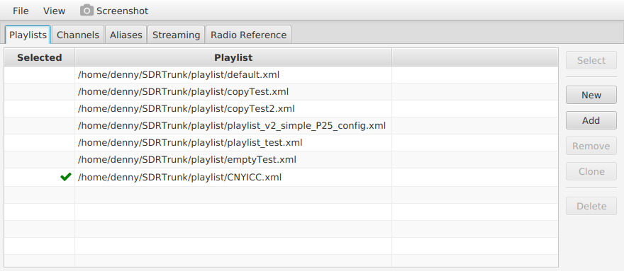

### Playlist Manager Buttons
* **Select** - makes the selected playlist the active playlist.  This will unload the current playlist and load the 
selected playlist.  Any actively decoding channels will be stopped.  All channels, aliases and stream configurations 
from the current playlist will be removed and the channels, aliases and stream configurations for the selected playlist 
will be loaded.
* **New** - creates a new empty playlist.
* **Add** - adds a playlist to the editor.  Use this button to add other playlists to the editor that are in different 
folders than the sdrtrunk playlist folder.
* **Remove** - removes the currently selected playlist from sdrtrunk.  This does NOT delete the file.
* **Clone** - creates a complete copy of the currently selected playlist.
* **Delete** - removes the currently selected playlist from sdrtrunk AND deletes the file from the file system.
***

## Channels
The channels tab lists the channel configurations for the currently selected playlist.  A channel configuration has
the details needed to set up a decoder for a channel to include logging and some recording settings.  

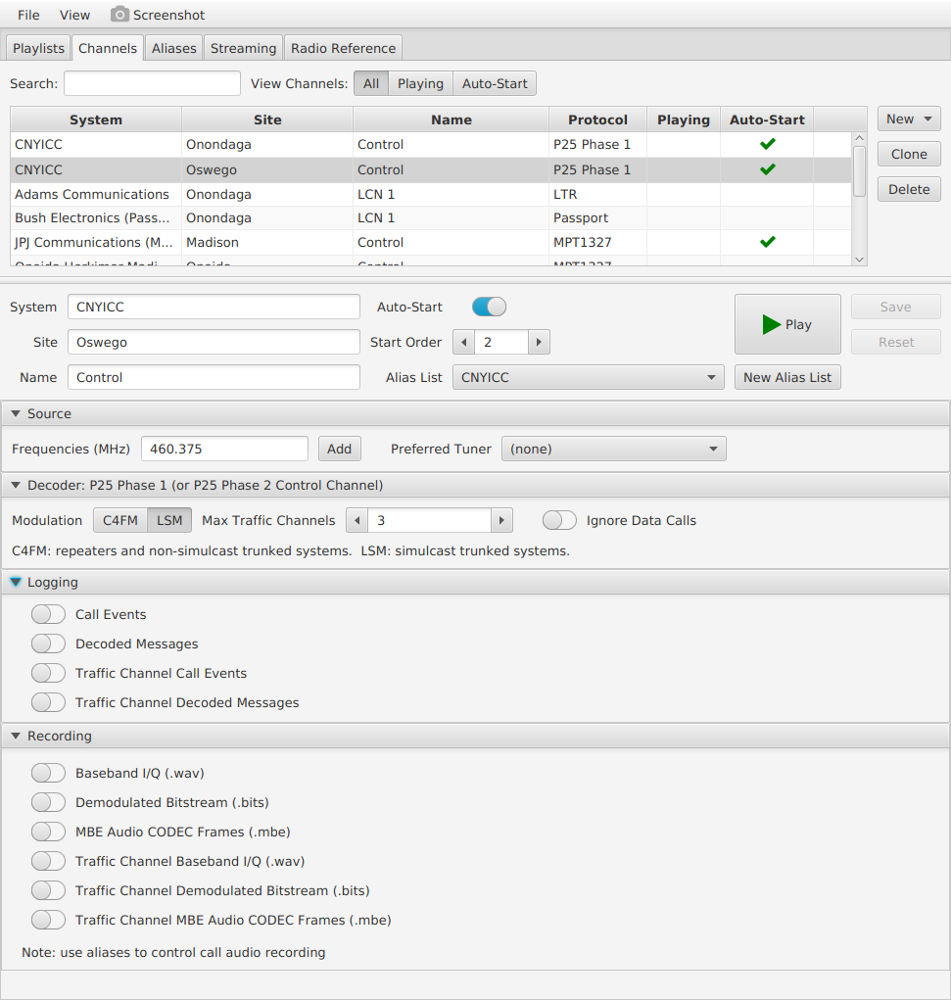

### Channel Search and Filter
The channel editor provides a search option and a set of filter buttons to quickly find channels in the channels table.

#### Search Box
Type any characters in the search box and the channels table will be filtered to show the matches.  The search characters
will be matched against values in the system, site, name and protocol fields.

#### Channel Filter Buttons
* **All** - shows all channel configurations
* **Playing** - shows channel configurations that are currently playing
* **Auto-Start** - shows channels that are configured to auto-start on application startup

### Channel Editor Buttons
* **New** - creates a new channel configuration.  You must select a protocol decoder type.
* **Clone** - creates an exact copy of the currently selected channel configuration.  This is convenient for when you
have a channel configuration setup and simply need to create another channel with all of the same settings, so that 
you can use a different frequency.
* **Delete** - deletes the currently selected channel.  If the channel is currently processing, it prompts you to stop
the channel.
***
### Channel Item Editor
Below the table of channel configurations is the channel item editor that is used for configuring individual channels.
Select a channel configuration in the channels table to load it into the channel item editor.

#### Channel Item Editor - General Section
* **Alias List*** - identifies the alias list that will be used for the channel.  The alias list contains the 
aliases and identifiers that will be assigned for any calls or events produced during decoding of the channel.
* **Auto-Start** - designates the channel to automatically play when the application starts up.
* **Name** - edits the channel name.
* **New Alias List** - creates a new alias list for the channel.  Note: the alias list name is limited to 25 characters.
* **Play/Stop** - starts the channel configuration decoding.  This button changes between play and stop, providing 
control over playing the channel.
* **Reset** - reloads the channel configuration into the editor and throws away any changes that you've made
* **Save** - saves any changes that you have made to the channel configuration
if the channel is currently playing.
* **Site** - edits an optional the site label.  The site label allows you to group channel configurations
that belong to the same site location.
* **Start Order** - designates the startup order for auto-start channels
* **System** - edits an optional system label.  The system label allows you to group channel configurations that
belong to the same radio system or network.

#### Channel Item Editor - Source Section
* **Frequencies** - identifies the channel frequency to be decoded.
**Note** some decoders (P25, MPT-1327) allow you to specify multiple frequencies.  If the decoder supports multiple
frequencies, you'll see an **Add** button that allows you to add additional frequency values.
* **Add** - creates an additional frequency field for you to specify additional frequency values.  You can click the 
**Add** button multiple times to create as many fields as you need.
* **Remove** - removes an additional frequency field when you have specified more than one frequency value.
* **Preferred Tuner** - optionally designates a preferred tuner to be used for the channel when the channel starts.
There is no guarantee that this tuner will be used.  If the tuner can tune the channel's frequency, then it will be
used.  Otherwise, the next available tuner will be used.

#### Channel Item Editor - Decoder Section
This section provides different editor configurations depending on the protocol that is selected for the channel.

##### AM Decoder
The AM decoder has no additional settings.

##### APCO25 Phase 1 Decoder (and APCO25 Phase 2 Trunked Systems)
* **Ignore Data Calls** - tells the decoder not to create traffic channels for data calls.
* **Max Traffic Channels** - this value places a limit on the maximum number of traffic channels that sdrtrunk will
create when it is decoding a trunked system so that sdrtrunk doesn't create more processing workload than your computer
can handle.  This value defaults to three.  You can set this equal to the number of repeater channels identified for 
the site, if your computer has enough processing power to decode all of those channels at the same time.  
* **Modulation** - select the modulation to decode: C4FM or LSM.  Use C4FM for P25 repeaters and non-simulcast trunked
systems.  Use LSM for trunked P25 systems that are configured for simulcast.

##### APCO25 Phase 2 Decoder - Individual Channels
***Note: all APCO25 Phase 2 systems use an APCO25 Phase 1 control channel***.  Use a Phase 1 decoder for the Phase 2 
system and sdrtrunk will automatically create the Phase 2 traffic channels for you.  However, if you want to listen to 
the Phase 2 channels individually, you must supply the descramble settings for the channel.
* **WACN** - wide area communications network (WACN) for the P25 network
* **System** - system identifier
* **NAC** - network access code

##### LTR Decoder
* **Direction** - choose which side of the repeater you want to monitor, either the input side (mobile radio to repeater),
or the output side (repeater to mobile radio).  ISW = input, OSW = output

##### LTR-Net Decoder
* **Direction** - choose which side of the repeater you want to monitor, either the input side (mobile radio to repeater),
or the output side (repeater to mobile radio).  ISW = input, OSW = output

##### MPT-1327 Decoder
* **Channel Map** - select a channel map to use for the system
* **Channel Map Editor** - create or modify channel maps to use with the MPT-1327 decoder
* **Call Timeout Seconds** - maximum length of time to allow a traffic channel to decode.  Normally, the traffic 
channel will broadcast signalling that indicates that the traffic channel is no longer being used.  If that signalling
is not decoded correctly, this timeout value will automatically tear-down the channel.
* **Max Traffic Channels** - this value places a limit on the maximum number of traffic channels that sdrtrunk will
create when it is decoding a trunked system so that sdrtrunk doesn't create more processing workload than your computer
can handle.  This value defaults to three.  You can set this equal to the number of repeater channels identified for 
the site, if your computer has enough processing power to decode all of those channels at the same time.  

##### NBFM Decoder
* **Channel Bandwidth** - specifies the bandwidth of the FM channel.  Most channels use bandwidth of 12.5 kHz.
* **Squelch Threshold** - specifies the threshold (-100 to 0) in decibels for the power squelch.  Set this value to just above the current noise floor.
* **Talkgroup To Assign** - a static talkgroup number (1 - 65535) to assign to the audio segments generated from this channel.  This enables you to use all of the alias features (recording, streaming, etc.) with NBFM audio segments. 

##### Passport Decoder
The passport decoder has no additional settings.

#### Channel Item Editor - Additional Decoders Section
Additional decoders decode additional digital signalling that is sometimes transmitted in the audio of a channel.  These
decoders are only available for select channel protocols like NBFM, LTR and LTR-Net.

* **Fleetsync** - decodes Fleetsync II ANI and GPS data bursts
* **LJ1200** - decodes LoJack data bursts on frequency 173.075 MHz.
* **MDC1200** - decodes MDC-1200 ANI data bursts
* **Tait 1200** - decodes Tait ANI and GPS data bursts

#### Channel Item Editor - Logging Section
* **Call Events** - records each of the events produced by the decoder and displayed in the Events tab of the Now 
Playing window
* **Decoded Messages** - records each of the messages produced by the decoder and displayed in the Messages tab of the
Now Playing window
* **Traffic Channel Call Events** - records decoded events for traffic channels.
* **Traffic Channel Decoded Messages** - records decoded messages for traffic channels.

#### Channel Item Editor - Recording Section
**Note:** aliases control audio recording for most of the decoders.  See the *Aliases* section for more details. 

* **Baseband I/Q (.wav)** - records the raw channel sample data 
* **Demodulated Bitstream (.bits)** - records the demodulated bits produced by the decoder.  This is only available for
certain decoders.
* **MBE Audio CODEC Frames (.mbe)** - records the AMBE and IMBE audio codec frames to a text file using JSON format. 
Ths is ony available for certain decoders (P25)
* **Traffic Channel Baseband I/Q (.wav)** - same, for traffic channels.
* **Traffic Channel Demodulated Bitstream (.bits)** - same, for traffic channels.
* **Traffic Channel MBE Audio COCDE Frames (.mbe)** - same, for traffic channels.
***

## Aliases
Aliases provide a powerful way to assign textual meaning to a variety of numbers and identifiers you encounter in radio 
communications like talkgroups and radio IDs.  You can assign aliases to multiple sets of identifiers and identifier
value ranges.  For example, if you want to alias an entire fire station and all of their radios, you can create an 
alias and add the talkgroup for the fire station and also add each of the individual radio IDs used by the members of
the fire station.

Aliases can be coupled with responses and actions such as recording, streaming or muting audio for the alias.  Alias
actions allow you to specify responses that should happen when the alias is active, such as Beep the computer, play
a sound clip, or run a computer script where your imagination is the only limit to the scope of the response.

### Alias List
Aliases are organized in sdrtrunk using a concept of alias lists.  An alias list groups a set of aliases and indicates
that each of those aliases will be used as a set.  When you setup a channel configuration for decoding, you can then
select the alias list name to use for that channel.  Each of the aliases that belong to the alias list will then be used
by the decoder channel to assign meaning, responses and actions to identifiers generated during decoding.

You normally create one alias list for each channel configuration in your playlist.  However, if you have several
channel configurations that are all part of the same system, you can share a common alias list across all of these 
channels.  Alias lists provide a convenient way to organize your aliases and assign them to your channel configurations.

There are three ways to view and edit aliases:
* **[View By: Alias](Playlist-Editor#view-by-alias-editor)** - view aliases in an alias list and edit individual aliases.
* **[View By: Identifier](Playlist-Editor#view-by-identifier-editor)** - view each of the identifiers and aliases, 
sorted by identifier, for an alias list.  This view allows you to look at aliases from an identifier perspective so 
that you can see which identifiers (e.g. talkgroups)
are mapped to each alias.
* **[View By: Record](Playlist-Editor#view-by-record-editor)** - quick editor to turn on/off recording for aliases in 
an alias list.
***

### View By Alias Editor
This editor provides a list of aliases in an alias list and allows you to select identifiers, control audio recording,
streaming, and listening priority and assign actions to the alias.

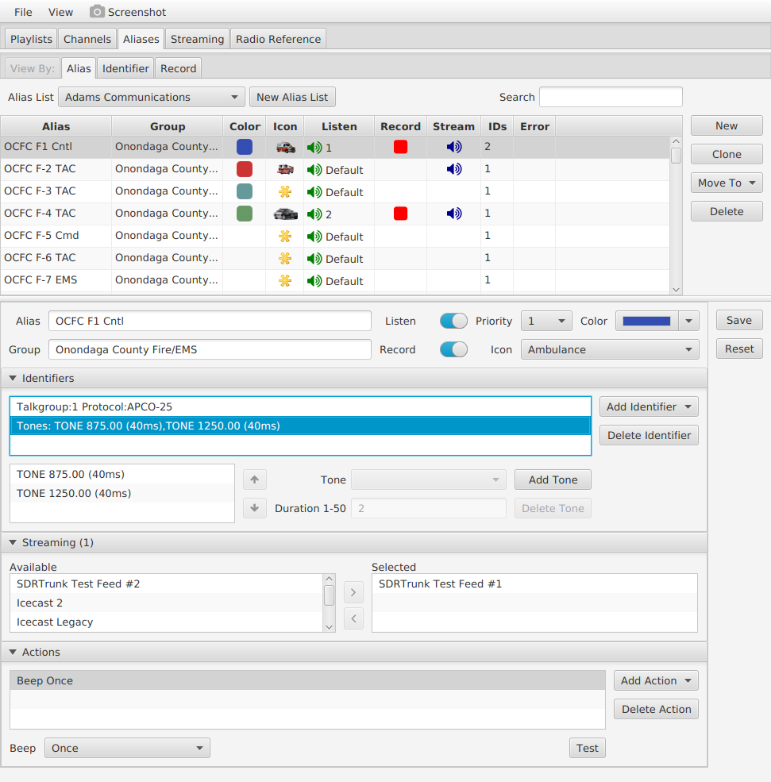

#### Alias List
Select an alias list to view the aliases.  Click the **New Alias List** button to create a new alias list.

#### Search
Type any characters and the list of aliases will be filtered to the aliases that match your search text.  The search
will match against the alias name and alias group values.

#### Create and Delete Alias Buttons
* **New** - creates a new alias
* **Clone** - creates a copy of the currently selected alias.  This is convenient when you have an alias setup just
the way you want (ie color, record, priority) and you want to use it as a template to create another aliase.
* **Move To** - moves the currently selected alias to another alias list.  Click the button and choose from the
alias lists.  The selected alias will be moved to that alias list.
* **Delete** - deletes the currently selected set of aliases.  Use Shift and Control while clicking additional aliases 
to select multiple aliases to delete.

#### Alias Editor - General Section
* **Save** - saves any changes to the alias configuration
* **Reset** - reloads the alias configuration into the editor, ignoring any current changes.

* **Alias** - the name or label to use for the alias
* **Color** - specifies a color to use for coloring the alias name
* **Group** - an optional label that allows you to designate multiple aliases as belonging to the same group.  This
allows you to search for aliases by the group name.
* **Icon** - specifies an icon to include with the alias label.
* **Listen** - controls listening to audio for this talkgroup.  Set to **off** to turn off monitoring for the alias.
* **Priority** - controls the listening or monitoring priority: 1 = highest, 99 = lowest.  Note: you do not have to
specify a priority.  The default priority, when not specified, is 100 (lowest).

#### Alias Editor - Identifiers Section
* **Add Identifier** - adds a new identifier to the alias.  Select from the list of protocols and the identifier types
that are available for each protocol.
* **Delete Identifier** - deletes the selected identifier from the alias.

##### Talkgroup and Talkgroup Range
Identifies a talkgroup or a range of talkgroups to match for the alias. This is typically the TO identifier in a 
radio call

##### Radio ID and Radio ID Range
Identifies a single radio or a range of radios.  This is typically the FROM identifier in a radio call.

##### Fully Qualified Radio and Fully Qualified Talkgroup
These alias identifiers are used with APCO25 systems where an ISSI patch allows a remote system user to roam onto the
local system and to avoid having an identifier collision between the roaming radio and the local radio identifiers,
the system uses a fully qualified ID (wacn.system.radioID).  When you see fully qualified values appearing in the 
sdrtrunk calls view, you can use these alias identifiers to correctly alias these roaming/remote users. 

##### User and Unit Status
Identifies a numeric user or unit status.  When individual radios transmit a status, they use a numeric value.  The
radio network defines a meaning for each of these number values and this meaning is not available to sdrtrunk.  If you
know that user status 1 is assigned a meaning of 'Need Assistance', then you can create an alias, assign a user status
identifier of 1, and then create a Beep alias action so that sdrtrunk will beep every time a radio transmits a 
status of 1.

##### Audio Tones
The AMBE audio CODEC used on certain radio networks (P25 Phase 2) can transmit special tone frames instead of audio
when the system is sending tones instead of voice.  These can be used for Knox tones, Tone-outs, 2-tone paging, etc or 
dialing DTMF telephone digits, or for simple telephone sounds like ringing or a busy signal.  Use the Audio Tones
identifier to specify a sequence of tones to match an alias.  For example, you can create an alias and define an
audio tone identifier for a 2-tone page sequence of 1000 Hz followed by 2000 Hz.  Then, you can create an alias 
action to notify you that the paging tone was transmitted.

Note: specify a sequence of tones and tone duration to match.  The AMBE audio CODEC uses audio and tone frames that
are each 20 milliseconds long.  Specify each tone duration in units of 20 milliseconds.  The duration value is a 
minimum value.  In order to match correctly, the transmitted tone must be longer than the duration specified.  Use a
duration value that is long enough to avoid false matches.  The decoder will combine all tones decoded during the 
call as a sequence of tones and tone durations.  The identifier will match any of those tones in the sequence that
have the correct tones, in the proper sequence, with at least the specified minimum duration each.

For example, a system transmits three 2-tone sequences to activate 3 fire stations: 1000/500, 875/1250, and 1625/1406.
You create a tone identifier of 875/1250.  This will match the middle sequence of tones.  Another example would be
matching a radio user calling a landline telephone number 555-1212.  Create a tone identifier for this sequence of DTMF 
digits in order to match the alias and trigger an alias action.

##### LoJack Function and Id
Used to identify specific LoJack functions and identifiers for the LoJack audio decoder

#### Alias Editor - Streaming Section
This section controls streaming for call audio that matches the alias.  Select from the **Available** list of 
streams and use the right arrow to move the stream to the **Selected** stream list.  If you no long wish to stream the
alias, select the stream to remove in the **Selected** stream list and use the left arrow to move it back to the 
**Available** stream list.

**Note:** use the Streaming tab to create and manage audio stream configurations.  Once created, those configurations
will appear in the **Available* stream list box.

#### Alias Editor - Actions Section
This section defines actions that you can assign to an alias so that when an aliased identifier is active in the 
decoder messaging or involved in an audio call, these actions will fire.

* **Add Action** - create a new alias action
* **Delete Action** - delete the selected action

##### Audio Clip Action
Plays the audio clip

##### Beep Action
Beeps the computer

##### Script Action 
Runs the specified script.

##### Options - Once
Performs the action once and never again until after the software is restarted.

##### Options - Once, Reset After Delay
Performs the action once.  Resets after the specified delay.

##### Options - Until Dismissed
Performs the action repeatedly until the user clicks the OK button in the dialog that appears.

##### Test
Test the action configuration to ensure it operates correctly.
***

### View By Identifier Editor
This editor provides a filtered list of identifiers and alias so that you can see all of the identifiers of each type
 and how they are mapped to each of the aliases.

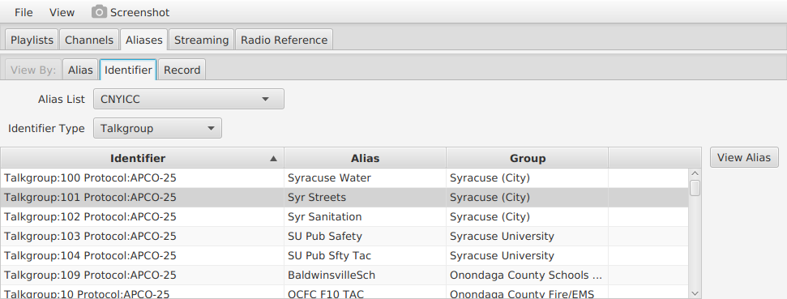

* **Alias List** - select the alias list to view
* **Identifier Type** - select the identifier type to view
* **View Alias** - opens the selected alias in the **View By Alias** editor
***

### View By Record Editor
This editor provides easy management of alias recording.

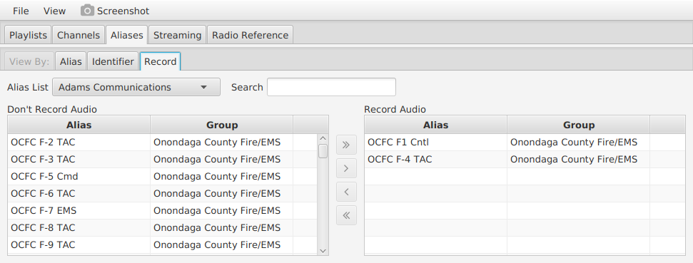

* **Alias List** - select the alias list to view
* **Search** - type characters to search both the record and don't record lists.  The search text matches either the 
alias name or the alias group in both lists.
* **Arrow Buttons** - allow you to move aliases between the record and don't record lists.  You can select multiple
aliases by using the Shift or Control keys in combination with mouse clicks.
***

## Streaming
This tab is for creating audio streaming configurations and selecting aliases for individual audio streams.  At the 
top of the tab is a table of stream configurations and buttons for creating or deleting.

* **New** - create a new streaming configuration by selecting from a list of supported audio streaming server types.
* **Delete** - deletes the selected streaming configuration.

**NOTE**: use the **Radio Reference** tab to login to radioreference.com before you attempt to create any Broadcastify
feeds.

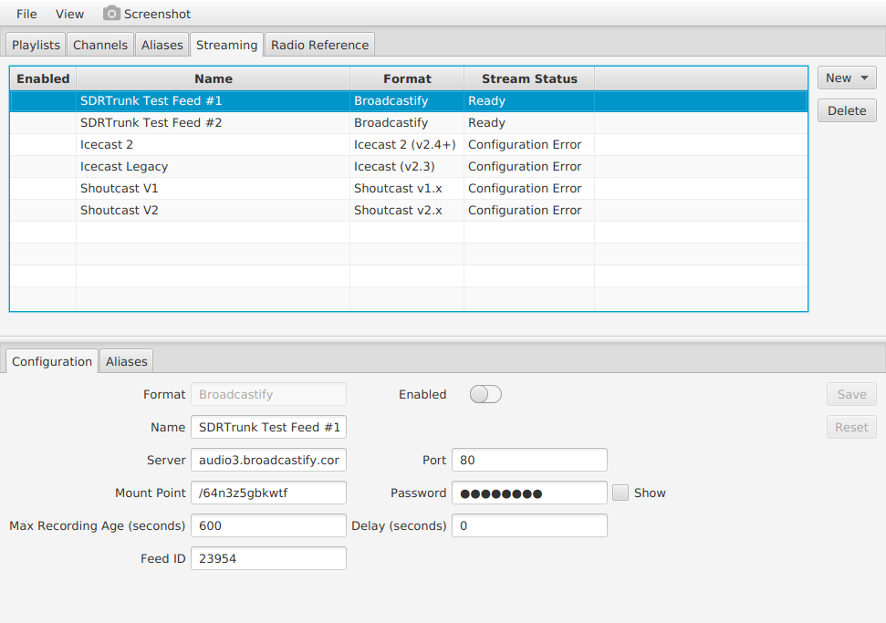

### Streaming - Configuration Editor
* **Enabled** - enables or turns on the stream.  When enabled, sdrtrunk will connect to the remote streaming server and
immediately begin streaming silence.  When decoding channels, audio calls will be queued for the stream when the call
identifiers match any aliases that are designated for the audio stream.
* **Save** - saves changes to the current stream configuration.
* **Reset** - reloads the stream configuration into the editor, ignoring any changes that were made to the configuration.

The editor contains various additional fields required for each of the audio streaming server types.

### Streaming - Aliases Editor
The aliases tab provides easy control over selecting aliases for an audio stream.  Aliases in the **Available** list are 
available to add to the stream.  Aliases listed in the **Selected** list are the aliases that are currently selected for
the stream.  Use the left/right arrow buttons to select aliases to stream or to remove aliases that are currently
selected for streaming.

* **Search** - search for aliases by alias list, group, or name.  When you type characters in the search box, both 
the available and selected lists are filtered to aliases that match your search text.
* **Available** - aliases available for streaming
* **Selected** - aliases that will be streamed
* **Arrow Buttons** - select alias(es) in either list and use the arrow buttons to move to the other list.  Use the 
Shift or Control keys in combination with mouse clicks to select multiple aliases.
***

## Radio Reference
The radio reference tab provides access to radio system and talkgroup details contained in the 
[RadioReference.com](https://www.radioreference.com/premium/) online database.  
**Note:** access to this database requires a premium subscription.

* [Login](#radio-reference---login)
* [Overview](#radio-reference---overview)
* [Trunked Radio Systems](#radio-reference---statecounty-trunked-system)
  * [System View](#radio-reference---trunking-system-view)
  * [Talkgroup View](#radio-reference---trunking-talkgroup-view)
***
  
### Radio Reference - Login
The Login button is located in the upper-right corner of the playlist editor tab.  Click the button to open the login 
window.

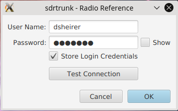

* **User Name** - user name for RadioReference
* **Password** - password for RadioReference  
* **Show** - shows the password or displays asterisks to hide the password (*)
* **Store Login Credentials** - stores your username and password on your computer and will automatically login to 
RadioReference each time you launch the software.  
**WARNING** if you choose this option, your login credentials will be
stored on your computer to your local user profile using clear plaintext without any protection or encryption.
* **Test Connection** - tests to determine if the user name and password are valid and the premium account subscription
is not expired.
* **Cancel** - closes the login dialog without making any changes
* **OK** = closes the login dialog and attempts to login with the user name and password.
***

### Radio Reference - Overview
The top of the radio reference editor tab provides user account information, a login button, and three dropdown boxes
allowing you to select **Country**, **State** and **County** filters.  As you change each filter, the other filters 
will reset to display new options.  For example, if you change the Country filter, the State filter will update with
the states for that country, and the County filter will be cleared until you select a new state.

The radio reference editor stores the filters and systems or agencies that you last access so that these same values
are selected and restored each time you launch the playlist editor.

Below the Country, State and County filters are tabs to display the search results for trunked systems and agencies at 
each of the National, State and County levels.

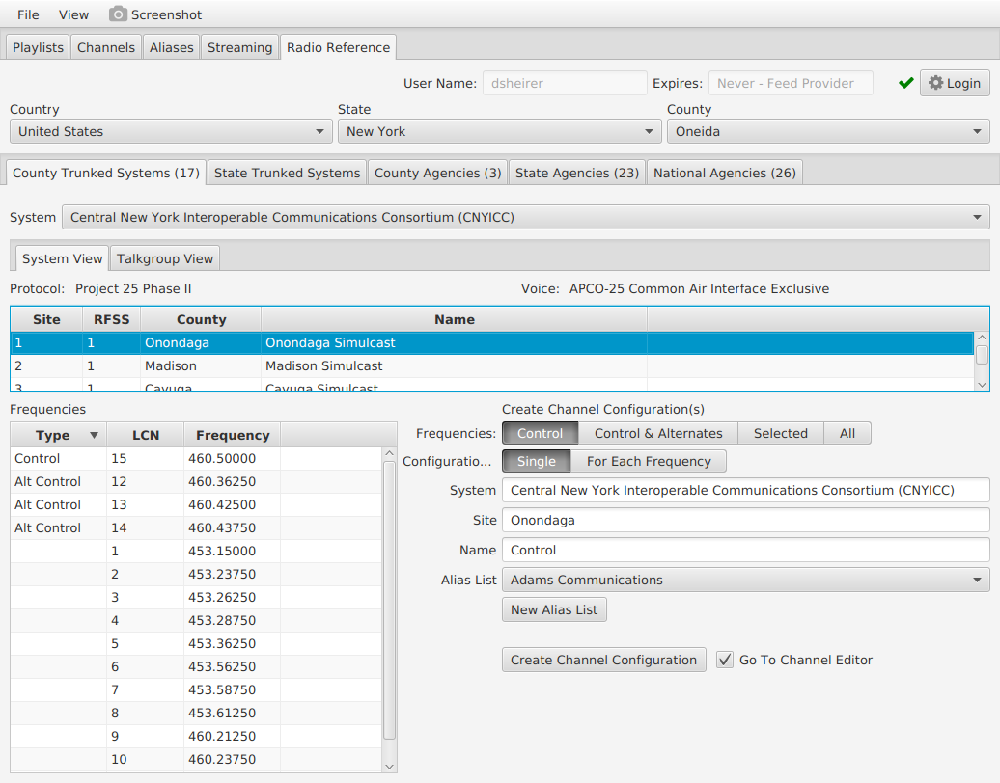
***

### Radio Reference - State/County Trunked System
These trunked system tabs show the search results for the currently selected Country, State and/or County filters. 

* **System** contains the trunked radio system search results.  The system drop-down box (see graphic below) lists each 
system and protocol and uses icons to indicate if sdrtrunk supports the system protocol (**green** checkbox) or if 
sdrtrunk doesn't support the protocol (**red** circle-slash).  When you select a trunked radio system from the list, 
the editor updates the **System View** and **Talkgroup View** tabs with site channel and talkgroup details for the system.

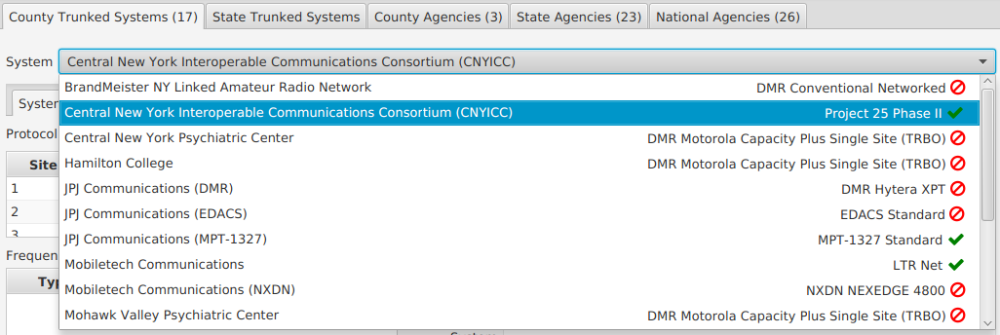
***

### Radio Reference - Trunking System View
This view provides details about the sites, channels and frequencies for the trunked radio system.  It allows you to 
easily create sdrtrunk channel configuration(s) to monitor each site and channel.

* **Sites Table** shows a list of sites for the selected trunked system.  Select one of the rows to see the site 
details and channel frequencies.

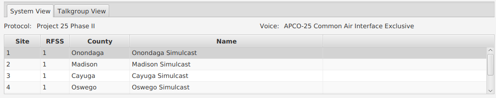

* **Channel Configuration Editor** allows you to select one or more site channels/frequencies and create an sdrtrunk
channel configuration that you will use to decode the site.

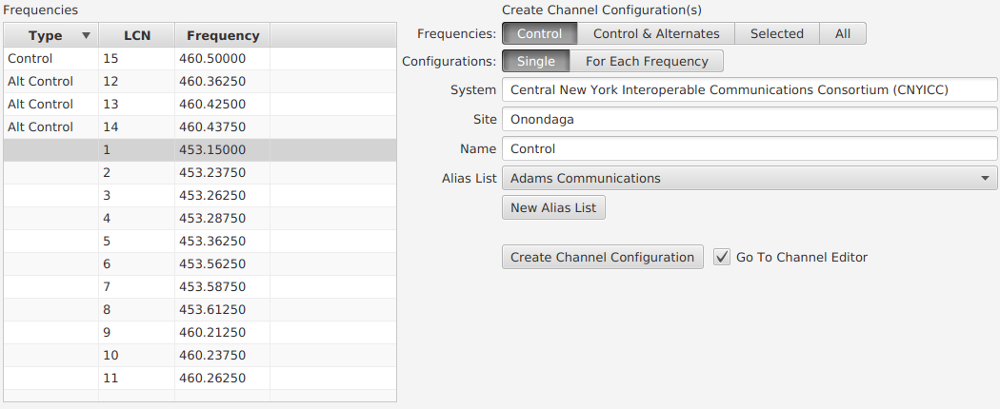

The left side of the channel configuration editor contains a table of channel frequencies and channel 
types.  **Control** indicates a control channel and **Alternate** indicates an alternate control channel.  

The editor on the right side has options you select to create a channel configuration for use in sdrtrunk.  The editor
automatically selects the optimal combination of **Frequencies** and **Configurations** for the system
that you've selected.  However, you may have to change these values depending on the system.

* **Frequencies** choose from types of channels to select from the frequencies table where:
  * **Control** selects only the control channel
  * **Control & Alternates** selects both the control channel and each of the alternate control channels
  * **Selected** uses the channel(s) that you select from the table.  Use shift or ctrl key in combination with mouse 
  clicks to select multiple channels
  * **All** selects all channels listed in the table
* **Configurations** specifies how many channel configurations to create:
  * **Single** combines all frequencies into a single channel configuration
  * **For Each Frequency** creates a channel configuration for each frequency
* **System** for the channel configuration.  Use the pre-filled value, or type your own.
* **Site** for the channel configuration.  Use the pre-filled value, or type your own.
* **Name** for the channel configuration.  Use the pre-filled value, or type your own.
* **Alias List** to use with this channel.  
**NOTE:** an alias list name is required and it must match the alias list name that you select for each of the aliases 
that you want to associate with this channel
* **New Alias List** button to create a new alias list to use with this channel.
* **Create Channel Configuration** creates a channel configuration and adds it to the Channels tab.
* **Go to Channel Editor** when checked, automatically takes you to the Channels tab when you click the create button, 
with your new channel configuration selected in the channel editor.
***
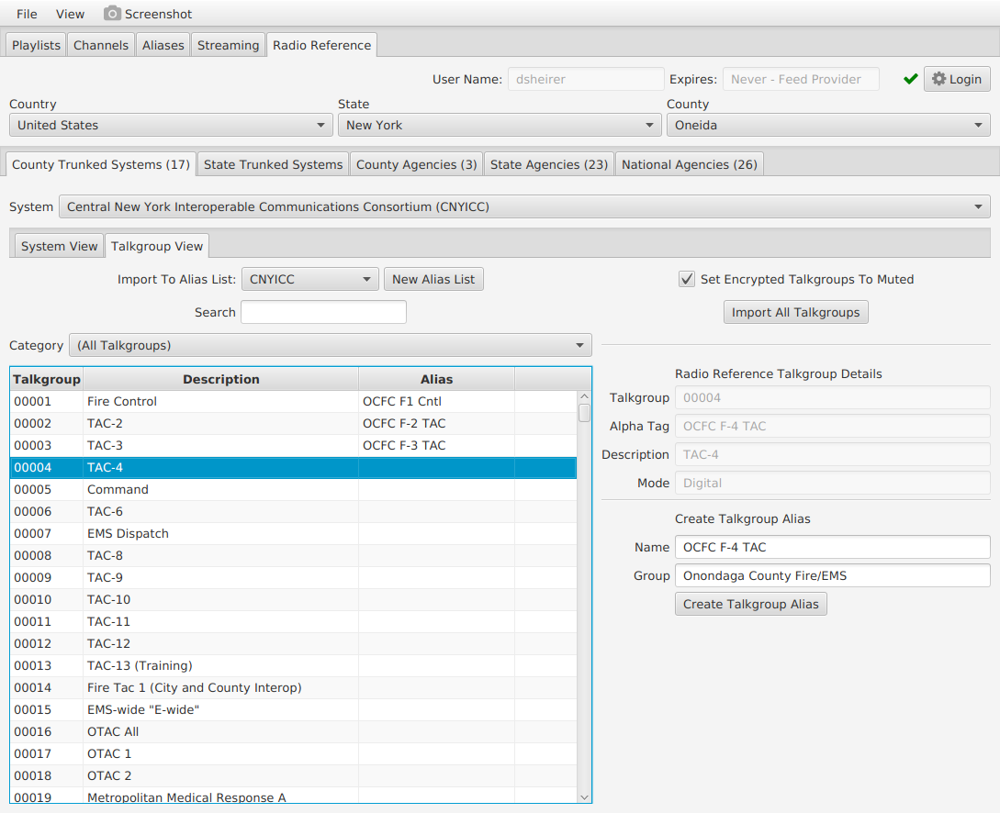
### Radio Reference - Trunking Talkgroup View
The talkgroup view provides a list of talkgroups and descriptions for the selected trunked system.  Use this view to
create aliases for some or all of the known talkgroup values that are available on radio reference.  The table on the
left side provides a list of talkgroup values and descriptions.  The **Alias** column highlights the talkgroup values
that you currently have aliased in your playlist for the currently selected **Alias List**.  If the alias column value 
is empty for any talkgroup, you can use the editor to the right to alias that talkgorup value.

* **Import To Alias List** select an alias list where you want the new aliases created.  
**NOTE:** an alias list name is required and it must match the alias list name that you specify in any channel 
configuration so that the aliases will be used for any calls for the channel. 
* **New Alias List** creates a new alias list and selects it in the **Import To Alias** box.
* **Search*** type any text here to quickly filter the talkgroup table.  The search text will filter against the 
talkgroup value, description and alias columns.
***

#### Talkgroup Alias Editor
* **Set Encrypted Talkgroups To Muted** automatically sets the alias to **Do Not Monitor** when the talkgroup is 
designated as an encrypted talkgroup.
* **Import All Talkgroups** creates aliases for all talkgroup values listed in the table that don't currently have an 
alias in the selected alias list (the **EASY** button)

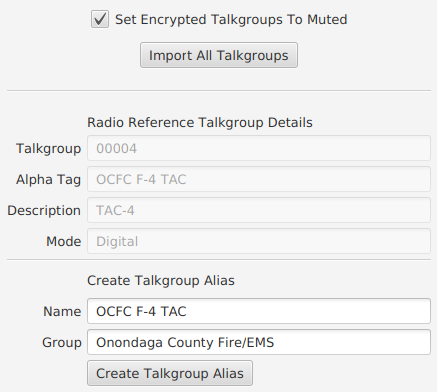

#### Radio Reference Talkgroup Details
* **Talkgroup** lists the talkgroup value
* **Alpha Tag** specified by radio reference.  The alias name is pre-filled with this same value.
* **Description** of the talkgroup

If the currently selected talkgroup does not contain an alias, the **Create Talkgroup Alias** editor appears.  Otherwise,
the **View/Edit Alias** button appears.

#### Create Talkgroup Alias
* **Name** to use for the alias.
* **Group** classifies the alias into a group to support quick searching in the **Aliases** tab
* **Create Talkgroup Alias** creates an alias for the talkgroup.

#### View/Edit Alias
If the currently selected talkgroup is already aliased, you can view or edit this alias, but you cannot create another
alias for the same talkgroup value within the current alias list.

* **View/Edit Alias** takes you to the aliases tab and loads the currently selected alias into the alias editor so 
that you can configure additional alias options.
***

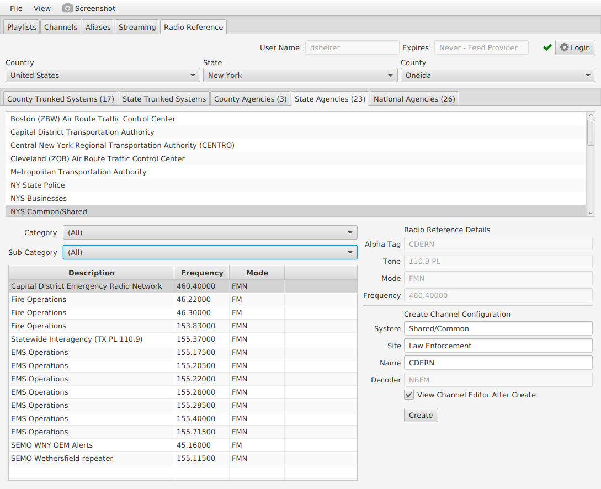
### Radio Reference - National/State/County Agencies

These agency tabs show the search results for the currently selected Country, State and/or County filters. The agency 
view allows you to select from a variety of non-trunked radio channels used by various agencies at the National, State 
and County level.

#### Radio Reference - Agency List
At the top of the agency view is a list of agencies.  Select an agency to view frequency details for the agency and to
enable options for creating sdrtrunk channel configurations for those frequencies.

#### Radio Reference - Agency Details
* **Category** filters the list of agency channels below.
* **Sub-Category** filters the list of agency channels below.
* **Agency Channel Table** shows the filtered list of agency channels
  * **Description** of the agency channel
  * **Frequency** for the channel
  * **Mode** describes the modulation or protocol used for the channel
  
#### Radio Reference - Agency Channel Editor
* **Radio Reference Details** section
  * **Alpha Tag** is an abbreviated label for the channel
  * **Tone** details any CTCSS or CDCSS connect tone required to access the channel
  * **Mode** describes the modulation or protocol used for the channel
  * **Frequency** for the channel
* **Create Channel Configuration** section to create an sdrtrunk channel configuration
  * **System** label to use for the channel configuration.  Defaults to the channel **Category**
  * **Site** label to use for the channel configuration. Defaults to the channel **Sub-Category**
  * **Name** label to use for the channel configuration. Defaults to the channel **Alpha Tag**
  * **Decoder** that will be used by sdrtrunk for the channel configuration.  This value is automatically selected 
  based on the **Mode** indicated for the agency channel
  * **View Channel Editor After Create** when checked takes you to the channel editor and selects the channel 
  configuration so that you can specify additional channel options after you click the **Create** button.
  * **Create**
***

## Quick Setup / How To Guides
* [How To: Create a Playlist Copy](#how-to-create-a-copy-of-your-playlist)
* [How To: Setup Channels](#how-to-setup-channels)
* [How To: Setup Aliases](#how-to-setup-aliases)
* [How To: Record Audio](#how-to-record-audio)
* [How To: Block (Mute) Audio](#how-to-blockmute-audio)
* [How To: Setup Audio Streaming](#how-to-setup-an-audio-stream)
* [How To: Setup Broadcastify Calls](#how-to-setup-broadcastify-calls)
* [How To: Setup Broadcastify Feeds](#how-to-setup-broadcastify-feeds)
* [How To: Assign Aliases to an Audio Stream](#how-to-assign-aliases-to-an-audio-stream)
* [How To: Login to Radio Reference](#how-to-login-to-radio-reference)
* [How To: Search Radio Reference](#how-to-search-radio-reference-for-agencies-and-trunked-systems)
* [How To: Import Agencies from Radio Reference](#how-to-import-agencies-from-radio-reference)
* [How To: Import Trunked Systems from Radio Reference](#how-to-import-trunked-systems-from-radio-reference)
* [How To: Import Talkgroups from Radio Reference](#how-to-import-talkgroups-from-radio-reference)

### How To: Create a Copy of Your Playlist
This setup guide describes how to create a copy of your (default) playlist and use the copy playlist.

1. Click on the **Playlist** tab.
2. Select the playlist that you want to copy.
3. Click the **Clone** button.
4. Enter a new filename for the playlist copy.
5. Select the new copy playlist.
6. Click the **Select** button to start using the new playlist copy.
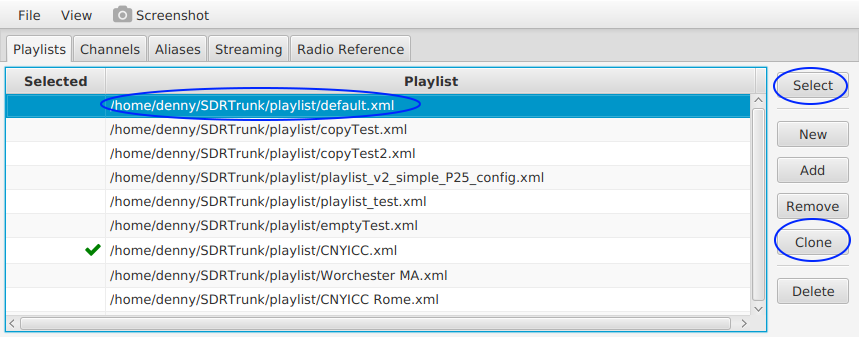
***

### How To: Setup Channels
This setup guide describes how to setup a channel configuration for decoding a radio channel in sdrtrunk.  In order to
use this setup guide, you must have at least one tuner setup correctly in sdrtrunk and know the frequency and radio 
protocol used for the channel.
1. Click the **Channels** tab
1. Click the **New** button and select a radio protocol from the list
1. The channel is created, added to the bottom of the list, and selected in the channel editor at the bottom
1. Enter a **Name** for the channel.
1. In the **Source** section, enter a **Frequency** value in megahertz.  (e.g. 450.325)
1. In the **Decoder** section, change options as needed for the selected protocol
1. Click the **Save** button.
1. Click the **Play** button to start the decoder.
1. Optional: select an alias list if you want to use aliases with this channel.
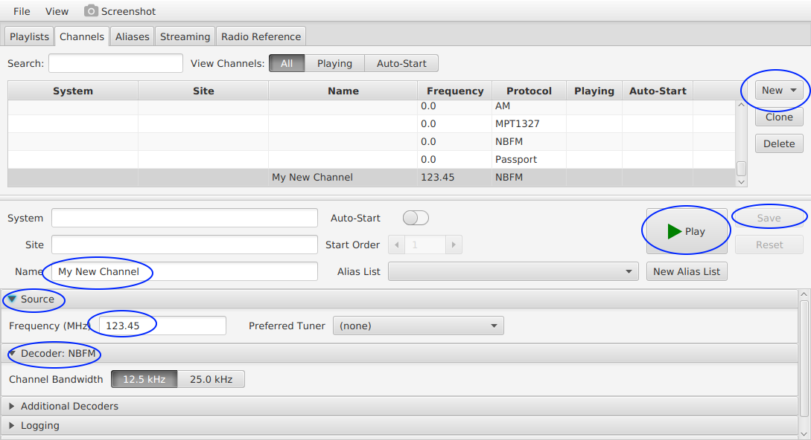
***

### How To: Setup Aliases
This setup guide describes how to create an alias list and create an alias with a talkgroup identifier.  You can select
the alias list that you create with this guide in any channel configuration to attach this alias to the channel.
1. Click the **Aliases** tab
1. Click the View By: **Alias** tab
1. Select an **Alias List** or create a **New Alias List**
1. Click the **New** button
1. A new alias is created and selected in the alias editor below.
1. Enter an **Alias** value
1. Optional: enter a **Group** for the alias
1. In the **Identifiers** section, click the **Add Identifier** button and select an identifier that you wish to 
assign to the alias (e.g. APCO25 Talkgroup)
1. A new alias identifier will be added to the list in the **Identifiers** section and an editor will appear.
1. Enter a value for the identifier.
1. Click the **Save** button
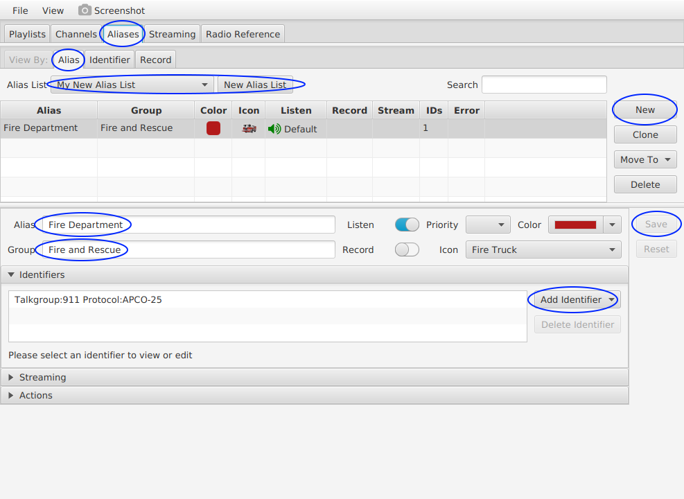
***

### How To: Record Audio
This setup guide describes how to turn on recording for an alias.  In order to use this setup guide, you must [create an
alias list](#how-to-setup-aliases) and you must [create a channel configuration](#how-to-setup-channels) and the alias 
list must be attached in the channel configuration.

**Option 1**: Use the **View By: Alias** Editor
1. Click the **Aliases** tab
1. Click the View By: **Alias** tab
1. Select an **Alias List** that contains the alias you want to record
1. Select the alias in the list of aliases that appears.
1. In the editor below, click the **Record** switch to on or off.
1. Click the **Save** button.
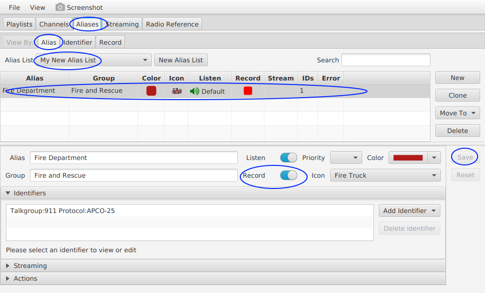

**Option 2**: Use the **View By: Record** Editor
1. Click the **Aliases** tab
1. Click the View By: **Record** tab
1. Select an **Alias List** that contains the alias you want to record
1. Select an alias in the **Don't Record Audio** list
1. Click the **>** arrow button to move the alias over to the **Record Audio** list.
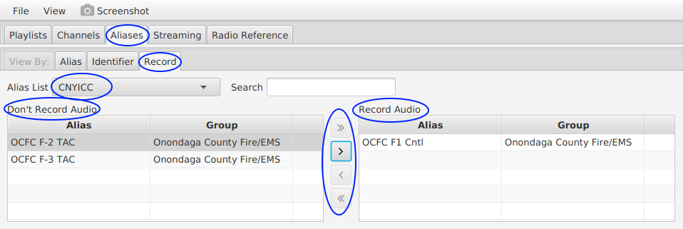
***

### How To: Block/Mute Audio
This setup guide describes how to block or mute playback of audio for an alias.  In order to use this setup guide, you 
must [create an alias list](#how-to-setup-aliases) and you must [create a channel configuration](#how-to-setup-channels) 
and the alias list must be attached in the channel configuration.

1. Click the **Aliases** tab
1. Click the View By: **Alias** tab
1. Select an **Alias List** that contains the alias you want to record
1. Select the alias in the list of aliases that appears.
1. In the editor below, click the **Listen** switch to off.
1. Click the **Save** button.
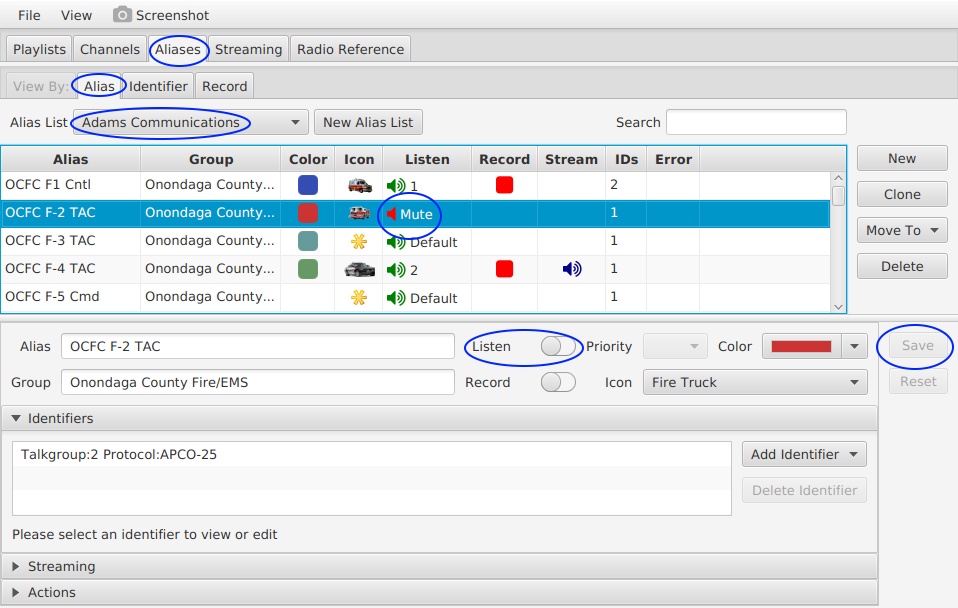
***

### How To: Setup an Audio Stream
This setup guide describes how to setup sdrtrunk to stream to an audio streaming server.  Once you've setup your stream
configuration, use the [assign aliases to an audio stream](#how-to-assign-aliases-to-an-audio-stream) quick
start guide to select aliases to stream.

1. Click the **Streaming** tab
1. Click the **New** button and select a streaming audio server type.
1. A new stream configuration is created and loaded into the editor in the **Configuration** tab below.
1. Enter a unique **Name** for this audio stream.
1. Fill out the details in the editor.
1. Click the **Enabled** button so that the stream will turn on (now and each time you restart the application).
1. Click the **Save** button.
1. In the table above, the **Stream Status** should show **Connected**.  If there is an error, it will be displayed
in this column.
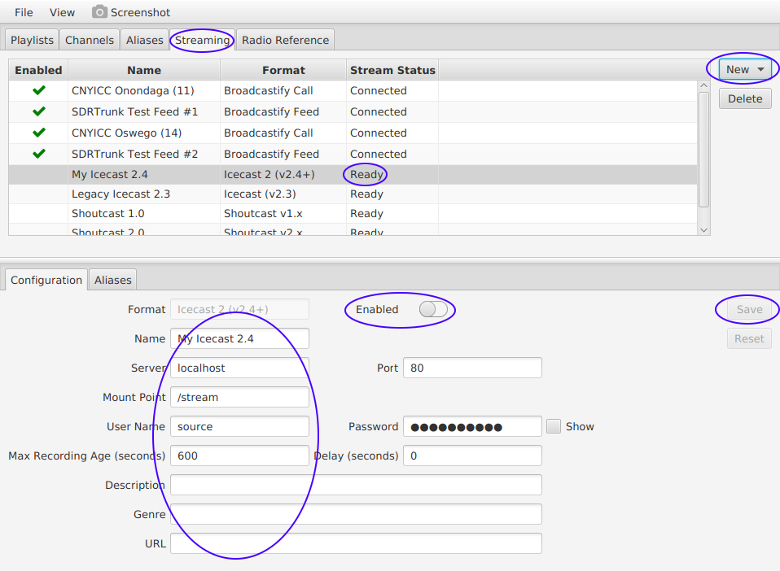
***

### How To: Setup Broadcastify Calls
This setup guide describes how to setup sdrtrunk to stream to the Broadcastify Calls service using the 
[Playlist Editor](#). Once you've setup your stream configuration, use the 
[assign aliases to an audio stream](#how-to-assign-aliases-to-an-audio-stream) quick start guide to select aliases 
to stream.

1. Click the **Streaming** tab
1. Click the **New** button and select **Broadcastify Calls** from the list.
1. A new Broadcastify Calls configuration is created and loaded into the editor in the **Configuration** tab below.
1. Enter a unique **Name** for this configuration.
1. Enter your **API Key** and **System ID** number into the editor.
1. Click the **Enabled** button so that the stream will turn on (now and each time you restart the application).
1. Click the **Save** button.
1. In the table above, the **Stream Status** should show **Connected**.  If there is an error, it will be displayed
in this column.

**NOTE:** sdrtrunk will allow you to stream ***ANY*** aliased talkgroup to this service.  Please ensure you select only
the aliased talkgroups that belong to the trunked radio system that is identified by the system id.

**NOTE:** if you setup two Broadcastify Calls configurations to stream two sites for the same trunked radio system, 
you will need to create a separate alias list for each site, where each alias list contains the same set of aliased 
talkgroups and then assign the aliases from each alias list to the matching Broadcastify Calls configuration.  Ensure, 
that each alias is configured to stream to just one Broadcastify Calls configuration, otherwise you could be sending 
duplicate audio calls to the service.
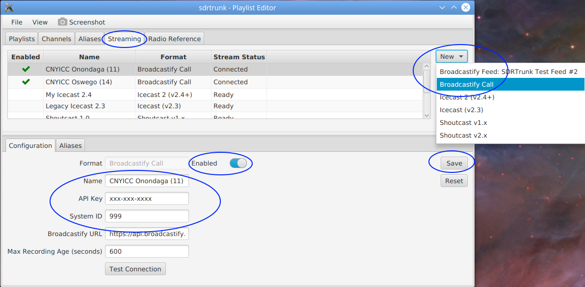
***

### How To: Setup Broadcastify Feeds
This setup guide describes how to setup sdrtrunk to stream to the Broadcastify Feeds service.  This guide assumes that
you [have logged into radio reference](#how-to-login-to-radio-reference). Once you've setup your 
stream configuration, use the [assign aliases to an audio stream](#how-to-assign-aliases-to-an-audio-stream) quick
start guide to select aliases to stream.

1. Click the **Streaming** tab
1. Click the **New** button and select one of your Broadcastify Feeds that appear in the list.
1. A new Broadcastify Feed configuration is created and loaded into the editor in the **Configuration** tab below.
1. The configuration details are automatically updated from your radio reference account.
1. Click the **Enabled** button so that the stream will turn on (now and each time you restart the application).
1. Click the **Save** button.
1. In the table above, the **Stream Status** should show **Connected**.  If there is an error, it will be displayed
in this column.
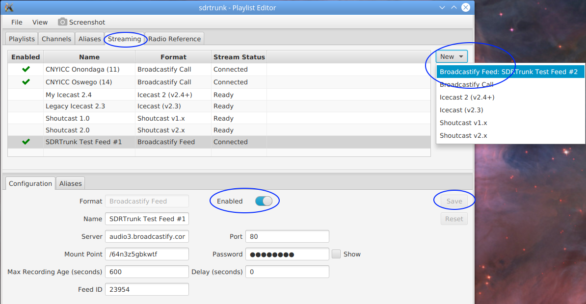
***

### How To: Setup Rdio-Scanner Streaming
This setup guide describes how to setup sdrtrunk to stream to a Rdio-Scanner instance. Once you've setup your 
stream configuration, use the [assign aliases to an audio stream](#how-to-assign-aliases-to-an-audio-stream) quick
start guide to select aliases to stream.

1. Click the **Streaming** tab
1. Click the **New** button and select **Rdio Scanner** from the list.
1. A new Rdio-Scanner configuration is created and loaded into the editor in the **Configuration** tab below.
1. Enter a unique **Name** for this configuration.
1. Enter your **API Key** and **System ID** number into the editor.
1. Enter your **Rdio-Scanner URL** host name into the editor. Be sure to include the port number if it is not 80 or 443.
1. Click the **Enabled** button so that the stream will turn on (now and each time you restart the application).
1. Click the **Save** button.
1. In the table above, the **Stream Status** should show **Connected**.  If there is an error, it will be displayed
in this column.

***

### How To: Setup OpenMHz Streaming
This setup guide describes how to setup sdrtrunk to stream to https://www.openmhz.com or a local trunk-server instance. Once you've setup your 
stream configuration, use the [assign aliases to an audio stream](#how-to-assign-aliases-to-an-audio-stream) quick
start guide to select aliases to stream.

1. Click the **Streaming** tab
1. Click the **New** button and select **OpenMHz** from the list.
1. A new OpenMHz configuration is created and loaded into the editor in the **Configuration** tab below.
1. Enter a unique **Name** for this configuration.
1. Enter your **API Key** and **System Short Name** into the editor.
1. Enter your **OpenMHz Upload Server** host name into the editor. You will need to modify this if you are running your own instance of trunk-server.
1. Click the **Enabled** button so that the stream will turn on (now and each time you restart the application).
1. Click the **Save** button.
1. In the table above, the **Stream Status** should show **Connected**.  If there is an error, it will be displayed
in this column.

***

### How To: Assign Aliases to an Audio Stream
This setup guide describes how to assign aliases to an audio stream or a Broadcastify Feed or Calls channel.  This 
guide assumes that you have [setup an audio stream](#how-to-setup-an-audio-stream) and you have 
[setup aliases](#how-to-setup-aliases).

**Option 1**: Use the Alias Configuration editor
1. Click the **Aliases** tab
1. Click the **View By: Alias** tab
1. Select an **Alias List** that contains the alias that you want to stream.
1. Click to select an alias in the list.  The alias appears in the editor below.
1. Expand the **Streaming** section if it is not expanded.
1. Select an audio stream from the **Available** audio streams list.
1. Click the **>** arrow button to move the selected audio stream to the **Selected** list.
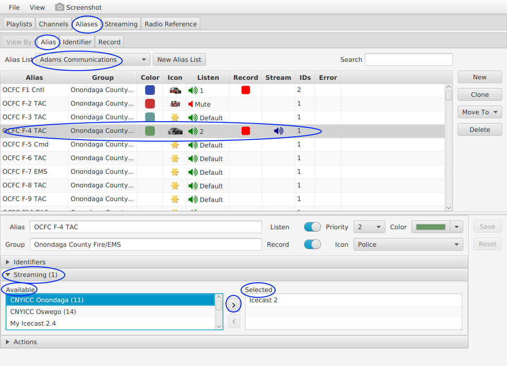

**Option 2**: Use the Streaming editor
1. Click the **Streaming** tab
1. Click the **Aliases** tab in the editor below
1. Select an alias from the **Available** list that is not currently assigned to stream.
1. Click the **>** arrow button to move the alias to the **Selected** to stream list.
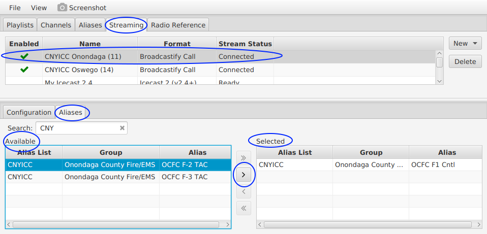
***

### How To: Login to Radio Reference
This setup guide describes how to login to Radio Reference API service.  This guide assumes that you have a valid 
username and password for RadioReference.com and that you have an active [premium](http://radioreference.com/premium) 
subscription.

1. Click the **Radio Reference** tab
1. Click the **Login** button
1. The Login Editor window will appear
1. Enter your radio reference **User Name** and **Password**
1. Check the **Store Login Credentials** box if you want sdrtrunk to automatically login each time or uncheck this box
if you want sdrtrunk to remove any stored login credentials and prompt you each time.
1. Click the **Test Connection** button.  If successful, a green check mark will appear.
1. Click the **OK** button to close the login window.
1. Your username and premium account expiration date appears at the top of the playlist editor.

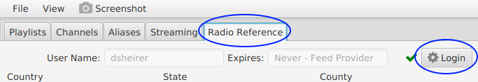

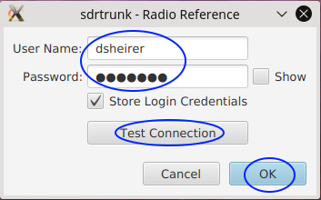
***

### How To: Search Radio Reference for Agencies and Trunked Systems
This setup guide describes how to search radio reference to find radio information for Agencies and Trunked radio 
systems at the National, State and County levels.  This guide assumes that you have 
[logged into radio reference](#how-to-login-to-radio-reference).

1. Click the **Radio Reference Tab**
1. Select a **Country**
1. (Optional) Select a **State**
1. (Optional) Select a **County**
1. Notice that the National, State and County Agencies and Trunked Systems tabs update with the search results.
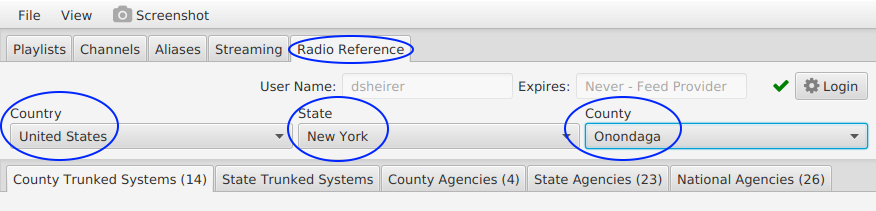
***

### How To: Import Agencies from Radio Reference
This setup guide describes how to import an agency channel frequency into a new sdrtrunk channel configuration.  This 
guide assumes that you have [searched radio reference](#how-to-search-radio-reference-for-agencies-and-trunked-systems) 
and have agency results in either the **County Agencies**, **State Agencies**, or **National Agencies** tabs.

1. Click the **Radio Reference Tab**
1. Click an agency search results tab: **County Agencies**, **State Agencies**, or **National Agencies** 
1. Select an agency in the agency list.  The agency details are show in the editor below.
1. Select a radio channel frequency from the list in the lower left corner.
1. Modify the **System**, **Site**, and **Name** options, if desired.
1. Check the **View Channel Editor After Create** box if you want to see the channel configuration after creating it.
1. Click the **Create** button to create the channel configuration.
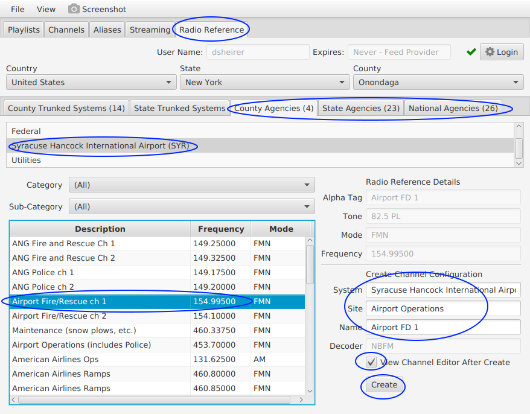
***
### How To: Import Trunked Systems from Radio Reference
This setup guide describes how to import a trunked system into a new sdrtrunk channel configuration.  This 
guide assumes that you have [searched radio reference](#how-to-search-radio-reference-for-agencies-and-trunked-systems) 
and have trunked system results in either the **County Trunked Systems**, or **State Trunked Systems** tabs.

1. Click the **Radio Reference Tab**
1. Click a search results tab: **County Trunked Systems**, or **State Trunked Systems**
1. Select a **System** from the list
1. Click the **System View** tab
1. Select a **Site** in the sites list
1. Change the **Frequencies** or **Configurations** buttons as needed.  The default values should be fine.
1. Select an **Alias List** or create a **New Alias List** in the lower-right corner editor.
1. Check the **Go To Channel Editor** to further edit and start the channel once created.
1. Click the **Create Channel Configuration** button to create the channel configuration.
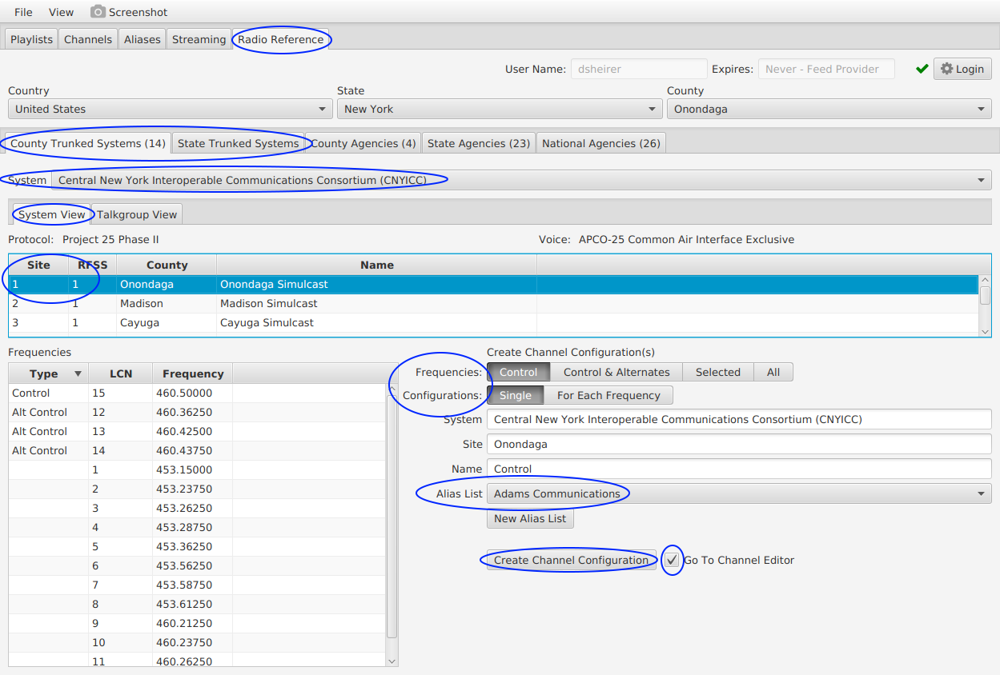
***

### How To: Import Talkgroups from Radio Reference
This setup guide describes how to import talkgroups from radio reference and create aliases.  This 
guide assumes that you have [searched radio reference](#how-to-search-radio-reference-for-agencies-and-trunked-systems) 
and have trunked system results in either the **County Trunked Systems**, or **State Trunked Systems** tabs.

1. Click the **Radio Reference Tab**
1. Click a search results tab: **County Trunked Systems**, or **State Trunked Systems**
1. Select a **System** from the list
1. Click the **Talkgroup View** tab
1. Select an **Import To Alias List** where you want to create the aliases, or click **New Alias List**
1. Click the **Import All Talkgroups** button.
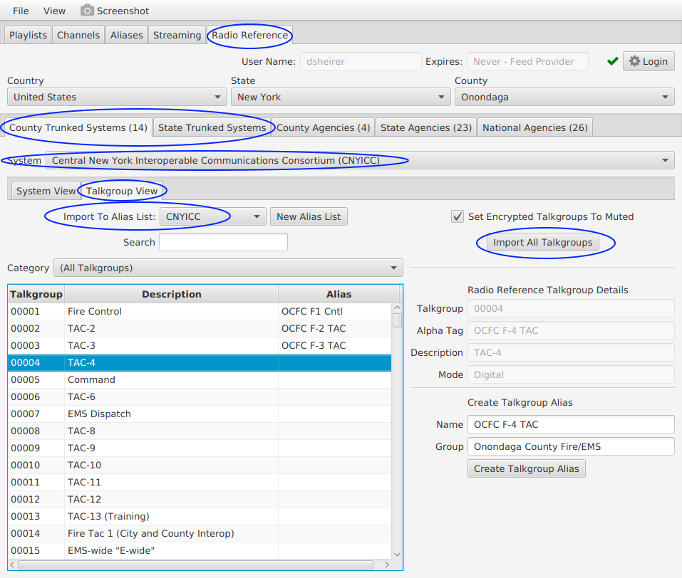
***

### How To: Setup and Use NBFM Squelch
This guide describes how to setup an NBFM channel using the new FM power squelch feature.

1. In the Playlist editor, click the **Channels** tab
1. Click the **New** button and select the **NBFM** decoder
1. Enter a **Frequency** value in the **Source** section.
1. Select 12.5 or 25.0 kHz channel bandwidth.  
1. Leave the **Squelch Threshold** setting as is, for now.
1. Click **Play** button to start the channel.
1. Switch to the main sdrtrunk window
1. Select the channel that's playing in the **Now Playing** window
1. Click the **Channel** tab in the lower section.
1. Adjust the **Squelch Threshold** (blue line) up or down so that it's slightly above the current noise floor represented by the solid grey bar.  Monitor the channel to ensure that when the signal is active it exceeds the threshold and you hear audio.

Note: the noise floor changes each time you change the gain settings or sample rate of your tuner and you must adjust the squelch threshold with each of those changes.

### How To: Use Aliases With NBFM Decoder
This guide describes how to setup the NBFM decoder so that a static talkgroup value is assigned to each audio segment generated by the NBFM decoder so that you can take advantage of sdtrunk aliasing features like streaming and recording with NBFM audio segments.

1. In Playlist editor, click the **Channels** tab
1. Select an existing NBFM channel or create a new one: [How To: Setup and Use NBFM Squelch](#how-to-setup-and-use-nbfm-squelch)
1. In the **Alias List** dropdown box, select an existing alias list or create a new one by clicking the **New Alias List** button and entering a new alias list name.
1. In the **Decoder: NBFM** section enter a **Talkgroup To Assign** value in the range 1 - 65535
1. Click **Save** button
1. Click the **Aliases** tab
1. Select the same **Alias List** that you specified in the channel.
1. Click **New** button to create a new Alias.
1. In the editor at the bottom, enter an **Alias** name
1. Click the **Add Identifier** button and select **NBFM** and **Talkgroup**
1. Enter the same **NBFM Talkgroup** value that you entered in the NBFM Channel configuration for **Talkgroup To Assign**
1. Configure the remaining alias settings for Listen, Record, Streaming and actions.
1. Click **Save**
1. In the **Channels** tab, select your new NBFM channel and click the **Play** button. 