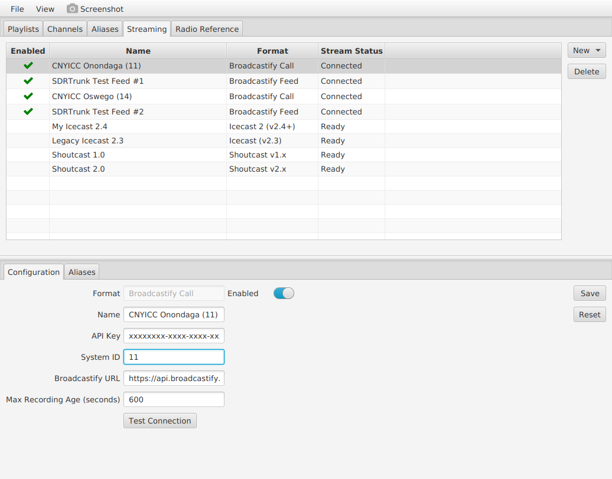
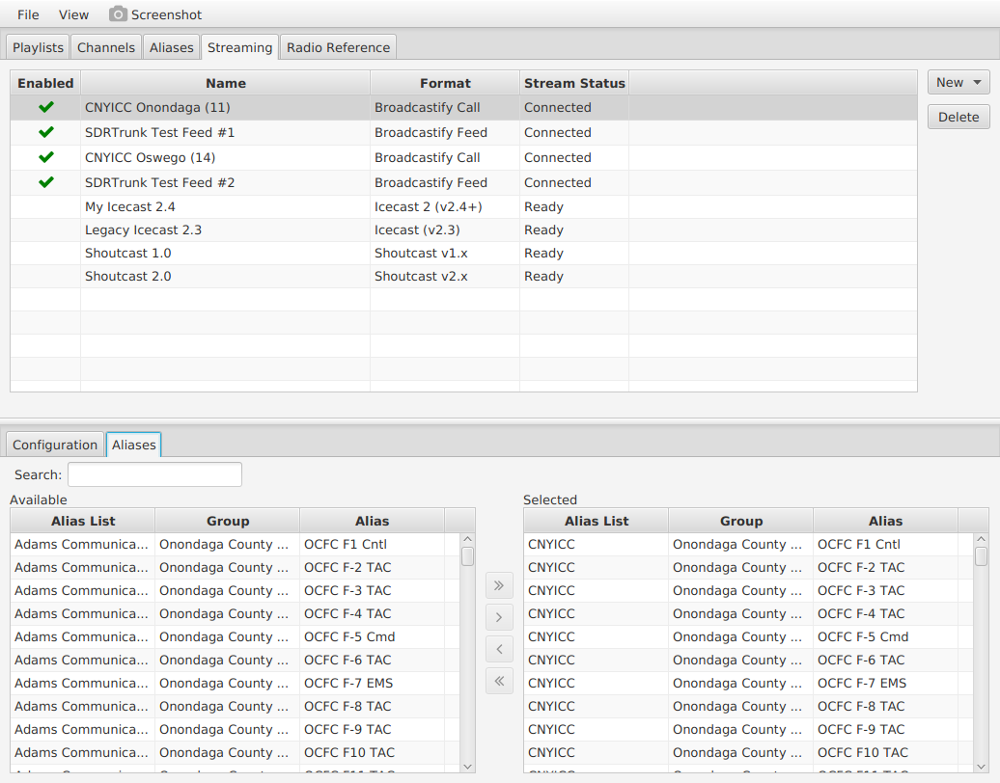

Playlists are an essential part of sdrtrunk.  All of the decoding, channel selection, streaming, aliasing of talkgroups and radio identifiers, etc is controlled by playlists.  The playlist editor gives you access to each of these pieces and includes fully integrated access to the world-wide database of radio network information at radioreference.com\*\*.

The playlist editor provides the following components:
* **[Playlists](Playlist-Editor#playlists)** - manage all of your playlists and select the current playlist
* **[Channels](Playlist-Editor#channels)** - create channel and decoder configurations and start/stop decoding
* **[Aliases](Playlist-Editor#aliases)** - create aliases and names for a variety of identifiers like talkgroups and radio IDs
* **[Streaming](Playlist-Editor#streaming)** - manage audio streaming and assign aliases to streaming channels
* **[Radio Reference](Playlist-Editor#radio-reference)**\*\* - online radio system database for easy downloading radio systems and talkgroups

\*\*Radio Reference access requires a premium subscription

## Playlists
The playlist tab allows you to manage your playlists.  Only one playlist can be active (selected) at any time. A default playlist (**default.xml**) is automatically created for you when you use the software for the first time.

The playlist table provides a list of playlist files available to sdrtrunk.  The **Selected** column indicates the currently active/selected playlist with a green checkmark.

### Playlist Manager Buttons
* **Select** - makes the selected playlist the active playlist.  This will unload the current playlist and load the selected playlist.  Any actively decoding channels will be stopped.  All channels, aliases and stream configurations from the current playlist will be removed and the channels, aliases and stream configurations for the selected playlist will be loaded.
* **New** - creates a new empty playlist.
* **Add** - adds a playlist to the editor.  Use this button to add other playlists to the editor that are in different folders than the sdrtrunk playlist folder.
* **Remove** - removes the currently selected playlist from sdrtrunk.  Does NOT delete the file.
* **Clone** - creates a comlete copy of the currently selected playlist.
* **Delete** - removes the currently selected playlist from sdrtrunk AND deletes the file from the file system.

## Channels
The channels tab lists the channel configurations for the currently selected playlist.  A channel configuration has
all of the details needed to setup a decoder for a channel to include logging and some recording settings.  

### Channel Search and Filter
The channel editor provides a search option and a set of filter buttons to quickly find channels in the channels table.

#### Search Box
Type any characters in the search box and the channels table will be filtered to show the matches.  The search characters
will be matched against values in the system, site, name and protocol fields.

#### Channel Filter Buttons
* **All** - shows all channel configurations
* **Playing** - shows channel configurations that are currently playing
* **Auto-Start** - shows channels that are configured to auto-start on application startup

### Channel Editor Buttons
* **New** - creates a new channel configuration.  You must select a protocol decoder type.
* **Clone** - creates an exact copy of the currently selected channel configuration.  This is convenient for when you
have a channel configuration setup and simply need to create another channel with all of the same settings, so that 
you can use a different frequency.
* **Delete** - deletes the currently selected channel.  If the channel is currently processing, it prompts you to stop
the channel.

### Channel Item Editor
Below the table of channel configurations is the channel item editor that is used for configuring individual channels.
Select a channel configuration in the channels table to load it into the channel item editor.

#### Channel Item Editor - General Section
* **Alias List*** - identifies the alias list that will be used for the channel.  The alias list contains the 
aliases and identifiers that will be assigned for any calls or events produced during decoding of the channel.
* **Auto-Start** - designates the channel to automatically play when the application starts up.
* **Name** - edits the channel name.
* **New Alias List** - creates a new alias list for the channel.  Note: the alias list name is limited to 25 characters.
* **Play/Stop** - starts the channel configuration decoding.  This button changes between play and stop, providing 
control over playing the channel.
* **Reset** - reloads the channel configuration into the editor and throws away any changes that you've made
* **Save** - saves any changes that you have made to the channel configuration
if the channel is currently playing.
* **Site** - edits an optional the site label.  The site label allows you to group channel configurations
that belong to the same site location.
* **Start Order** - designates the startup order for auto-start channels
* **System** - edits an optional system label.  The system label allows you to group channel configurations that
belong to the same radio system or network.

#### Channel Item Editor - Source Section
* **Frequencies** - identifies the channel frequency to be decoded.
**Note** some decoders (P25, MPT-1327) allow you to specify multiple frequencies.  If the decoder supports multiple
frequencies, you'll see an **Add** button that allows you to add additional frequency values.
* **Add** - creates an additional frequency field for you to specify additional frequency values.  You can click the 
**Add** button multiple times to create as many fields as you need.
* **Remove** - removes an additional frequency field when you have specified more than one frequency value.
* **Preferred Tuner** - optionally designates a preferred tuner to be used for the channel when the channel starts.
There is no guarantee that this tuner will be used.  If the tuner can tune the channel's frequency, then it will be
used.  Otherwise, the next available tuner will be used.

#### Channel Item Editor - Decoder Section
This section provides different editor configurations depending on the protocol that is selected for the channel.

##### AM Decoder
The AM decoder has no additional settings.

##### APCO25 Phase 1 Decoder (and APCO25 Phase 2 Trunked Systems)
* **Ignore Data Calls** - tells the decoder not to create traffic channels for data calls.
* **Max Traffic Channels** - this value places a limit on the maximum number of traffic channels that sdrtrunk will
create when it is decoding a trunked system so that sdrtrunk doesn't create more processing workload than your computer
can handle.  This value defaults to three.  You can set this equal to the number of repeater channels identified for 
the site, if your computer has enough processing power to decode all of those channels at the same time.  
* **Modulation** - select the modulation to decode: C4FM or LSM.  Use C4FM for P25 repeaters and non-simulcast trunked
systems.  Use LSM for trunked P25 systems that are configured for simulcast.

##### APCO25 Phase 2 Decoder - Individual Channels
***Note: all APCO25 Phase 2 systems use an APCO25 Phase 1 control channel***.  Use a Phase 1 decoder for the Phase 2 system
and sdrtrunk will automatically create the Phase 2 traffic channels for you.  However, if you want to listen to the 
Phase 2 channels individually, you must supply the descramble settings for the channel.
* **WACN** - wide area communications network (WACN) for the P25 network
* **System** - system identifier
* **NAC** - network access code

##### LTR Decoder
* **Direction** - choose which side of the repeater you want to monitor, either the input side (mobile radio to repeater)
or the output side (repeater to mobile radio).  ISW = input, OSW = output

##### LTR-Net Decoder
* **Direction** - choose which side of the repeater you want to monitor, either the input side (mobile radio to repeater)
or the output side (repeater to mobile radio).  ISW = input, OSW = output

##### MPT-1327 Decoder
* **Channel Map** - select a channel map to use for the system
* **Channel Map Editor** - create or modify channel maps to use with the MPT-1327 decoder
* **Call Timeout Seconds** - maximum length of time to allow a traffic channel to decode.  Normally, the traffic 
channel will broadcast signalling that indicates that the traffic channel is no longer being used.  If that signalling
is not decoded correctly, this timeout value will automatically tear-down the channel.
* **Max Traffic Channels** - this value places a limit on the maximum number of traffic channels that sdrtrunk will
create when it is decoding a trunked system so that sdrtrunk doesn't create more processing workload than your computer
can handle.  This value defaults to three.  You can set this equal to the number of repeater channels identified for 
the site, if your computer has enough processing power to decode all of those channels at the same time.  

##### NBFM Decoder
* **Channel Bandwidth** - specifies the bandwidth of the FM channel.  Most channels use bandwidth of 12.5 kHz.

##### Passport Decoder
The passport decoder has no additional settings.

#### Channel Item Editor - Additional Decoders Section
Additional decoders decode additional digital signalling that is sometimes transmitted in the audio of a channel.  These
decoders are only available for select channel protocols like NBFM, LTR and LTR-Net.

* **Fleetsync** - decodes Fleetsync II ANI and GPS data bursts
* **LJ1200** - decodes LoJack data bursts on frequency 173.075 MHz.
* **MDC1200** - decodes MDC-1200 ANI data bursts
* **Tait 1200** - decodes Tait ANI and GPS data bursts

#### Channel Item Editor - Logging Section
* **Call Events** - records each of the events produced by the decoder and displayed in the Events tab of the Now 
Playing window
* **Decoded Messages** - records each of the messages produced by the decoder and displayed in the Messages tab of the
Now Playing window
* **Traffic Channel Call Events** - records decoded events for traffic channels.
* **Traffic Channel Decoded Messages** - records decoded messages for traffic channels.

#### Channel Item Editor - Recording Section
**Note:** aliases control audio recording for most of the decoders.  See the *Aliases* section for more details. 

* **Baseband I/Q (.wav)** - records the raw channel sample data 
* **Demodulated Bitstream (.bits)** - records the demodulated bits produced by the decoder.  This is only available for
certain decoders.
* **MBE Audio CODEC Frames (.mbe)** - records the AMBE and IMBE audio codec frames to a text file using JSON format. 
Ths is ony available for certain decoders (P25)
* **Traffic Channel Baseband I/Q (.wav)** - same, for traffic channels.
* **Traffic Channel Demodulated Bitstream (.bits)** - same, for traffic channels.
* **Traffic Channel MBE Audio COCDE Frames (.mbe)** - same, for traffic channels.

## Aliases
There are three ways to view and edit aliases:
* **[View By: Alias](Playlist-Editor#view-by-alias-editor)** - view aliases in an alias list and edit individual aliases.
* **[View By: Identifier](Playlist-Editor#view-by-identifier-editor)** - view each of the identifiers and aliases, sorted by identifier, for an alias list.  This
view allows you to look at aliases from an identifier perspective so that you can see which identifiers (e.g. talkgroups)
are mapped to each alias.
* **[View By: Record](Playlist-Editor#view-by-record-editor)** - quick editor to turn on/off recording for aliases in an alias list.

### View By Alias Editor
This editor provides a list of aliases in an alias list and allows you to select identifiers, control audio recording
and listening priority and assign actions to the alias.

#### Alias List
Select an alias list to view the aliases.  Click the **New Alias List** button to create a new alias list.

#### Search
Type any characters and the list of aliases will be filtered to the aliases that match your search text.  The search
will match against the alias name and alias group values.

#### Create and Delete Alias Buttons
* **New** - creates a new alias
* **Clone** - creates a copy of the currently selected alias.  This is convenient when you have an alias setup just
the way you want (ie color, record, priority) and you want to use it as a template to create another aliase.
* **Move To** - moves the currently selected alias to another alias list.  Click the button and choose from the
alias lists.  The selected alias will be moved to that alias list.
* **Delete** - deletes the currently selected set of aliases.  Use Shift and Control while clicking additional aliases 
to select multiple aliases to delete.

#### Alias Editor - General Section
* **Save** - saves any changes to the alias configuration
* **Reset** - reloads the alias configuration into the editor, ignoring any current changes.

* **Alias** - the name or label to use for the alias
* **Color** - specifies a color to use for coloring the alias name
* **Group** - an optional label that allows you to designate multiple aliases as belonging to the same group.  This
allows you to search for aliases by the group name.
* **Icon** - specifies an icon to include with the alias label.
* **Listen** - controls listening to audio for this talkgroup.  Set to **off** to turn off monitoring for the alias.
* **Priority** - controls the listening or monitoring priority: 1 = highest, 99 = lowest.  Note: you do not have to
specify a priority.  The default priority, when not specified, is 100 (lowest).

#### Alias Editor - Identifiers Section
* **Add Identifier** - adds a new identifier to the alias.  Select from the list of protocols and the identifier types
that are available for each protocol.
* **Delete Identifier** - deletes the selected identifier from the alias.

##### Talkgroup and Talkgroup Range
Identifies a talkgroup or a range of talkgroups to match for the alias. This is typically the TO identifier in a 
radio call

##### Radio ID and Radio ID Range
Identifies a single radio or a range of radios.  This is typically the FROM identifier in a radio call.

##### User and Unit Status
Identifies a numeric user or unit status.  When individual radios transmit a status, they use a numeric value.  The
radio network defines a meaning for each of these number values and this meaning is not available to sdrtrunk.  If you
know that user status 1 is assigned a meaning of 'Need Assistance', then you can create an alias, assign a user status
identifier of 1, and then create a Beep alias action so that sdrtrunk will beep every time a radio transmits a 
status of 1.

##### Audio Tones
The AMBE audio CODEC used on certain radio networks (P25 Phase 2) can transmit special tone frames instead of audio
when the system is sending tones instead of voice.  These can be used for Knox tones, Tone-outs, 2-tone paging, etc or 
dialing DTMF telephone digits, or for simple telephone sounds like ringing or a busy signal.  Use the Audio Tones
identifier to specify a sequence of tones to match an alias.  For example, you can create an alias and define an
audio tone identifier for a 2-tone page sequence of 1000 Hz followed by 2000 Hz.  Then, you can create an alias 
action to notify you that the paging tone was transmitted.

Note: specify a sequence of tones and tone duration to match.  The AMBE audio CODEC uses audio and tone frames that
are each 20 milliseconds long.  Specify each tone duration in units of 20 milliseconds.  The duration value is a 
minimum value.  In order to match correctly, the transmitted tone must be longer than the duration specified.  Use a
duration value that is long enough to avoid false matches.  The decoder will combine all tones decoded during the 
call as a sequence of tones and tone durations.  The identifier will match any of those tones in the sequence that
have the correct tones, in the proper sequence, with at least the specified minimum duration each.

For example, a system transmits three 2-tone sequences to activate 3 fire stations: 1000/500, 875/1250, and 1625/1406.
You create a tone identifier of 875/1250.  This will match the middle sequence of tones.  Another example would be
matching a radio user calling a landline telephone number 555-1212.  Create a tone identifier for this sequence of DTMF 
digits in order to match the alias and trigger an alias action.

##### LoJack Function and Id
Used to identify specific LoJack functions and identifiers for the LoJack audio decoder

#### Alias Editor - Streaming Section
This section controls streaming for call audio that matches the alias.  Select from the **Available** list of 
streams and use the right arrow to move the stream to the **Selected** stream list.  If you no long wish to stream the
alias, select the stream to remove in the **Selected** stream list and use the left arrow to move it back to the 
**Available** stream list.

**Note:** use the Streaming tab to create and manage audio stream configurations.  Once created, those configurations
will appear in the **Available* stream list box.

#### Alias Editor - Actions Section
This section defines actions that you can assign to an alias so that when an aliased identifier is active in the 
decoder messaging or involved in an audio call, these actions will fire.

* **Add Action** - create a new alias action
* **Delete Action** - delete the selected action

##### Audio Clip Action
Plays the audio clip

##### Beep Action
Beeps the computer

##### Script Action 
Runs the specified script.

##### Options - Once
Performs the action once and never again until after the software is restarted.

##### Options - Once, Reset After Delay
Performs the action once.  Resets after the specified delay.

##### Options - Until Dismissed
Performs the action repeatedly until the user clicks the OK button in the dialog that appears.

##### Test
Test the action configuration to ensure it operates correctly.

### View By Identifier Editor
This editor provides a filtered list of identifiers and alias so that you can see all of the identifiers of each type
 and how they are mapped to each of the aliases.

* **Alias List** - select the alias list to view
* **Identifier Type** - select the identifier type to view
* **View Alias** - opens the selected alias in the **View By Alias** editor

### View By Record Editor
This editor provides easy management of alias recording.

* **Alias List** - select the alias list to view
* **Search** - type characters to search both the record and don't record lists.  The search text matches either the 
alias name or the alias group in both lists.
* **Arrow Buttons** - allow you to move aliases between the record and don't record lists.  You can select multiple
aliases by using the Shift or Control keys in combination with mouse clicks.

## Streaming
This tab is for creating audio streaming configurations and selecting aliases for individual audio streams.  At the 
top of the tab is a table of stream configurations and buttons for creating or deleting.

* **New** - create a new streaming configuration by selecting from a list of supported audio streaming server types.
* **Delete** - deletes the selected streaming configuration.

**NOTE**: use the **Radio Reference** tab to login to radioreference.com before you attempt to create any Broadcastify
streams.

### Streaming - Configuration Editor
* **Enabled** - enables or turns on the stream.  When enabled, sdrtrunk will connect to the remote streaming server and
immediately begin streaming silence.  When decoding channels, audio calls will be queued for the stream when the call
identifiers match any aliases that are designated for the audio stream.
* **Save** - saves changes to the current stream configuration.
* **Reset** - reloads the stream configuration into the editor, ignoring any changes that were made to the configuration.

The editor contains various additional fields required for each of the audio streaming server types.

### Streaming - Aliases Editor
The aliases tab provides easy control over selecting aliases for an audio stream.

* **Search** - search for aliases by alias list, group, or name.  When you type characters in the search box, both 
the available and selected lists are filtered to aliases that match your search text.
* **Availabe** - aliases available for streaming
* **Selected** - aliases that will be streamed
* **Arrow Buttons** - select alias(es) in either list and use the arrow buttons to move to the other list.  Use the 
Shift or Control keys in combination with mouse clicks to select multiple aliases.

## Radio Reference
Work in progress ...

# Access The Playlist Editor
Work in progress ...

# Quick Setup Tips
Work in progress ...

