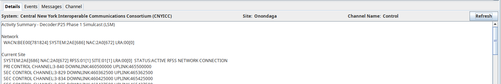

# Primary Application Window
The following sections detail how to use the features available in the sdrtrunk primary application window.

<!-- TOC -->
* [Primary Application Window](#primary-application-window)
* [Overview](#overview)
* [Menus](#menus)
* [Spectral & Waterfall Display Panels](#spectral--waterfall-display-panels)
  * [Spectral Display Panel](#spectral-display-panel)
    * [Spectral Display - Context Menus](#spectral-display---context-menus)
  * [Waterfall Display Panel](#waterfall-display-panel)
    * [Waterfall - Context Menus](#waterfall---context-menus)
  * [Zooming - Spectral and Waterfall Display](#zooming---spectral-and-waterfall-display)
* [Audio Playback Panel](#audio-playback-panel)
  * [Audio Playback Panel - Context Menus](#audio-playback-panel---context-menus)
* [Tabbed Views](#tabbed-views)
  * [Now Playing](#now-playing)
    * [Decoding Channels Table](#decoding-channels-table)
    * [Selected Channel - Tabbed Views](#selected-channel---tabbed-views)
    * [Selected Channel - Details View](#selected-channel---details-view)
    * [Selected Channel - Events View](#selected-channel---events-view)
    * [Selected Channel - Messages View](#selected-channel---messages-view)
    * [Selected Channel - Channel View](#selected-channel---channel-view)
  * [Map](#map)
    * [Map Controls](#map-controls)
  * [Tuners](#tuners)
  * [Playlist Editor](#playlist-editor)
* [Streaming Status Panel](#streaming-status-panel)
<!-- TOC -->

# Overview
The sdrtrunk primary application window is composed of the following sections:
* **Spectral Display** - displays the frequency content of the currently selected tuner
* **Waterfall** - displays a running history of the frequency content from the spectral display.
* **Audio Playback** - displays in-progress call audio playback
* **Tabbed Views** - a set of tabbed views:
  * **Now Playing** - a table of channels currently decoding with a selected channel activity detail panel
  * **Map** - a map view for displaying decoded mobile radio GPS locations
  * **Tuners** - view of tuners and tuner control editors
  * **Playlist Editor** - quick-access button to open the [Playlist Editor](Playlist-Editor)
* **Streaming Status** - status of audio streaming call activity

# Menus
The following menus are available at the top of the primary application window.
* **File** Menu
  * **Exit** - shutdown the application.
* **View** Menu
  * **Playlist Editor** - opens the [Playlist Editor](Playlist-Editor) window
  * **User Preferences** - opens the [User Preferences](User-Preferences) editor.
  * **Icon Manager** - opens the [Icon Manager](Icon-Manager) editor.
  * **Logs & Recordings** - opens a system file explorer to the sdrtrunk applicaton directory where the log files and 
recordings are stored
  * **Tuners** - presents a list of system tuners allowing you to select a specific tuner for display in the Spectral 
Display window.
  * **Disable Spectrum & Waterfall** - disables the Spectral Display and Waterfall and pauses FFT calculations.  Use 
the **View >> Tuners** menu to select a tuner and restart the displays.
  * **Show Streaming Status** - toggle button to turn on or off the streaming status panel at the bottom of the primary 
application window.
* **Screen Capture** Menu - button to take a screenshot of the primary application window.  Screenshots are stored in the 
sdrtrunk screenshots directory.  Use the **View >> Logs & Recordings** menu item to open a file explorer to the
sdrtrunk directory and access screenshots.

# Spectral & Waterfall Display Panels
## Spectral Display Panel
The spectral display panel provides a zoomable view of the frequency content from the currently selected tuner.  On 
startup, the application automatically selects the first tuner for display, unless the user has disabled the 
spectral and waterfall displays.  

The spectral display overlays the frequency spectrum with channel overlays for each decoding channel that you define in 
the playlist manager as well as dynamically allocated traffic channels when decoding trunked radio systems.  The cursor 
also displays the frequency value and current zoom levels when you hover your mouse over the spectral display areas.

### Spectral Display - Context Menus
Use a mouse right-click anywhere in the spectral display area to access the context menus.

* **Channels** Menu - displays a list of channels currently under the cursor area and presents menu option(s) to display 
each channel in the [Playlist Editor](Playlist-Editor)

* **Color** Menu - presents submenu options for configuring the color setting for each of the features displayed in the 
Spectral Display and Waterfall panels.  A color chooser is presented for each submenu.  These settings are remembered
across application restarts.
  * **Channel** - channel overlay for a channel that is not currently enabled for processing.
  * **Channel Processing** - channel overlay color for a channel that is currently enabled for processing.
  * **Channel Selected** - channel overlay color for a channel that is currently selected in the Now Playing table.
  * **Cursor** - color for the cursor and frequency/zoom details
  * **Line** - color for frequency reference line details
  * **Background** - background color for the spectral display
  * **Gradient Bottom** - foreground color of the frequency content gradient.
  * **Gradient Top** - foreground color of the frequency content gradient.

* **Display** Menu - provides submenu options for configuring the spectral display.
  * **Averaging** - controls the averaging of successive FFT calculation results.  A setting of 1 turns off 
averaging and presents a dynamically changing spectral display.  Values higher than one indicate the quantity of FFT
calculation results that are averaged together before display.  Higher values present a more stable frequency content
display, but may not be dynamic enough to display very short duration signals.
  * **Channel** - controls the display of channel overlays.  When you have a wide bandwidth tuner displayed with many 
channels, the display can become cluttered.  Use these menu options to manage this display.
    * **All** - displays all channel overlays.
    * **Enabled** - only displays channels that are enabled for processing.
    * **None** - turns off display of channel overlays.
  * **FFT Width** - controls the size of the FFT used for calculating the frequency content from the currently selected 
tuner.  Smaller values require less processing power but provide very coarse frequency resolution.  Higher values provide
finer-grained frequency resolution but also require more processing power.
  * **Frame Rate** - controls the number of FFT calculations per second.  Setting this value lower will decrease
processing requirements, but the Spectral Display will be slow to refresh.  Setting this value higher will update the 
spectral display more quickly, but will also require more processing.
  * **Window Type** - configures the window used in the FFT calculation.  Different windows can affect the FFT 
calculation in different ways with some windows producing a 'splattering' effect where higher strength
signals splatter across the frequency spectrum.  Experiment with each window setting to find one that you prefer.
  * **Smoothing** - controls the averaging of frequency bins across the FFT results.  Turning on smoothing will flatten
out the frequency content and can reduce the peak values of signals while smoothing the signals and noise floor into a 
softer appearance. Smoothing is turned off by default.  The submenu options control the averaging algorithm
that is used and the number value range controls how many frequency bins are averaged together.

* **Zoom** Menu - allows you to zoom the spectral and waterfall displays.  

* **Disable Spectrum & Waterfall** Menu - a toggle button controlling FFT calculations and the
spectral and waterfall displays.  When disabled, both displays show empty frequency content and a label 
indicating **DISABLED - Right Click to Select a Tuner**.  Use the context menu to select a tuner and 
enable FFT calculations and spectral and waterfall displays.

* **Show - TUNER** Menu - an optional menu item that appears for each tuner that can be displayed in the 
spectral and waterfall displays.  Use one of the show tuner menu options to reenable display of frequency content
after you have disabled the spectral and waterfall displays.

## Waterfall Display Panel
The waterfall panel displays a running history of the frequency content from the spectral display.

### Waterfall - Context Menus
Use a mouse right-click anywhere in the waterfall display area to access the context menus.

* **Pause** Menu - toggles on/off pausing of the waterfall display.  This allows you to pause the display to inspect the frequency
values for signals that have appeared in the recent past history so that you can configure a decoding channel for the 
correct frequency.  

* **Color / Display / Zoom / Disable Spectrum & Waterfall** Menus - these are the same menu options that are available in the Spectral Display context menu (see above).

## Zooming - Spectral and Waterfall Display
* **Zoom** - use your mouse scroll wheel to zoom in and out of the spectral and waterfall displays.  The panels zoom
about the frequency center currently under the mouse so that you can hover over a signal and quickly zoom in on that
signal.  A zoom control appears at the bottom of the waterfall display panel to show the zoom size and the location of 
the zoomed area relative to the unzoomed frequency spectrum.

* **Drag To Scroll** - use the mouse left-click drag to scroll across the zoomed-in displays and change the currently
visible portion of the frequency spectrum.

# Audio Playback Panel
The audio playback panel displays the current audio playback of either a single (mono) channel to both speakers or two 
channels (stereo) with separate call audio in each of the left and right audio channels.

* **Mute Button** - the speaker icon controls muting of audio playback.  Green indicates the audio is unmuted.  Red
indicates the audio is muted.  Click the speaker icon to toggle between muted and unmuted.

* **MONO Panel** - displays the current call audio information when configured for a single playback channel.

* **LEFT Panel** - displays call audio details for the left audio channel when configured for stereo playback channels.

* **RIGHT Panel** - displays call audio details for the right audio channel when configured for stereo playback channels.

## Audio Playback Panel - Context Menus
Right-click anywhere along the audio playback panel to access the context menu.

* **Configure** - button to open the [User Preferences](User-Preferences) editor and configure the mixer or sound 
card to use for audio playback.  Each sound card or mixer device can be selected and configured for mono or stereo 
audio playback, when supported by the audio device.

* **Channel: MONO** Menu - presents submenu options for configuring the MONO playback channel.
  * **Mute** Menu - mutes just this channel.  When muted, a red 'R' appears in the channel panel.
  * **Volume** - controls audio volume for just this channel.

* **Channel: LEFT** Menu - presents submenu options for configuring the LEFT playback channel with the same Mute and 
Volume submenu options.

* **Channel: RIGHT** Menu - presents submenu options for configuring the RIGHT playback channel with the same Mute and
  Volume submenu options.

# Tabbed Views
At the middle of the application window are a collection of tabbed views that provide access to the Now Playing view, 
Map view, Tuners view and Playlist Editor access button.

## Now Playing
The **Now Playing** tabbed view displays a table of channels currently decoding in the application.  Each channel row
can be selected and you can access details about the channel in the Selected Channel tabbed views below.

### Decoding Channels Table
The decoding channels table lists the channels currently enabled for decoding.  The following is a description of the 
column contents.

* **Status** - indicates the status or state of the decoder assigned to the channel.  User-activated channels will 
normally decode until the user stops the channel.  Traffic channels that are dynamically created by the decoders will
exist in a sequence of states until the decoder decides to stop the channel when the activity on that traffic channel
has ceased.
  * **ACTIVE** - the decoder is actively decoding information from the channel.
  * **CALL** - unencrypted call audio is active on the channel.
  * **CONTROL** - the decoder is actively decoding control messaging.
  * **DATA** - the decoder is decoding a data packet.
  * **ENCRYPTED** - channel messages are encrypted, normally associated with an encrypted call.
  * **FADE** - the decoder has not decoded any messages or audio in at least the preceding two seconds.
  * **IDLE** - channel is idle and the decoder is not decoding any messages or audio activity.
  * **RESET** - channel is being reset to be reused.
  * **TEARDOWN** - traffic channel activity has ceased and the channel is being torn down and stopped.

* **Decoder** - the radio protocol decoder selected for the channel.
* **From** - one or more identifiers for the calling or sending entity.
* **Alias** - alias(es) for the identifiers listed in the **From** column
* **To** - one or more identifiers for the called or receiving entity.
* **Alias** - alias(es) for the identifiers listed in the **To** column
* **Channel** - logical channel identifier
* **Frequency** - center tuned frequency for the channel
* **Channel Name** - name assigned to the channel by the user in the channel configuration.  Dynamically created traffic 
channels will display **TRAFFIC** in this column.

### Selected Channel - Tabbed Views
You can select individual channel rows in the decoding channels table and see channel and decoder status information in
the tabbed views below the table.

### Selected Channel - Details View
The selected channel details view displays summary information about the channel or radio system produced by the channel
decoder.  For certain radio protocols like the APCO25, the decoder assembles summary details about the radio
network and individual radio sites and channels.  For other radio protocols, the decoder assembles a list of
observed entities active on the radio channel.

* **System** - the user-assigned system label specified in the channel configuration.
* **Site** - the user-assigned site label specified in the channel configuration.
* **Channel Name** - the user-assigned channel name specified in the channel configuration.
* **Refresh** Button - refreshes the details panel with the latest summary information from the decoder.

### Selected Channel - Events View
The events view displays a list of events occurring on the currently selected channel.  You can enable logging of
these events in the [Playlist Editor](Playlist-Editor) channel configuration in the **Logging** tab.

* **Filter** Button - provides options for filtering the contents of the events view.  The set of filters are 
specific to each decoder protocol.

* **Clear** Button - clears the contents of the events table.  This button also has a down-click arrow submenu where you can
specify the quantity of events to keep in the table view.  The default history value is 500.

The following describes the columns of the events table.
* **Time** - timestamp for the event.  You can configure the timestamp format in the [User Preferences](User-Preferences) editor.
* **Duration** - duration for events like audio calls that are not discrete time events.
* **Event** - description of the event type
* **From** - one or more entity identifiers that initiated the event.
* **Alias** - alias(es) for the from identifiers.
* **To** - one or more entity identifiers involved in the event.
* **Alias** - alias(es) for the to identifiers.
* **Channel** - logical channel ID where the event occurred.
* **Frequency** - of the channel for the event.
* **Details** - of the event.

### Selected Channel - Messages View
This view displays a table of messages decoded from the channel.  You can enable logging of these messages in the 
[Playlist Editor](Playlist-Editor) channel configuration in the **Logging** tab.

The following describes the columns of this table:

* **Time** - timestamp of the message
* **Protocol** - decoded radio protocol for the message
* **Timeslot** - timeslot where the message occurred.  This will always be zero for non-TDMA radio protocols.
* **Message** - a description of the decoded message.

### Selected Channel - Channel View
The channel view provides details about the signal quality for the decoding channel and access to adjusting squelch 
control when the channel uses the NBFM decoder.  Each decoding channel produces occasional signal strength measurements
and those measurement details are displayed in the **Power(dB)** meter.  This meter is not calibrated and the power 
readings are as measured from the digitized channel sample stream.

**Note:** the power meter details will be empty until you select a channel in the Now Playing Decoding Channels table.  
Additionally, the peak power measurement is reset each time you navigate away from the channel tab view by clicking on 
another tab in the selected channel tabbed views or by selecting another channel in the Decoding Channels table while
continuing to view the channel view tab for the selected channel.

* **Power (dB)** - meter that displays squelch and power measurement details for the currently selected channel.
  * **Grey Bar** - current power level
  * **Blue Line** - current squelch threshold (when supported by the decoder)
  * **Pink LIne** - peak power level observed on the channel.  This value is reset each time you refresh the channel 
view by switching to another tab in the selected channel tabs and then revisiting the channel tab.

* **Peak** - peak observed channel power (dB)

* **Power** - current channel power (dB)

* **Squelch** - current squelch threshold (dB),  Displays **Not Available** when squelch is not supported by the decoder.

* **Up Arrow** - increases the squelch threshold

* **Down Arrow** - decreases the squelch threshold

## Map
Displays an Open Street Maps view for displaying geo-registered events produced by the channel decoders.  Certain protocols 
like APCO25, DMR and Fleetsync can produce radio GPS position reports and display those reports on the map.

### Map Controls
* **Zoom** - mouse scroll wheel controls zoom in/out of the map
* **Drag** - mouse left-click and hold to drag and reposition the map view.
* **Context Menu** - mouse right-click anywhere in the map area to access the context menu.
  * **Set Default Location & Zoom** Menu - stores the map's current view coordinates and zoom level as the default map view 
used when the application starts.

## Tuners
The tuners tab displays a list of tuners currently accessible by the sdrtrunk application.  See the [Tuners](Tuners)
wiki page for details on configuring and using the SDR tuners.

## Playlist Editor

The playlist editor button in the tabbed views provides quick access to launch the [Playlist Editor](Playlist-Editor)

# Streaming Status Panel
The streaming status panel displays a status table for the enabled audio streaming configurations.  Streaming is 
configured in the [Playlist Editor](Playlist-Editor) and aliases are assigned to one or more streaming configuration. 
This status panel displays the status of audio call streaming for each streaming configuration.  The following 
describes the columns of the status table:

You can control display of the streaming status panel via the **View >> Show Streaming Status** menu option in the 
primary application window.

* **Streaming** - icon to indicate the stream format

* **Name** - of the streaming configuration

* **Status** - connection status for the stream

* **Queued** - number of completed audio calls that have not yet been streamed.

* **Streamed/Uploaded** - number of audio calls that have been streamed.

* **Aged Off** - number of completed audio calls that could not be streamed or uploaded because the call audio is too 
old.  This can happen when the call volume for the number of aliases assigned to the channel exceeds capacity of 
the streaming channel and calls are aged off so that more current call audio can be streamed instead.

* **Upload Error** - number of calls that were rejected for streaming.  This can happen with broadcastify 
when multiple users are streaming for the same system.  Broadcastify accepts the first stream request and will
reject subsequent and duplicate requests, based on call talkgroup and call timestamp.  Broadcastify can also reject call
audio streaming requests when the service detects that your local computer system clock is not correct.
