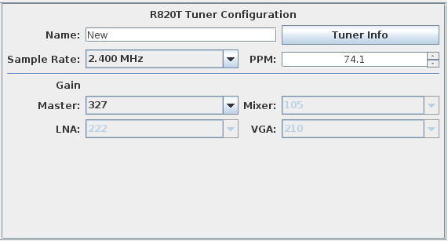

**Version:** 0.3.0

RTL-2832 R820T and R820T2 Tuner Configuration
---

**Figure 1:** R820T Tuner Configuration

The following settings shown in Figure 1 are available for configuring the tuner:

#### Name
Name for the tuner configuration. 

#### Tuner Info Button
Provides a summary of details about the currently selected tuner, including USB ID, Vendor, Product, 
Serial number, IR status, and Remote Wake status.

#### Sample Rate
Allows you to change the sample rate.

#### PPM
Adjusts the frequency correction Parts Per Million (PPM) value for the tuner.  If you notice in
the spectral display that the frequency labels are slightly misaligned to observed signals, you
can adjust this value to align the frequency to the observed signals with known operating 
frequencies.

#### Master Gain
Sets the overall gain for the tuner and automatically controls the individual gain controls.  Use 
the **Manual** setting to enable and independently change the LNA, Mixer and Enhance gain controls

#### LNA Gain
Sets the LNA gain.  Place the Master Gain into **Manual** mode to enable this control.

#### Mixer Gain
Sets the Mixer gain.  Place the Master Gain into **Manual** mode to enable this control.

#### Enhance Gain
Sets the Enhance gain.  Place the Master Gain into **Manual** mode to enable this control.