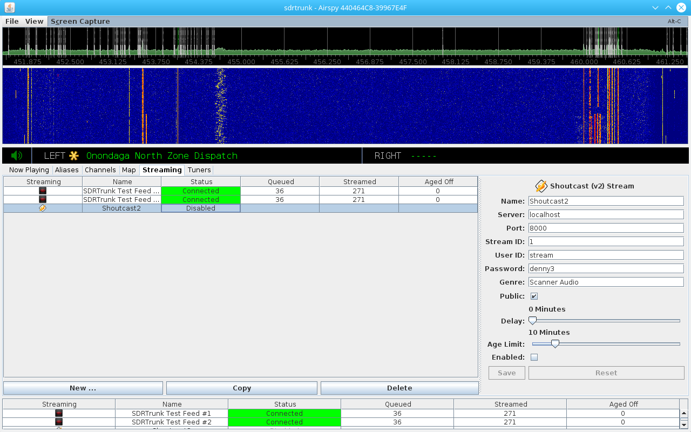
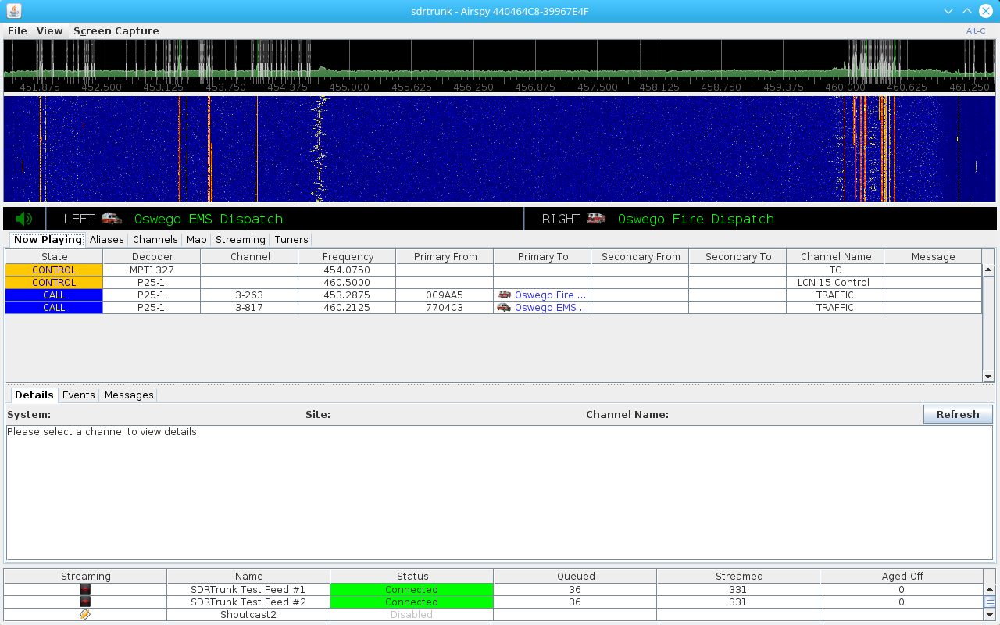

**Version:** 0.3.0

Streaming Overview
---
The SDRTrunk application supports streaming of multiple audio calls to multiple 
remote audio streaming servers.  Audio calls are temporarily recorded to disk in 
MP3 audio format.  The temporary recording is then queued for broadcast with one 
or more audio streams.  Streaming uses aliases to identify which stream(s) will 
broadcast the audio recording.  Each temporary recording contains metadata about 
the call that is also forwarded to the streaming server.

This concept allows you to create simple single channel audio streams or very 
complex audio streams that are combined from multiple radio systems or radio 
users. For example, you could monitor a group on a P25 system and a related 
separate group on an LTR system and combine all calls from both systems into a 
single broadcast channel.

Temporary audio recordings that are queued for streaming in the order received.  
When the streaming queue is empty, MP3 silence frames are streamed to maintain a 
consistent connection to the remote server.  When silence is streaming, the 
metadata is updated to read '_Scanning..._'.

**Figure 1:** Streaming Tab

Figure 1 shows the streaming configuration tab where you can add, copy and delete
streaming configurations.  The following describes the streaming tabel columns:

#### Streaming
Show an icon identifying the streaming server type.

#### Name
The name assigned to the streaming channel.  This is also the name that can be
selected when choosing a broadcast channel to add to an alias.

#### Status
Shows the status of the connection. 
* **Configuration Error** - the broadcast channel configuration contais an error
* **Connected** - connected to the remote streaming server and streaming audio
* **Connecting** - attempting to connect to the remote streaming server
* **Disabled** - the **Enable** button in the stream configuration is not checked
and this broadcast channel has been disabled for streaming.
* **Disconnected** - the stream is disconnected.  This normally occurs when the 
connection is interrupted and the application will normally attempt to reconnect.
* **Error** - there is an error with the stream configuration or remote server.
* **Invalid User Name/Password** - user name or password is incorrect
* **Invalid Mount/Stream ID** - the mount point or stream ID is not recognized by
the remote server
* **Max Sources Exceeded** - the remote server rejected the connection because 
there are too many audio sources currently connected
* **Mount Point In Use** - your mount point is already in use.  This can happen
if you disconnect from the server and reconnect too quickly.  Waiting a few seconds
and restarting the connection will normally clear this error.
* **No Server** - the remote streaming server is not available.
* **Temporary Broadcast Error** - general temporary error
* **Unsupported Audio Format** - the remote server does not support MP3 audio

#### Queued
The number of MP3 audio recordings that are waiting to be streamed

#### Streamed
The number of MP3 audio recordings that have been streamed this session.

#### Aged Off
The number of MP3 audio recordings that were removed from the streaming queue
because the start time of the recording exceeded the maximum wait time or Age
Limit.  When this value grows large relative to the streamed count on a daily 
basis, consider removing some of the aliases that you have assigned to be 
streamed over this broadcast channel because the volume of call audio is 
exceeding the application's ability to stream the audio in a timely manner.  
It is normal for some calls to be aged off during periods of increased audio
volume.

## Supported Servers

The following servers are supported:
* [Broadcastify](http://www.broadcastify.com/)
* Icecast Version 2.3.x (TCP connection)
* [Icecast Version 2.4.1+](http://icecast.org/) (HTTP 1.1 connection)
* Shoutcast 1.x
* [Shoutcast 2.x/Ultravox 2.1](http://wiki.shoutcast.com/wiki/SHOUTcast_Broadcaster)

## Audio Format
* MP3 lossless audio compression
* Constant Bit Rate (CBR)
* 8000 Hz Sample Rate
* 16-bit samples

## Setup an Audio Stream
1. Click the **Streaming** tab
2. Click the **New** button and select the streaming server type
3. Create a unique name for the channel (each stream requires a unique name)
4. Fill in the server-specific stream details.  See **Streaming Configurations** 
below
5. Click **Save**
6. Attach this stream to one or more Aliases.

## [Aliases](Alias) and Broadcast Channels

Aliases are used for designating specific radio users and/or groups for streaming.  
You can attach one or more Broadcast Channel identifiers to each alias.  When a 
call occurs, it is temporarily recorded to disk in MP3 format.  Once the recording 
is complete, it is queued for broadcast with each broadcast channel that is listed 
for each and every alias involved in the call.  

For example, if you have a call from radio ID 123456 to talkgroup ABCD and the 
radio ID has Channel A and Channel B attached, and the talkgroup has Channel B and 
Channel C attached, then the call would be streamed to all three channels. 

### Attaching a Broadcast Channel to an Individual Alias
1. Create an [Alias List](AliasList) and attach it to your decoding [Channel Configuration](Channel)
1. In the **Aliases** tab, select the alias you want to stream
1. In the Alias editor screen, switch to the **Audio/Identifier** tab
1. Click **New** and select **Audio Broadcast Channel**
1. In the drop-down list, select the Broadcast Channel that you have previously configured
1. Click **Save**
1. Repeat these steps to add additional broadcast channels for the alias.

### Attaching a Broadcast Channel to Multiple Aliases
1. Create an [Alias List](AliasList) and attach it to your decoding [Channel Configuration](Channel)
1. In the **Aliases** tab, select the the set of aliases that you want to modify
1. In the multiple alias editor, place a check in the **Stream** entry
1. Select the broadcast channel from the drop-down list
1. Click **Save**

**Figure 2:** Now Playing with Streaming Status Panel Showing

## Streaming Status Panel

Select the View menu at the top of the application window and click on the 
**Show Streaming Status** menu item to turn on the streaming status panel at the 
bottom of the application window as shown in Figure 2.  This allows you to view 
the 'Now Playing' window, channel details windows, and monitor your streaming 
status at the same time. **Note:** this status panel is read-only.  You can only 
make changes to stream configurations in the **Streaming** tab.

## Streaming Configurations

### All Server Configurations
* **Delay** - this delays streaming of queued audio calls by the specified minutes (0-60 minutes).  Calls will remain in the queue and will not be streamed until the call start time plus the delay minutes has elapsed.
* **Age Limit** - time limit for retaining audio recordings in the broadcast queue (1-60 minutes).  If a call remains in the queue too long, it is automatically deleted once the call start time plus delay plus age limit has elapsed.  This feature ensures that your streaming queue doesn't grow to the point that streaming will never catch up.  It also ensures that what you're streaming is relatively recent audio.  Note: if you see that a large number of your calls are being aged off (deleted prior to broadcast), consider changing/reducing the number of aliases that you have designated for that stream, or increase the age limit value to allow for temporary increases in activity.
* **Enabled** - enables or disables a stream.  Use this check box to turn streaming on or off.
* **Save** - saves any changes you have made to the configuration.  If a stream is running when you make changes, the stream will be disconnected and then recreated with the new settings.
* **Reset** - resets the editor window to the saved configuration values after you have made changes to the editor.

### Broadcastify
* **Lookup ...** - click this button to lookup your stream provider details on Broadcastify and auto-configure your stream.  Enter your user name and password in the dialog window.  Click **Get Feeds** and then select one of the streams/feeds that appear in the list.  Click **Ok**.
* **Name** - name of your feed
* **Server** - Broadcastify server URL for your feed
* **Port** - Broadcastify server port for your feed
* **Mount** - mount point for your feed
* **Password** - password for your feed
* **Feed ID** - your feed identifier

### Icecast v2.3 and v2.4+
* **Name** - unique name for your feed
* **Server** - server URL for your feed
* **Port** - server port for your feed
* **Mount** - mount point for your feed
* **User Name** - (v2.4+ only) user name for your feed
* **Password** - password for your feed
* **Description** - description of the feed contents
* **Genre** - genre of the feed contents
* **Public** - designates the feed as Public (checked) or Private (not checked)

### Shoutcast v1.x
* **Name** - unique name for your feed
* **Server** - server URL for your feed
* **Port** - server port for your feed
* **Password** - password for your feed
* **Genre** - genre of the feed contents
* **Description** - description of the feed contents
* **Public** - designates the feed as Public (checked) or Private (not checked)

### Shoutcast v2.x
* **Name** - unique name for your feed
* **Server** - server URL for your feed
* **Port** - server port for your feed
* **Stream ID** - numeric ID for your feed
* **User ID** - user name/ID for your feed
* **Password** - password for your feed
* **Genre** - genre of the feed contents
* **Public** - designates the feed as Public (checked) or Private (not checked)