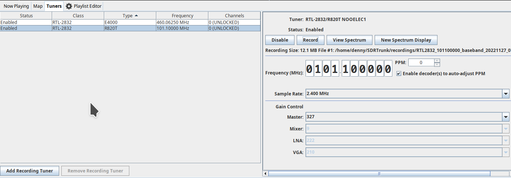
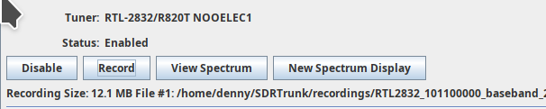
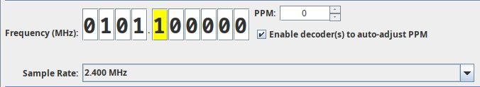

# Tuners and Software Defined Radios (SDR)
<!-- TOC -->
* [Tuners and Software Defined Radios (SDR)](#tuners-and-software-defined-radios--sdr-)
  * [Overview](#overview)
    * [Enable/Disable Tuner Use](#enabledisable-tuner-use)
    * [USB HotPlug Detection](#usb-hotplug-detection)
    * [Preferred Tuners](#preferred-tuners)
  * [SDR Driver Setup](#sdr-driver-setup)
    * [Install udev Rules](#install-udev-rules)
  * [General Tuner Use](#general-tuner-use)
    * [Tuner Table](#tuner-table)
    * [Recording Tuners](#recording-tuners)
    * [Tuner Editor](#tuner-editor)
    * [Frequency Control](#frequency-control)
    * [PPM Correction](#ppm-correction)
    * [Enable Auto-Adjust PPM](#enable-auto-adjust-ppm)
    * [Tuner-Specific Controls](#tuner-specific-controls)
  * [Calibrating SDR Tuners](#calibrating-sdr-tuners)
    * [Calibrating Tuner PPM](#calibrating-tuner-ppm)
    * [Calibrating Tuner Gain](#calibrating-tuner-gain)
  * [SDRPlay RSPduo](#sdrplay-rspduo)
  * [SDRPlay on Mac OS](#sdrplay-on-mac-os)
  * [Supported SDRs](#supported-sdrs)
<!-- TOC -->
## Overview
sdrtrunk uses USB SDR dongles as a source of radio signals for decoding.  The application can also use wide bandwidth
baseband recordings generated from SDR dongles.

### Enable/Disable Tuner Use
sdrtrunk attempts to claim and use all SDRs that it finds when the application starts up.  You can disable individual
SDRs so that sdrtrunk doesn't automatically claim them.  Some of the RTL-2832 based SDRs do not provide a consistently
unique identifier, so if you move the SDR to a different USB port, this can impact the disabled setting for that SDR.

### USB HotPlug Detection
On Linux and OS-X systems, sdrtrunk can detect when you plugin or remove an SDR dongle.  The application will 
automatically claim a newly added USB dongle and make it available for application use, unless the dongle was previously
disabled by the user.  The Windows LibUsb library does not currently support USB Hot Plug detection to notify sdrtrunk 
when new USB devices are available.  However, you can restart the application after adding a new USB device so that the 
device can be used.

### Preferred Tuners
You can edit Channel configurations in the Playlist Editor to select a 'Preferred Tuner' to use with a channel.  When
sdrtrunk starts the channel for decoding, it will attempt to use the preferred tuner that you selected if that tuner is 
currently available and can also tune the channel.  When the preferred tuner is not available or can't tune the 
channel's frequency, sdrtrunk will automatically select the another available tuner.

## SDR Driver Setup
Install the driver(s) for your USB based SDR dongles.  Like many other SDR applications, sdrtrunk uses
LibUsb to interface with SDR dongles.  If your dongle is supported by sdrtrunk and it is already configured to work
correctly with other SDR applications, it should also work with sdrtrunk.

Windows

Some dongles require the Zadig USB driver software:
* [Zadig Website](https://zadig.akeo.ie/)
* [RTL-SDR Zadig Articles](https://www.rtl-sdr.com/tag/zadig/)

SDRPlay RSP tuner support requires installing the API.  Note: the API is installed/included when you install SDRUno application.
* [SDRPlay Software Download](https://www.sdrplay.com/softwarehome/)

Linux / OS-X

### Install udev Rules
Install udev rules file for any tuners you'll be using into the /etc/udev/rules.d/ directory. The following udev files 
are available here: https://github.com/DSheirer/sdrtrunk/tree/master/src/main/resources

**funcube-dongle.rules**
**52-airspy.rules**
**53-hackrf.rules**
**rtl-sdr.rules**

Ensure that the user account used to start the application also has access to these dongle resources.

SDRPlay RSP tuner support requires installing the API.  Note: the API is installed/included when you install SDRUno application.
* [SDRPlay Software Download](https://www.sdrplay.com/softwarehome/)

## General Tuner Use
SDRs are capable of sourcing many radio channels simultaneously, limited only by the bandwidth (ie sample rate) of the
SDR and the supported frequency range(s).  sdrtrunk manages SDRs as a pooled set of resources.  When the application allocates new radio traffic channels, it
simply iterates through the set of SDRs until it finds an SDR that is capable of tuning the requested channel frequency.

### Tuner Table
The Tuners tab presents a list of tuners that are discovered by the sdrtrunk application. Clicking on a row in the 
tuner list will **select** that tuner and display a tuner editor in the right-hand panel where you can control the tuner.

The following columns are displayed in the tuner list table:
* **Status** indicates the status of the tuner.  
  * **Enabled** indicates that the tuner is being used by the application.
  * **Disabled** indicates that the user has disabled this tuner and it will not be used by sdrtrunk.
  * **Error** indicates that there is an error with the tuner that must be resolved before the tuner can be used.
* **Class** is the general category or class of the tuner
* **Type** is the specific type or model of the tuner
* **Frequency** indicates the current center tuned frequency of the tuner
* **Channels** indicates how many channels are being sourced from the tuner.  A value of **0 (UNLOCKED)** will be 
displayed when the tuner is not sourcing any channels.  A non-zero value, for example: **1 (LOCKED)**, indicates the
number of channels being sourced from the tuner.  The **LOCKED** label indicates that the tuner editor's frequency and
sample rate controls are locked and cannot be changed by the user until all of the decoding channels being sourced by
the tuner have been stopped.

### Recording Tuners
You can manually create baseband recordings from each tuner and use these recordings to simulate an actual
tuner for offline decoding or visualizing the frequency spectrum.  This is useful if you want to capture the entire 
frequency spectrum of a tuner and later playback that recording to setup new decoder channels or make recordings of 
individual channels that you extract from the larger tuner baseband recording.

The recording tuner feature only works with baseband recordings generated by sdrtrunk using the WAV file format where 
the signed 16-bit samples are stored with inphase samples in channel 1 and quadrature samples in channel 2.

The following buttons control use of recording tuners:

* **Add Recording Tuner** - adds a previously generated baseband recording as an available tuner that can be used with
all of the decoders and application features.  Once added, the recording tuner will continue to be available across 
application restarts until you remove the recording tuner.  The add recording dialog will automatically infer the 
center frequency for the recording from the filename, however you may have to manually enter the frequency if this process fails.
* **Remove Recording Tuner** - removes the currently selected recording tuner.

### Tuner Editor
Each tuner editor panel provides controls for changing the operating configuration of the tuner and for interacting
with the spectral display to visualize the frequency spectrum of the tuner.

The following buttons are available:
* **Enable/Disable** - controls sdrtrunk use of the dongle.  Clicking **Disable** removes the tuner from use by the 
application.  This setting is saved across application restarts and will remain disabled until you click Enable again.
* **Record** - turns on/off baseband recording for the tuner.  When recording, the label below the button row 
displays the recording file size, recording number, and recording file path.  The baseband recorder will automatically 
roll-over to a new file once the maximum recording file size **(4 GB)** is reached.  See the Recording Tuners section above for details on using baseband 
recordings offline to simulate a tuner or to replay a previous recording and decode channels.
* **View Spectrum** - shows the current tuner in the primary application spectral display.
* **New Spectrum Display** - shows the current tuner in a new separate spectral display window.  You can open multiple
spectral display windows for the same tuner with each display independently zoomable into a specific frequency region. 
* **Restart** - attempts to restart a tuner that is showing an **Error** status.  This button is only visible when the
tuner has an **Error** status.  It attempts to restart the error tuner, however it may not clear the error issue.

### Frequency Control
The tuner editor frequency control allows you to manually change the center tuned frequency for the SDR tuner, when the
tuner is not supplying decoder channels.

During decoding, sdrtrunk automatically manages the center tuned frequency for each SDR.  When you are not actively 
decoding channels, the application allows you to manually tune and view the tuner's frequency spectrum.  However, once 
you activate a channel for decoding, sdrtrunk takes control of the SDR tuning and locks the tuner editor's frequency 
control so that you can no longer manually tune the SDR.  sdrtrunk will automatically select the optimal center tune 
frequency for the tuner based on the set of channels that are sourced from the SDR.

### PPM Correction
Consumer-grade USB SDR dongles can have significant clock drift causing frequency error. As the dongle heats up and cools
down, this error can change.  If you don't manually adjust each of your tuners to compensate for this error, it can
prevent sdrtrunk from correctly tuning channel frequencies and result in poor or no decoding of channel's digital 
signal.  By default, sdrtrunk sets this PPM offset to 0 and you must calibrate each SDR dongle to remove this 
frequency error.

### Enable Decoders to Auto-Adjust PPM
Some of sdrtrunk's digital decoders (APCO 25 & DMR) can provide frequency error reporting to an Automatic PPM correction
feature that can automatically adjust/correct the tuner's PPM value during the decoding process to maintain calibration 
of the tuner.  However, this feature only works when the tuner PPM is initially calibrated by the user so that the 
decoder can see the signal.  As the PPM calibration error changes over time while the application is running, each of 
the channel decoders will report the frequency error for their channel and the Auto PPM function will average these 
error reports and adjust the tuner PPM value periodically.

When you are using a decoder that provides frequency error reporting to the Auto-PPM feature, the current average error 
value as reported by the decoders will be displayed in the tuner editor next to the PPM adjust control.

### Sample Rate
Most SDR dongles support various sample rates.  The sample rate control allows you to select among the supported 
sample rate options.  There is a direct correlation between sample rate and the bandwidth or range of frequencies
that can be tuned by the SDR.  

**Note:** some of the bandwidth provided by SDRs can be unusable due to filter roll-off at the spectral edges and a DC 
spectral component.  sdrtrunk avoids placing decoding channels into these frequency regions because the signal
quality can be compromised and negatively impact decoding.

### Tuner-Specific Controls
Each SDR tuner can provide a number of configuration parameters that you can adjust such as Gain, Bias-T and clock 
reference signals.  The tuner editor displayed for each tuner contains controls that allow you to adjust these options.

## Calibrating SDR Tuners
It is critically important that you calibrate each of your SDR tuners before you attempt to decode any signals.

### Calibrating Tuner PPM
Use the following steps to correct the tuner drift error for each of your SDR tuners:
1. Select the tuner for display in the primary application window by clicking the **View Spectrum** button.
1. Allow the tuner to operate for a few minutes to allow the operating temperature to stabilize.
1. Manually adjust the tuner frequency to bring a known, accurate signal into the spectral view.  This signal should
   be in the same frequency region that contains the signals that you'll be decoding.  You DO NOT have to tune this known
   signal to the center of the display as that may hinder your ability to accurately align the signal to the frequency
   values.  U.S. NOAA weather channels (162.xxx MHz) and APCO25 channels are generally good reference signals.
1. Zoom (mouse wheel) in the Spectral Display to this signal so that you can clearly see the signal and the frequency values shown
   immediately below the signal.
1. Adjust the PPM value (+/-) until you align the signal with the known frequency value for that signal.

Note: you can manually adjust this tuner PPM value when channels are decoding when you see that the signals are not lining
up with the channel overlay in the spectral display.  You should do this when you're not using decoders that provide
measurements to the auto-PPM feature.

### Calibrating Tuner Gain
It is important for you to adjust the gain levels for each SDR tuner that you are using with sdrtrunk.  Setting the 
gain level too high or too low will critically impact the signal decoding capability.  Follow these
steps to adjust tuner gain:

1. Turn off all gain controls and set all gain sliders to the minimum value.
1. Watch the spectral display to see how the frequency spectrum changes as you adjust the gain values.
1. Incrementally increase the gain level while the individual signals continue to increase in height/amplitude.
1. Stop increasing the gain level when the noise floor starts to rise along with the signals.

**Noise Floor** - the general level of the frequency spectrum display in the areas where there are no signals.

## SDRPlay RSP Tuners

### Setting Gain on RSP tuners
The gain settings for SDRPlay tuners works differently than other tuners.  Enable the automatic gain control (AGC) and set the gain level to the maximum value.  If you see the overload indicator flashing, consider turning down the gain level a tick at a time until the overload subsides. 

### SDRPlay RSPduo
The RSPduo can be configured for either single tuner or dual tuner.  In single tuner mode, you have access up to 10 MHz sample rate.  In dual-tuner mode, you have access to two tuners each operating up to 2 MHz sample rate.  You must configure sdrtrunk for how you want to use the RSPduo.

Open the User Preferences dialog and select the Tuners tab to access the RSPduo tuner selection mode that sdrtrunk uses when starting the application.  You can also access this dialog from the RSPduo tuner editor screen when you select the RSPduo in the Tuners tab.  In this dialog, you can choose how sdrtrunk configures your RSPduo.  If you make any changes to this setting, you must restart sdrtrunk:

* Single Tuner 1 - configures for single tuner 1 mode
* Single Tuner 2 - configures for single tuner 2 mode
* Dual Tuner - configures for dual, tuner 1 and 2 mode

### SDRPlay on Mac OS
See the [FAQ](FAQ#how-can-i-use-sdrplay-receivers-on-a-mac-os-computer) wiki for instructions on creating a symbolic link to the sdrplay API driver that sdrtrunk can use.

## Supported SDRs
sdrtrunk supports the following SDR dongles:

* Airspy (Mini, R1, R2)
* Funcube Dongle (Pro, Plus)
* HackRF (HackRF One, Jawbreaker, RAD1O)
* RTL-2832 (E4000, R820T, R820T2)
* SDRPlay (RSP1, RSP1A, RSP2/pro, RSPduo, RSPdx) in Version 0.6.0

