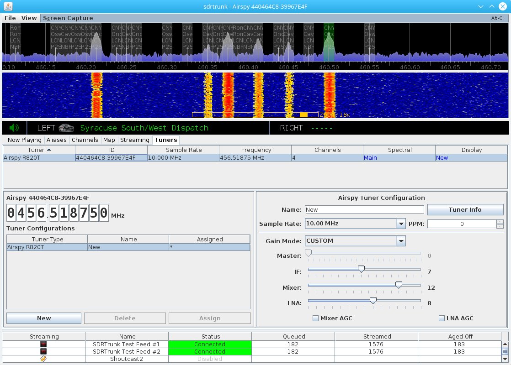

**Version:** 0.3.0

Tuners
---
The tuners tab lists all tuners currently recognized and available for use by the sdrtrunk
application.  You can create one or more tuner configurations for each tuner and identify
one of those configurations as the default configuration for the tuner.  The application 
attempts to reconfigure your tuner to the same settings used the last time that you ran the
software.

**Figure 1:** Tuners View 

The tuners view contains three sections with all available tuners listed in the top section, tuner 
configurations listed in the lower-left panel and a tuner configuration editor panel in the 
lower-right panel.

Select a tuner row in the top table to view available tuner configurations in the lower-left.

Select a tuner configuration in the lower-left table to view the tuner configuration editor panel
in the lower right.

Supported Tuners
---
The following tuners are currently supported by the SDRTrunk application.  Additional tuner support will 
be added in the future.

  * [Airspy](Airspy)
  * [Funcube Dongle Pro](FuncubeDonglePro) (1.0)
  * [Funcube Dongle Pro Plus](FuncubeDongleProPlus) (2.0)
  * [HackRF](HackRF)
  * [RTL-2832 with Elonics E4000](E4000)
  * [RTL-2832 with Rafael Micro R820T or R820T2](R820T)

Tuner Management
---
The application automatically manages all tuners as a pooled set of resources.  As you enable channels 
for decoding, sdrtrunk polls each tuner to see if it can support the requested channel frequency, and 
then assigns the channel to the tuner.  If no tuners can support the channel, then the channel will 
not start and you will receive a popup message indicating that no tuners are available.

Each tuner can source one or more channel frequencies so long as the set of channel frequencies fit 
within the current center tuned frequency and bandwidth (sample rate) of the tuner.  As additional 
channels are sourced by the tuner, the tuner controller will automatically adjust the center frequency 
to provide a best-fit of all sourced channels, while ensuring that no channels overlap any 
DC-spike that may be present in the center of the spectrum for some types of tuners.

Tuners Table
---
All available tuners are detailed in the table at the top of the tuners view.  The following columns
are included in the table:

#### Tuner
Description of the tuner model

#### ID
Identifier or serial number of the tuner

#### Sample Rate
Current sample rate setting for the tuner

#### Frequency
Current center tuned frequency of the tuner.  **Note:** the sdrtrunk application automatically adjusts
the tuner's center tuned frequency according to the channels that are being sourced from the tuner.  You
can adjust this frequency and each of the decoding channels will adjust their offset to compensate.  
However, it's recommended to let the application manage this setting for you.

#### Channels
Number of decoding channels currently being sourced by the tuner.

#### Spectral
Provides a quick-link for showing the tuner in the primary spectral display.  Click the **Main**
link in the row to show that tuner in the primary spectral display.

#### Display
Provides a quick-link to launch a new spectral display window for the tuner.  Click the **New**
link in the row to create a new spectral display window for the tuner.

**Note:** you can launch multiple windows for each tuner or combination of tuners.  However, each
window adds to the overall processing workload for the computer and using too many spectral
display windows may impair application performance.

Tuner Configuration Table
---
The tuner configuration table lists all tuner configurations for the currently selected tuner.  This
section includes a descriptive name for the tuner and a **Frequency** control for adjusting the 
center tuned frequency for the currently selected tuner.  The following columns are included in 
the tuner configuration table:

#### Tuner Type
Indicates the type of tuner for the configuration.

#### Name
Name of the tuner configuration

#### Assigned
Only one of the tuner configurations listed will contain an asterisk (*) indicating that the 
configuration is the currently assigned configuration for the selected tuner.

The following buttons allow you to manage your tuner configurations for the currently selected
tuner:

#### New Button
Click to create a new tuner configuration for the selected tuner.

#### Delete Button
Click to delete the currently selected tuner configuration.  If you attempt to delete a 
tuner configuration that is assigned to the currently selected tuner, a popup error 
message will appear indicating that you have to assign another tuner configuration to
the tuner before you can delete the currently selected tuner configuration.

#### Assign Button
Assigns the currently selected tuner configuration as the default configuration for the
currently selected tuner.  The default configuration is used to configure the tuner 
each time you start the application.

Tuner Configuration Editor
---
Selecting a tuner configuration in the tuner configuration table will load the 
corresponding editor for the tuner configuration and allow you to change settings
for the tuner.  See each specific tuner type listed above in the **Supported Tuners**
section for a listing of available settings.

**Note:** any changes made to the default tuner configuration will be automatically
applied to the currently selected tuner.
