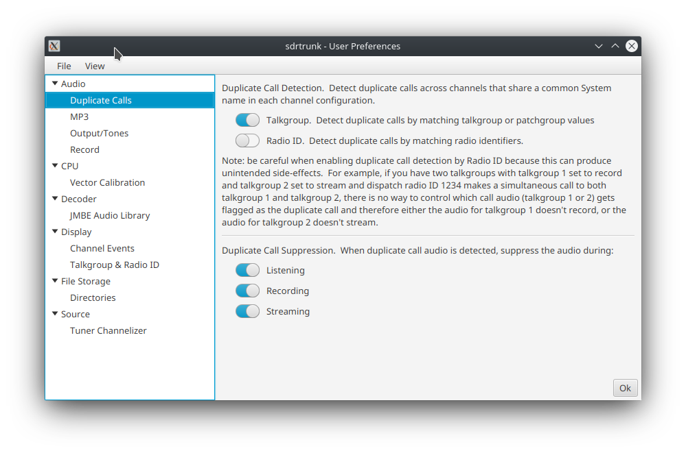

# User Preferences Editor
The user preferences editor contains sdrtrunk application settings that the user can customize.  These
settings are organized by category.

You can access the User Preferences editor from the main application window via the **View** menu.

## Audio
The audio tab contains settings for audio playback, recording and call handling.

### Duplicate Calls
The duplicate calls editor contains settings for managing duplicate call audio that can occur when 
you are decoding multiple sites or control channels from the same trunked system.  In order for this
duplicate call feature to work you must ensure that each of the decoding channels share a common
**System** name.

#### Duplicate Call Detection
This section contains settings for enabling various methods of duplicate call detection.

* **Talkgroup** - enables duplicate call detection by called talkgroup.  This is the most-common method for
duplicate call detection and handling.
* **Radio ID** - enables duplicate call detection by calling radio ID.  This method of duplicate call 
detection is disabled by default because it can have unintended side-effects as documented in the 
preference editor pane.

#### Duplicate Call Suppression
The settings in this section determines how duplicate call suppression is applied.

* **Listening** - suppress monitoring of duplicate call audio.
* **Recording** - suppress recording of duplicate call audio.
* **Streaming** - suppress streaming of duplicate call audio.

### MP3
The MP3 preference editor contains settings that control the conversion/encoding of decoded audio to MP3
audio format.

* **Normalize Audio Before Encoding** - enables a process that attempts to normalize the audio volume
before it is encoded to MP3.
* **LAME Encoder Setting** - identifies the MP3 encoding format to use
* **Input Audio Sample Rate** - identifies the input audio format to the MP3 encoder.  sdtrunk uses
an application default of 8kHz sample rate with 32-bit sample size when generating audio.  Selecting
another input sample rate will cause sdrtrunk to resample the audio from the system default format
before it is sent to the MP3 encoder and incur additional CPU processing workload.

### Output / Tones
The output/tones editor controls audio playback device selection and playback tones insertion.

#### Audio Output Device
* **Audio Output Device** - selects the audio output to use for audio playback.  sdrtrunk attempts
to use the system default audio device which is generally correct for most users.  However, users
with alternate audio hardware configurations can select from among the audio playback devices
provided by the operating system. Click the **Test** button to generate a short tone on the selected
audio output device to verify that sdrtrunk audio playback is configured correctly.

#### Audio Playback Insert Tones
This feature inserts short tones during audio playback to indicate audio playback events.  sdrtrunk
can insert these tones before audio playback to let you know what's going on with audio playback.
* **Start Tone** - a short tone is injected before playback of each audio call.
* **Priority PreemptTone** - a short one is injected when a higher priority call interrupts
playback of the current audio call and starts playback of the higher priority call.
* **Drop Tone** - a short tone is inserted when playback of a call is interrupted and dropped because
an alias associated with the call indicates Do Not Monitor the audio.

You can select from among several tones and tone volumes for each of these tone insert events:
* **Frequency** - controls the frequency of the generated insert tone.
* **Volume** - controls the volume of the generated insert tone.
* **Test** - the selected frequency and volume settings by clicking the test button.

### Record
This preference editor allows you to select the default format for audio recordings.
* **MP3** - the default recording format for all audio recordings.
* **WAVE** - an alternate recording format.

## CPU

### Vector Calibration
The sdrtrunk application can take advantage of advanced CPU processing capabilities called Single
Instruction Multiple Data (SIMD) that enables the CPU to efficiently execute several calculations in parallel
during the same CPU cycle.  The Java runtime was updated starting in JDK 17 to enable Java applications
to use these CPU SIMD instructions.  However, as of Java 19 this SIMD support continues to be in a 
preview status and has not been finalized yet.  Despite this preview status, the capability is 
stable enough for use in the sdrtrunk application.

You may or may not notice any change in the processing workload on your computer with SIMD enabled
or disabled.  Sometimes the performance impacts are minimal.  However, SIMD does speed up some of the
data processing intensive operations by 4x or 8x.

SIMD feature support across CPUs is not consistent and sometimes the SIMD operations can actually run slower
than the non-SIMD operations.  Depending on the CPU, SIMD operations can process 2, 4, 8 or 16 operations
at the same time. For these reasons, the sdrtrunk application has several options available to choose from for various
processing-intensive tasks and the application must choose which SIMD option performs the best on 
your computer.  The best SIMD processing option is determined through the vector calibraton process.

The Vector Calibration feature runs by default the first time that you launch the 
application.  You can choose to cancel this calibration and run it at a later time by clicking the
**Calibrate** button in this editor.

Additional SIMD processing options will be added to the application over time.  As these options
are included in releases, the vector calibration dialog will appear on application startup and 
automatically run the calibration routines for only the newly added processing options.

* **Enable SIMD Vector Operations** - enables using SIMD processing when your CPU supports it.  You
must run the vector calibrations for this to have an effect.
* **Don't Show Calibration Dialog** - disables automatic vector calibration dialog on application startup.
* **Calibrations To Perform** - indicates the number of calibrations that will be run when you click the **Calibrate** 
button
* **Calibrate** - starts the calibration process.
* **Reset All Calibrations** - resets all calibrations to default (ie not calibrated) so that they can be run again.

