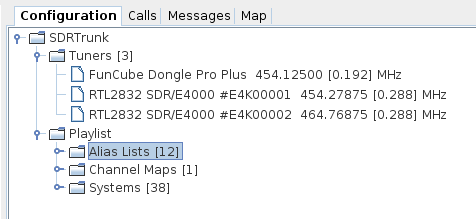

# Configuration #

The configuration window uses a tree list to provide access to all of the configurable features and settings in the SDRTrunk application.

  * [Tuners](Tuner)
  * [Playlist](Playlist)

