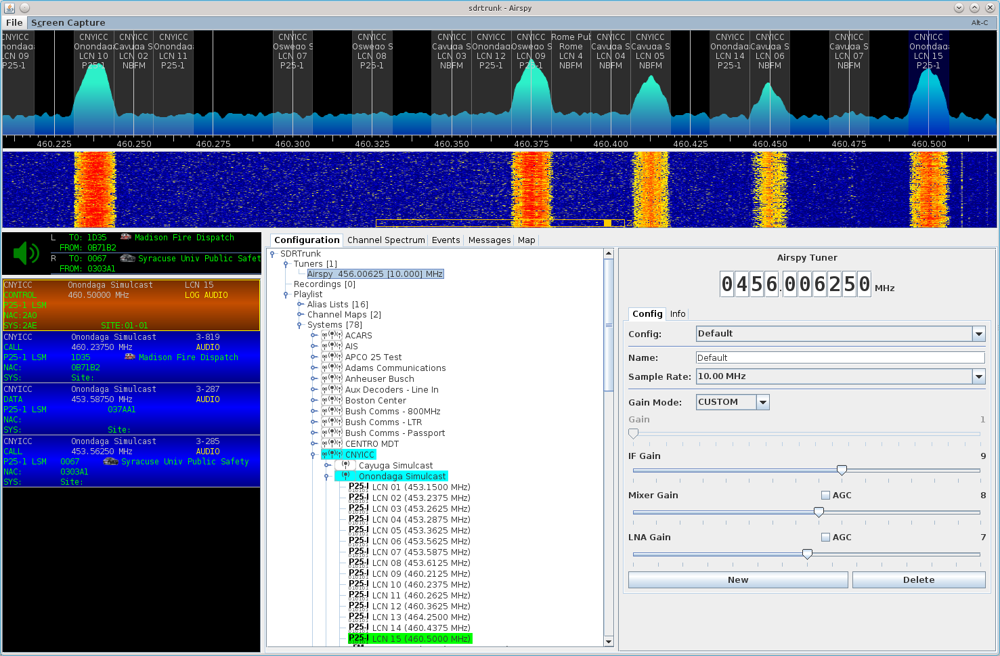

# APCO-25 Decoder #

The P25 decoder processes all voice, trunking, and data messages and provides
traffic/voice/data call following when a tuner is available that can monitor
both the control channel and any traffic channels within the available bandwidth
of the tuner, or across multiple tuners.

## P-25 Phase I##
Decodes FDMA Common Air Interface (CAI) C4FM modulation and Linear Simulcast 
Modulation (LSM).

## P-25 Phase II##
Phase II TDMA decoding is not currently supported.

## P-25 Hybrid (Phase I/II)##
P25 hybrid systems use both Phase 1 control channels and Phase I and Phase II
traffic channels, providing transition support for users with a combination of
Phase I and Phase II radios.

TDMA configuration messages that are broadcast on Phase I control channels are 
decoded.  Currently these include the TDMA timing synchronization and TDMA 
channel identifier messages.

## Audio Vocoders ##

### IMBE ###
APCO-25 Phase I audio calls use the multi-band excitation model vocoder to
compress the digitized audio.  SDRTrunk supports the JMBE library for decoding
audio, but DOES NOT include the jmbe library in the normal application download.
You must download and compile the library and place the jmbe-x.x.x.jar file in
the same directory from where you launch the sdrtrunk application.  On startup,
sdrtrunk will attempt to discover the library and can then decode imbe audio.

[JMBE library](https://github.com/DSheirer/jmbe)

[How To Setup JMBE](JMBE)

### VSELP ###
SDRTrunk recognizes VSELP audio CODEC messages and will display them in the
messages tab during decoding.  However, it will not decode the audio.

## Traffic Channel Following ##
The P25 decoder provides full traffic channel following when monitoring a P25
control channel.  You can optionally select to not follow data calls in the 
decoder configuration when setting up the channel for decoding.

## Talkgroups and Addresses ##

All talkgroups and radio addresses are listed in hexadecimal (base-16) notation
and use the digits 0 - 9 and the letters A - F.  Talkgroups are four characters
in length and radio addresses are six characters in length.

Packet data IP Version 4 addresses will normally show in the from column of the
events window and the Logical Link ID (radio address) will show in the from
column with the radio's IP Version 4 address listed in the details column. If
the data contains UDP over IP protocol, the UDP source and destination ports
will be appended to the IP address.

## Aliases ##

You can create an Alias List and attach it to your P25 decoder in the channel
configuration window.

When aliasing talkgroups and radio addresses, ensure you include the full 4 or 6
character talkgroup or address with leading zeros.

## Modulation ##

Choose either C4FM or LSM Simulcast (CQPSK) modulation in the channel configuration
decoder tab.  When you select the P25 Decoder from the drop-down list, the
modulation selector list will appear.

## P25 Decoding Example ##

The following screenshot shows the application configured to decode one P25
control channel.  It also shows 3 traffic channels being decoded where the 
call event was decoded on the control channel and sdrtrunk automatically 
created the 3 decoder channels to follow the calls.

