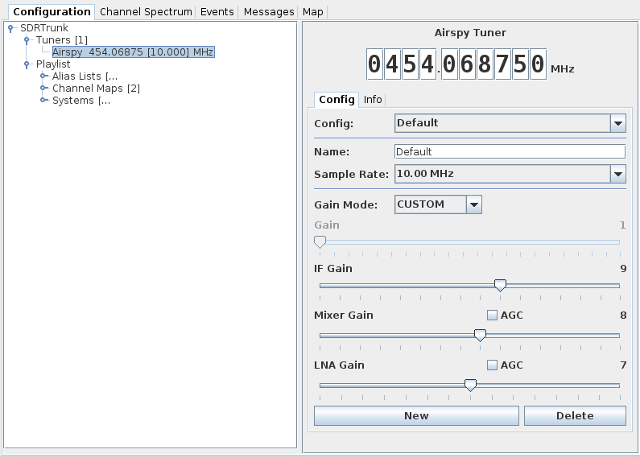

# Airspy #

## Tuner Configurations ##

SDRTrunk allows you to define multiple named tuner configurations per tuner
type.  A **Default** configuration is automatically created the first time you
use each specific tuner type and will be recreated again if you accidentally
delete or rename the **Default** configuration.

Each time you plug your USB tuner into a new USB port, it will automatically
use the **Default** tuner configuration.  If you select a different named
configuration, SDRTrunk will remember to use that named configuration each time
you use the USB tuner in that specific USB port.  If you create a named
configuration for your tuner and subsequently move the tuner to a different
USB port, simply select that named configuration from the drop-down list and it
will store that port to named configuration setting.

All changes to a named configuration are automatically saved.

## Configuration ##

  * **Frequency** - sets the tuned frequency
  * **Config Tab** - controls for changing tuner configuration
  * **Info Tab** - displays information about the tuner

### Configuration Tab ###

  * **Configuration Selection List** - selects a named configuration to use.  Automatically applies the corresponding settings to the tuner
  * **Name** - tuner configuration name.

  * **New** - creates a new named tuner configuration
  * **Delete** - deletes the currently listed tuner configuration

  * **Sample Rate** - select from 10.00 or 2.50 MHz sample rates. Note: the
  additional decimation option is not currently supported in sdrtrunk. 
  * **Gain Mode** - select from LINEARITY, SENSITIVITY, or CUSTOM.  Linearity
  and sensitivity modes provide a single gain adjustment value that automatically
  configures the IF, Mixer and LNA gains for each master gain setting.  The
  Custom mode disables the single gain adjustment slider and provides access to
  each of the IF, Mixer and LNA gain sliders so that you can manually adjust
  each gain value to meet your specific needs.

### Info Tab ###
The info tab displays information about the tuner:

  * **Serial** - serial number of the Airspy tuner.
  * **Firmware** - version number of the firmware loaded in the airspy
  * **Part** - airspy part number
  * **Board ID** - airspy board identifier

## Using the Airspy ##

## Updating Firmware ##

The firmware label shown on the Info tab is the GIT revision label that was
tagged against the software release.  SDRTrunk does not support
flashing the Airspy with new firmware.  Use the Airspy tools to update the
tuner.

## Using Airspy With Linux ##

If you've never setup your airspy for linux, you'll need to add permissions to allow users to access the airspy:

Copy the file **\config\52-airspy.rules** from the sdrtrunk application folder to your **\etc\udev\rules.d** folder.
 
    sudo cp 52-airspy.rules \etc\udev\rules.d

Set file permissions.

    sudo chmod u=rw,g=r,o=r 52-airspy.rules

Refresh the udev rules

    sudo udevadm control --reload-rules
