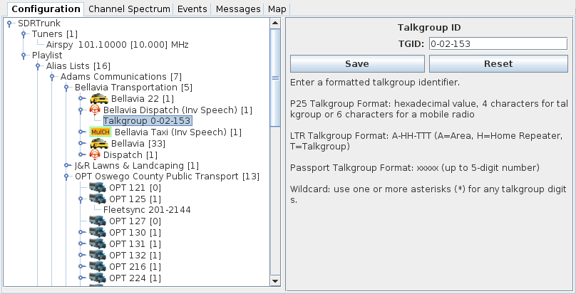

# Alias #

An alias is a user defined label that can be associated with one or more 
identifiers produced by the decoders.  Each alias can include:

 * **Alias Identifier** - (see below) one or more identifiers that you want to be associated with the alias
 * [Alias Action](AliasAction) - an action that you want to happen each time the alias is active
 * [Non-Recordable](NonRecordable) - indicates that the alias should not be recorded when 
 	AUDIO recording is specified for the decoding channel
 * [Call Priority](CallPriority) - specifies audio playback priority for this alias or allows
 you to designate an alias as 'DO NOT MONITOR'


## Creating an Alias ##

Right-click on the Alias Group folder and select **New Alias**.

## Deleting an Alias ##

Right-click on the Alias and select **Delete**

## Configuring an Alias ##

  * **Name** - display name for the alias
  * **Map Color** - for decoders that produce (GPS) locations where the entity can be plotted on the map, designates the color of the label and history trail used for that entity
  * **Map Icon** - picture to display with the alias
  * **[Icon Manager](IconManager)** - tool for managing and importing new pictures to use with Aliases.
  * **Save** - saves any changes to the alias
  * **Reset** - resets the alias with the last saved values

## Alias Identifiers ##

Each message and event produced by the decoders contains user and system 
identifiers that can be aliased.  One or more of these decoded identifiers can
be assigned to an alias.

### Alias Identifier Wildcards ###

Each of the alias identifiers (except LTR-Net unique ID and Status) allow you to 
specify a single character wildcard (asterisk) or a full java regular expression 
to use when matching identifiers.

Examples:

```
0-**-123                 LTR talkgroup 123 on any LCN
ABCD12**                 Any electronic serial numbers beginning with ABCD12
(?!FA-40|FA-41|FA-42).*  Any lojack site ID except for FA-40, FA-41, or FA-42 (use '|' to separate each site identifier)
```

### Create an Alias Identifier ###

Right-click on the Alias folder and in the ADD ID menu, select the type of alias 
identifer you want to associate with the Alias.

### Delete an Alias Identifier ###

Right-click on the Alias identifier and select **Delete**.

## Alias Identifier Types ##

  * **ESN** - electronic serial number.


  * **Fleetsync** - fleetsync identifier.


  * **LoJack** - lojack tower or transponder and related functions.
  
  * **MDC-1200** - MDC-1200 identifier.


  * **MIN** - passport radio Mobile ID Number (MIN).


  * **MPT-1327** - MPT-1327 user or group identifier.


  * **Site** - site number.


  * **Status** - status numeric value produced by decoders like P25 or FLEETSYNC
   
  * **Talkgroup** - used with P25, LTR and Passport talkgroups.  **TGID** 
identifies the formatted talkgroup.



  * **Unique ID** - LTR-Net mobile radio unique ID (UID).

