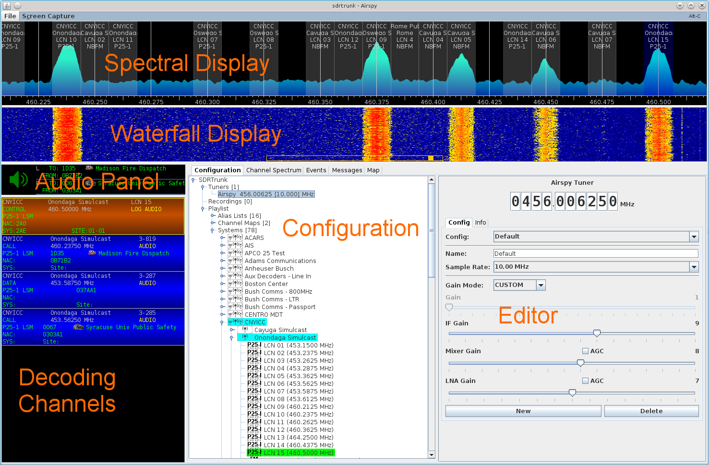

### Application Overview ###

  * [Audio Panel](AudioPanel)
  * [Channel Spectrum](ChannelSpectrum)
  * [Configuration](Configuration)
  * [Decoding Channels](DecodingChannels)
  * [Editor](Editor)
  * [Events](CallEvents)
  * [Map](Map)
  * [Messages](Messages)
  * [Spectral Display](SpectralDisplay)
  * [Waterfall Display](WaterfallDisplay)
  

  