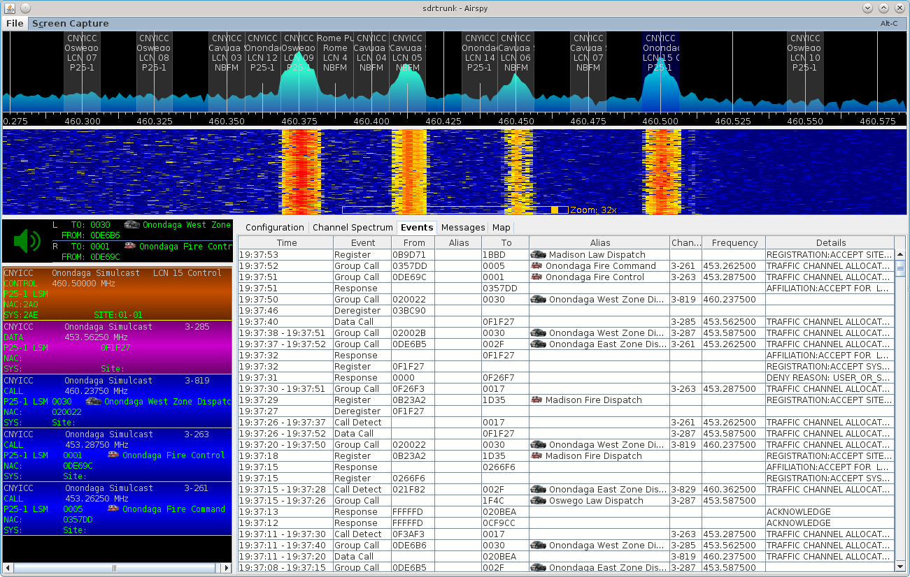

# Call Events #

The **Events** window displays a history of the radio calls and network messages
that have been decoded for each channel.  Select each channel individually in 
the [decoding channels](DecodingChannels) window to display the call event 
history for that channel.

## Call Event Table Details ##

  * **Time** - time that the event occurred
  * **Event** - call event description
  * **From** - identifier of the radio that initiated the call
  * **From Alias** - alias label of the from entity
  * **To** - identifier of the radio or talkgroup receiving the call
  * **To Alias** - alias label of the to entity
  * **Channel** - channel number for the event
  * **Frequency** - frequency of the channel number
  * **Details** - minimal additional details for the call event

## Call Event Types ##
  * **Acknowledge** - acknowledgement from a radio
  * **ANI** - automatic number identification for a radio
  * **Announcement** - announcement transmitted on a control channel
  * **Call** - call event
  * **Call Alert** - a mobile radio is alerted about a pending call
  * **Call Detect** - a call detected on another channel
  * **Call-Do Not Monitor** - a call where either the TO or FROM identifier's
  alias has a call priority with the 'Do Not Monitor' box checked
  * **Command** - the network is commanding a mobile radio to do something
  * **Data Call** - a data call event
  * **Deregister** - a mobile radio is deregistering from the network
  * **Emergency** - emergency notification from a radio
  * **Encrypted Call** - a call using encryption
  * **ESN** - radio registering on the network with an ESN, or responding to an ESN interrogation
  * **Function** - a function transmitted by the network to the mobile radio
  * **GPS** - gps location broadcast from a mobile radio
  * **Group Call** - a group call event
  * **Page** - the system is paging a radio
  * **Query** - the network is querying the status of a mobile radio
  * **Register** - radio registering on the network
  * **Response** - the network is responding to a mobile radio
  * **SDM** - short data message
  * **Station ID** - network callsign (FCC ID)
  * **Status** - status message
  * **Telephone Interconnect** - a landline call to or from a mobile radio
  * **Unit To Unit Call** - mobile radio to mobile radio call
  * **Unique ID** - LTR-Net unique identifier for a radio registration
  