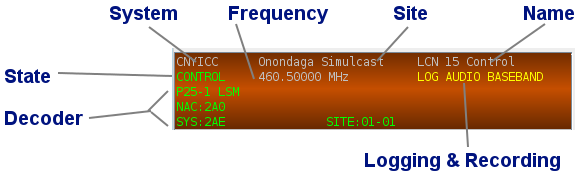
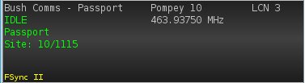
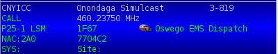
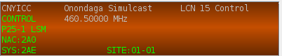
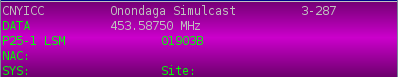
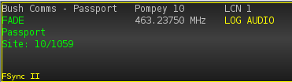

# Decoding Channels #

The decoding channels window displays a list of each of the channels that you
have enabled for decode.

## Standard vs. Traffic Channels ##

There are two types of decoding channels processed by the system.  STANDARD
channels are defined in the playlist and enabled/disabled by you.  TRAFFIC 
channels are dynamically created by the Traffic Channel Manager when you are 
decoding a control channel and the decoder detects that the monitored network
has allocated a traffic channel.  The traffic channel is created, enabled and
disabled at the end of the call.  If you are decoding a trunked control channel
and you have configured the decoder to allow traffic channels, you will see these
traffic channels appear in the decoding channels list and then disappear upon
call teardown.

## Decoding Channel Window ##

Each decoding channel that you have enabled will have a display panel that shows
the channel information and the current state of the channel.
 

* **Decoder** - primary and auxiliary decoders and related display fields that are specific to each decoder
* **Frequency** - frequency for the channel or audio input source name
* **Logging & Recording** - indicates logging (LOG) and recording (AUDIO/BASEBAND) options are enabled for this channel
* **Name** - name of the channel
* **Site** - channel's site name
* **State** - indicates the current channel state
* **System** - channel's system name

## Channel States ##
Channel state tracks activity for the primary decoder and any auxiliary decoders
that have been added to the channel. Each state has a color associated with it
to provide visual feedback when the state changes.  You can change the color 
for each of these states using the right-click context menu.

### IDLE State ###
Idle is the normal/resting state for a channel when it is not decoding any channel
activity, or when it is only decoding routine, periodic messages from the channel.

### CALL State ###
Call indicates the decoder is processing a call sequence.  

### CONTROL State ###
Control indicates that the decoder is processing a trunked radio system control channel.

### DATA State ###
Data indicates that the decoder is processing a data call between the network
and the mobile radio.  Normally, there will be no audio during this state.

### FADE or TEARDOWN State ###
The FADE and TEARDOWN states occur after any CALL, DATA, or ENCRYPTED states to
provide a short period of time where you can still view the event details after
the event is over.  For short audio calls, this provides you a moment to look
at the decoder and see which Identifiers were involved in the event.

Standard channels use the FADE state and Traffic channels use the TEARDOWN state.
Traffic channels are immediately disabled, so you will likely not see the 
TEARDOWN state.  Standard channels will immediately transition back to an IDLE
state after the brief FADE pause.

### Automatic Audio Squelch ###
Channel state also controls audio playback.  When you are using a trunking or
digital decoder, audio will only playback when the channel is in a CALL state.
If you are using a non-trunking decoder like the AM or the NBFM narrow band FM 
demodulator, no automatic audio squelch is provided.

## Selected Channel ##

A decoding channel can be selected or deselected by left-clicking on the channel
display.  A selected channel will have a color (yellow) highlight around the 
perimiter of the channel display.  Selecting a channel causes several changes 
in the application display:

 * **Audio Playback Priority** is set to override all other audio priorities that
 you have defined with aliases.  This causes any audio output from the 
 selected channel to automatically be played to the speakers.
 * **Channel Spectrum** will display demodulated audio from the channel only 
 when the channel spectrum tab is visible.  When the channel spectrum tab is
 hidden by selecting another tab, the spectrum display and processing is halted
 even though the channel may still be selected
 * **Events** tab in the configuration window will display any decode events
 for the decoder channel.
 * **Messages** tab in the configuration window will display any decoded 
 messages from the decoder channel.
 

## Channel Display Context Menus ##

Right-click on any of the decoding channel displays to see a list of 
context-sensitive menus applicable to each channel.

### CHANNEL Menu ###
 * **Disable** - disables decoding for this channel
 * [Activity Summary](ActivitySummary) - displays a current activity summary for the channel
 * **Delete** - disables and permanently deletes the channel from the [playlist](Playlist)
 
### COLOR Menu ###
 * **Background** - changes the background color of the channel display.  Note: 
 the channel state color may obscure this background color.
 * **Channel State** - changes the color gradient used for each channel state
 * **Labels** - changes the text colors for the primary DECODER and the auxiliary 
 AUX DECODER display labels and the DETAILS for the channel like System, Site and Name. 
 * **Selected** - changes the channel selection border color
