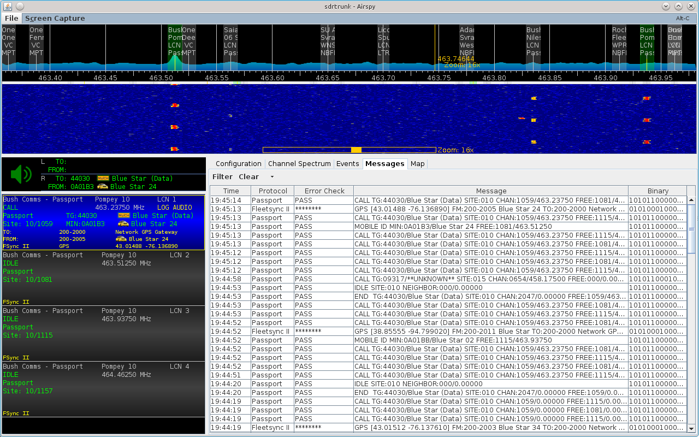

# Passport #

The passport decoder will decode the Outbound Status Word (OSW) messages and 
signaling that are transmitted by the network to the mobile radio.  Passport
systems do not have dedicated control channels, therefore this decoder does not
support trunked channel following.

## Talkgroups ##

User mobile radios are normally assigned the talkgroup identifiers starting 
from 1, upward.  Group talkgroups are normally assigned from the highest 
talkgroup numbers working their way downward.  You can create an alias for each 
talkgroup.

## Mobile ID Number (MIN) ##

Each passport mobile radio on the network is assigned a MIN.  You can create 
an alias for each MIN.

## Squelch Control ##

The Passport decoder provides signaling-based squelch control.

## Aliases ##

If you are in the United States, and your Passport network may occasionally 
broadcast its FCC station callsign.  Add the following alias and talkgroup
identifier to your alias list to automatically identify these station ID
call events:

  * 65535 FCC CWID

## Passport Decode Example ##

The below screenshot shows a passport channel being decoded where the system
also uses the Fleetsync auxiliary protocol overlay.  SDRTrunk decodes both the 
passport signaling and the fleetsync data bursts and displays the decoded 
information.  In this instance, the mobile radio is transmitting an automatic
 Fleetsync GPS location report without the user's input.

