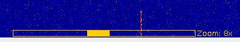

# Introduction #

The spectral display component shows the frequency activity of the currently selected tuner and all configured decoder channels.

## Cursor ##
A cursor with frequency readout is automatically shown as you move the mouse about the spectral display window.  When zoomed
in, the zoom level is also displayed below the frequency value.

## Zoom ##
The spectral and waterfall displays can be zoomed together using the mouse scroll wheel, or using the right-click context menu.  

When zoomed in, a small zoom window appears at the bottom of the waterfall display indicating the area of the spectral and waterfall displays that is visible and the zoom level.  You can left click drag the display with the mouse when zoomed in to drag the display left or right.  The zoom control 

## Context Menus ##

Right-click anywhere in the spectral display to show a list of context-specific menu options.

### Channel Menu ###

Channels defined in the [Playlist](Playlist) are also displayed in the spectral display window.  Each channel exposes a context menu allowing you to start/stop the channel decoder, or view the [ActivitySummary](ActivitySummary) for currently decoding channels

### Frequency Menu ###

The current frequency displayed by the cursor displays as a menu that allows you to assign a decoder and automatically start decoding that channel.  A channel configuration is automatically created and enabled.

### Color Menu ###

The color menu allows you to change any of the global color settings used by all spectral displays.

  * **Background** - background color for the spectral display
  * **Channel** - channel overlay color for channels that are defined in the configuration, but are currently not processing (decoding) or selected
  * **Channel Processing** - channel overlay color for any channels that are currently processing (decoding)
  * **Channel Selected** - channel overlay color for the channel that is currently selected in the [Decoding Channels](DecodingChannels) window.
  * **Cursor** - color used for the cursor and frequency readout
  * **Gradient Bottom** - bottom color for the gradient used to display the frequency spectrum
  * **Gradient Top** - top color for the gradient used to display the frequency spectrum
  * **Lines** - color used for lines and frequency labels

### Display Menu ###

The display menu allows you to change settings associated with Discrete Fourier Transform (DFT) results that are displayed in the spectral display.  
* **Averaging** - sets the averaging window size.  Averaging occurs over multiple sets of DFT results.
* **Channel** - controls display of channel overlays.  Choose to display ALL, NONE, or only the channels currently ENABLED and decoding.
* **FFT Width** - bin size used in DFT calculations, 512 - 32,768.  Using a higher setting provides increased resolution in the display, but also significantly increases CPU usage.
* **Frame Rate** - determines the number of times per second that the DFT is calculated and the spectral display is updated.
* **Window Type** - specifies the windowing method to use prior to calculating the DFT.  Windowing minimizes signals from bleeding over into neighboring DFT bins.
* **Smoothing** - sets the smoothing filter type.  Smoothing is applied across DFT bins within the same DFT result set.

### Zoom Menu ###

Changes the zoom size where 1x is no zoom and 64x is the display zoomed in 64 times.  

## Changing Displayed [Tuner](Tuner) ##

Right-click on the desired tuner in the [Configuration](Configuration) window and select **Show in Main Spectrum**, or choose **New Spectrum Window** to create a new, separate Spectral Display and Waterfall.