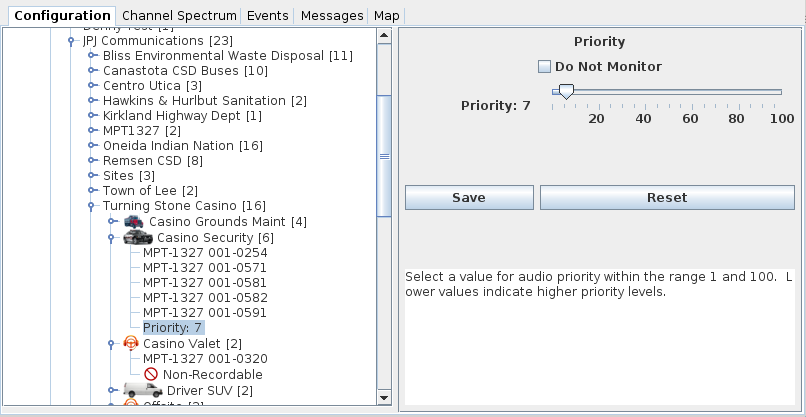

# Call Priority #

Any alias can be assigned a call monitoring priority.  Priority values range 
from 1 to 100, with 1 being the highest priority and 100 being the lowest.

Audio playback will use any call priority that you have specified and will 
automatically override lower priority calls with higher priority calls when they
occur.

You can designate an alias as 'DO NOT MONITOR' and any audio calls where that
alias is a participant will not be routed for audio playback.

Note: if you select a decoding channel, any audio from that channel will have 
the highest priority and will override any settings that you have defined.  
Selected audio has an effective priority of 0 so it will be higher priority than
your priority 1 alias calls.

