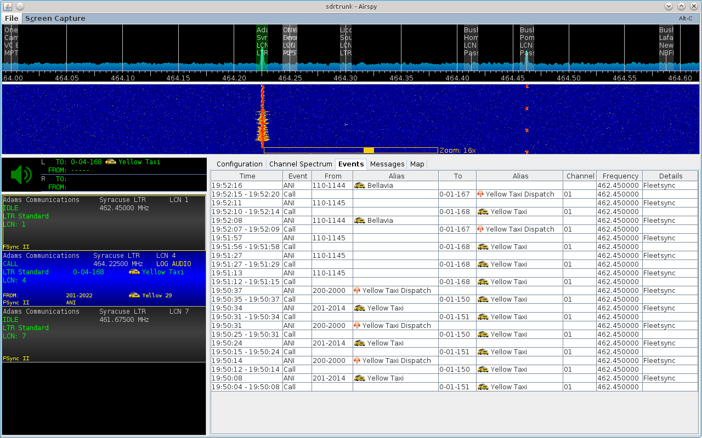

# LTR Standard Decoder #

## Squelch Control ##

The LTR decoder provides signaling-based squelch control.

## Aliases ##

If you are in the United States and your LTR network occasionally broadcasts its FCC station callsign, then add the following alias to each alias list you are using for LTR to identify these as FCC Callsign Broadcasts:

  * `*`-`*``*`-255 FCC CWID
  

  