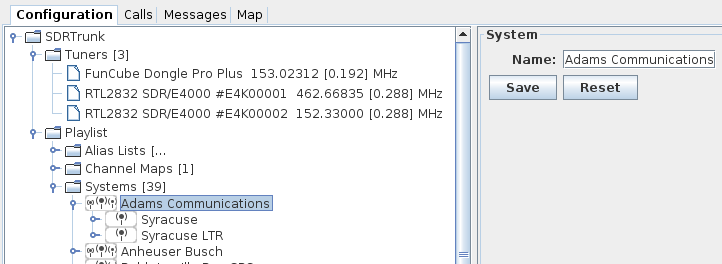

# System #

A system is a top-level folder for managing a set of [sites](Site) and [channels](Channel).  Use a different system for each trunked radio network, or to organize a collection of related sites and channels.

When a channel within the system is actively decoding, the system icon is colored Green.

# Creating a New System #

1. Expand the [Playlist](Playlist) folder and the [Systems](Systems) folder

2. Right-click on the [Systems](Systems) folder and select 'New System'.

3. Select the new [System](System) folder and update the system name in the editor.  Click 'Save'.

# Deleting a System #

1. Expand the [Playlist](Playlist) folder and the [Systems](Systems) folder

2. Right-click on the [System](System) and select 'Delete'

# Changing a System Name #

1. Expand the [Playlist](Playlist) folder and the [Systems](Systems) folder

2. Select the system from the list.

3. Update the system name in the editor and click 'Save'